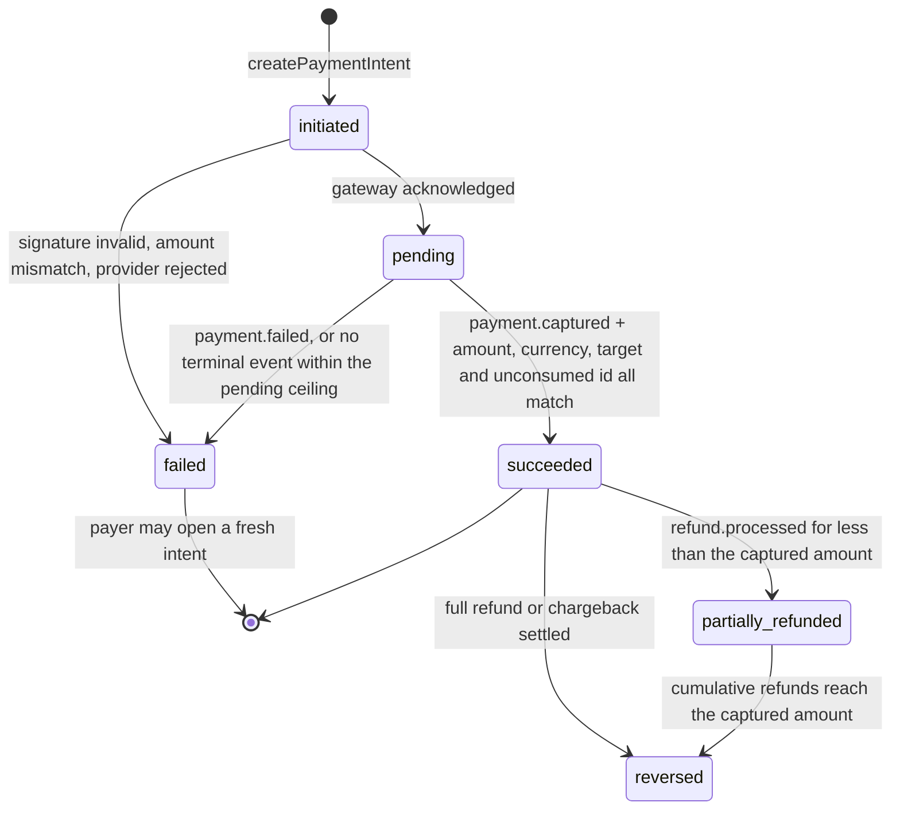
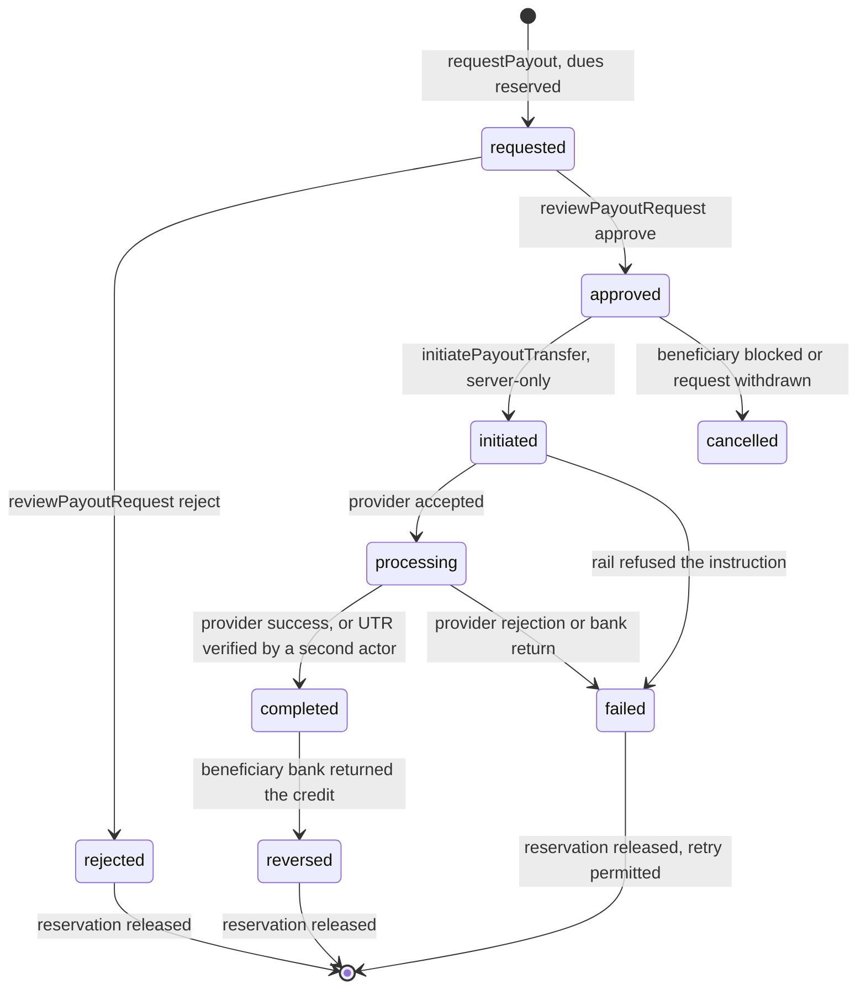

# Logikchain API Specifications

This document serves as the authoritative source of truth for **Firebase Functions 2nd gen** (`onCall`, `onRequest`, `onSchedule`) backend execution logic, permissions, state mutations, transactional integrity, and error codes within the Logikchain platform. All sensitive mutations and business transactions must go through these server-side exports to enforce security boundaries, maintain transactional integrity, and ensure robust offline synchronization.

The operations in this file are the only API. Each one has an HTTP method and `/v1` path (§0B), a **Security** block (auth, App Check, roles, status, resource, official client), and a Firebase Function `operationId` that is identical on `emulator`, `dev`, `test`, and `prod`. A PWA and a Kotlin Android app are two runtimes of the same contract. They are not Cloud Run services, 1st-gen Functions, or RPC-only `POST /api/{name}` paths. Hosting, official clients, compute settings, and what the hybrid split forbids live in `constitution/Logikchain_Architecture.md`. This file owns the wire: method, path, security, payloads, error codes, and the obligations every client must meet before a call is legal.

---

## API Specifications

This section defines the HTTP API (GET / POST / PATCH / PUT / DELETE) implemented by Firebase Functions 2nd gen. All sensitive mutations must go through these routes. Each operation states its **HTTP** line and **Security** block before its payload.

### 0. Client contract (hybrid web + Android)

The platform ships two client **runtimes** against **one Firebase project per alias** (`dev`, `test`, `prod`; plus a local `emulator` that is not a project): the Vite PWA (five role entries, one kernel — `constitution/Logikchain_Architecture.md` §2a) and the Kotlin + Jetpack Compose Android app. Inside one alias they share Auth UIDs, custom claims, Firestore documents, FCM `Notification` records, and every function below. They do not share those with another alias. They do not share an outbox implementation, and they are not equally official for every job. A merchant bundle at `/m/` is not a second API. `constitution/Logikchain_Architecture.md` is the split; `constitution/Logikchain_Firebase_Workflow.md` is the playbook per alias; the rules that belong on the wire are here.

**One contract.** Function names, request and response shapes, `idempotencyKey` semantics, `capturedAt` preservation, and error codes are identical on both clients. An Android-only payload or a PWA-only REST wrapper around the same mutation is a second API and is rejected. Screen IDs and `Notification.deepLink` values are the same strings on both runtimes.

**Reads and writes stay on opposite paths.** Clients read from Firestore (persistence on, TTLs as in the system instructions). Clients never write `Orders`, `MerchantOrders`, `Gigs`, cash or credit collections, payment or payout records, `BeneficiaryAccounts`, or `VerificationCodeBatches`. A tap that changes those documents calls a function in this file. The Firebase JS SDK being able to `set()` a document is not permission to do so from the PWA.

**App Check is a precondition, not a courtesy.** Every client-reachable callable and HTTPS function rejects a missing or invalid App Check token with `UNAUTHENTICATED`. Web presents reCAPTCHA Enterprise (or the documented web provider). Android presents Play Integrity. Provider callbacks (`handleGatewayWebhook`, `recordPayoutSettlement`) authenticate by signature over the raw body and are the exception, because a payment gateway cannot obtain an App Check token.

**Official-client enforcement.** When the caller role is `vehicle`, the following functions accept only an App Check token whose provider is Play Integrity: `startGig`, `updateGigLocation`, `completeAndFinalizeGig`, `markOrderDelivered`, `updateMerchantOrderStatus`, `confirmCreditRepayment`, `declareCashHandover`, `confirmCashSettlement`. Any other provider returns `CLIENT_NOT_OFFICIAL`. The PWA treats that error as a handoff into the Play app, not as a retry. This is what makes the Android outbox the only place a queued handover can live: a service-worker retry of the same physical event is how `CODE_REPLAYED` becomes a dispute. Merchant self-confirmation of a bulk order on the merchant's own authenticated session remains legal on web, as section 4A already states — the caller and the counterparty are the same UID, and there is no driver outbox to protect.

**The durable outbox is not Firestore offline persistence.** The Firestore SDK caches reads and may queue the few document writes the rules still allow. It does not persist an unsent callable. Android therefore keeps a Room + WorkManager outbox for every function this file marks as queueable. Each row carries the function name, the original payload, a client-minted `idempotencyKey` that is stable across retries of the same physical event, and the device `capturedAt`. Replay is in capture order. A short-circuit on the key returns the original result. A permanent refusal (`CODE_REPLAYED`, `INVALID_STATE`) surfaces on `SHR-12` / `DRV-05.1` and is not dropped. The PWA must not implement a second copy of this queue for `vehicle` jobs.

**Queue versus block is the same matrix on both clients.** The drawn form is `constitution/wireframes/Patterns.md` §4. The wire form is:

- **Queued** (Android official client, strong offline proof only): `updateGigLocation`; and `markOrderDelivered`, `updateMerchantOrderStatus`, `confirmCreditRepayment`, `declareCashHandover`, `confirmCashSettlement` when the proof method is `"offline_code"` or `"counter_signature"`. `"otp"` cannot be queued, because it requires a live private-subdocument read.
- **Blocked offline** on every client: `placeOrder` (including cash-on-pickup), `placeMerchantOrder`, `createPaymentIntent`, `processPayment`, `refundOrder`, `requestPayout`, `reviewPayoutRequest`, `registerPayoutBeneficiary`, `retryPayout`, `verifyManualPayout`, `issueCreditNote`, `subscribeToPlan`, `changeSubscriptionPlan`, `assignSubscription`, every Support configuration write, `runReconciliation`, `resolveReconciliationException`, `closeAccountingPeriod`, `reopenAccountingPeriod`. The control is disabled with "Needs an internet connection". A queued payment is worse than a refused one: it is an approval against a balance and a beneficiary state the approver can no longer see.

**Claims are refreshed before the next route.** After `convertBuyerToRole`, `suspendUser`, or `restoreUser`, every signed-in client for that UID force-refreshes the ID token before it decides which chrome to show. The server already re-reads `/UserProfiles/{callerId}` on every mutation, so a stale claim cannot write. It can still route a PWA to buyer chrome after the Play app has driver claims, and that disagreement is a product defect rather than an acceptable window.

**Device tokens are per client, not per user-session.** `registerDeviceToken` upserts one `DeviceToken` keyed by `token` and tagged `platform: "web" | "android" | "ios"`. Logout revokes **that** token. It does not empty the array. A hybrid user is expected to hold both a web token and an Android token; FCM fans out to all of them. Cap remains five, oldest `updatedAt` dropped.

**Error codes introduced by this contract.**

- `UNAUTHENTICATED`: App Check token missing or invalid on a client-reachable function. Also the existing Auth-missing case.
- `CLIENT_NOT_OFFICIAL`: Caller role is `vehicle` and the App Check provider is not Play Integrity on a function listed under official-client enforcement.

### 0A. Runtime (Firebase Functions 2nd gen) and project targeting

Every heading below that says **Callable**, **HTTPS**, **Scheduled**, or **Server-Only** is a **Firebase Functions 2nd gen** export on **Node 20**. The heading name **is** the exported function name (`placeOrder`, `handleGatewayWebhook`, `runReconciliation`). Clients call that name through the Firebase Functions SDK **or** the §0B HTTP path. There is no parallel Cloud Run service, no 1st-gen `functions.https.onCall`, no Python runtime, and no per-environment rename.

Hosting on every remote alias rewrites `/v1/**` to the `api` `onRequest` export in `asia-south1`. That function dispatches to the same handler registry as the named callables. A second HTTP gateway is a second API.

| Kind in this spec | Firebase import | Who invokes it |
| ----------------- | --------------- | -------------- |
| Callable / HTTP | `onCall` or `onRequest` from `firebase-functions/v2/https` | PWA and Android. Same handler. HTTP uses §0B `METHOD /v1/...` with Bearer + App Check. |
| HTTPS REST | `onRequest` from `firebase-functions/v2/https` | Razorpay and payout rails (`handleGatewayWebhook`, `recordPayoutSettlement`). Signature over the raw body, not App Check |
| Scheduled | `onSchedule` from `firebase-functions/v2/scheduler` | Cloud Scheduler, never a client |
| Server-Only | `onTaskDispatched` or an `onCall` that rejects every client token | Queue workers such as `initiatePayoutTransfer` |

**Region and scale** are not per-function choices. `asia-south1`, `minInstances: 0`, concurrency 20–80, memory 512 MB unless the export is on the isolation list in `constitution/Logikchain_Architecture.md` §4 (1 GiB). A function that deploys to `us-central1` because that was the CLI default is out of contract.

**Handlers do not import handlers.** Shared mutation helpers (`createPaymentIntentInternal`, tax, custody, rails) live in `functions/src/lib/`. A cycle between `orders.ts` and `payments.ts` is a defect, not a convenience.

**The same export lands on every alias.** `httpsCallable('placeOrder')` is `placeOrder` on `emulator`, `dev`, `test`, and `prod`. The Firebase options in the **client build** select the alias (`constitution/Logikchain_Firebase_Workflow.md` playbooks). Function source reads `process.env.GCLOUD_PROJECT` for Storage paths, webhook self-URLs, and KMS resource names. A string literal project ID (`logikchain-prod`, `logikchainTest`, or any other) inside a function is a defect: it is how a `test` deploy writes to a `prod` bucket.

**Isolation is still a Firebase Function.** `handleGatewayWebhook`, `recordPayoutSettlement`, `initiatePayoutTransfer`, `runReconciliation`, `postDueCreditRelief`, period-close / TDS jobs, and Vertex-backed helpers are their own exports so a long job cannot starve `placeOrder`. They are not an invitation to `gcloud run deploy`.

**Deploy** is `firebase deploy --project <alias> --only functions` with alias `dev` \| `test` \| `prod`. Production is CI from a tag. The workflow file owns the commands; this section owns the rule that the API does not change when the alias does.

### 0B. HTTP contract (GET / POST / PATCH / PUT / DELETE)

The public API is a versioned HTTP interface. Firebase Functions 2nd gen is the **runtime**, not the URL shape. Clients call `httpsCallable(operationId)` **or** `METHOD /v1/...` on the same handler. The security block is identical either way. RPC paths (`POST /api/placeOrder`) are retired; they are not a second contract.

HTTP API tests are Bruno collections under `tests/bruno/`, one request folder per `operationId`. The standard is `constitution/Logikchain_API_Testing.md`. Those tests hit this catalog's `METHOD /v1/...` lines on `emulator`. They are not a second API.

**Verb rules**

| Verb | Use |
| ---- | --- |
| `GET` | Read-only. No mutation. Filters are query parameters (or a JSON object the OpenAPI operation documents). |
| `POST` | Create a resource, or a custom action (`:start`, `:cancel`, `:deliver`, `:confirm`). Actions that are not a field patch use a colon suffix (AIP-136). |
| `PATCH` | Partial update of an existing resource (profile fields, gig location, order status, a review decision). |
| `PUT` | Idempotent create-or-replace of a named Support/config document (`upsert*`). |
| `DELETE` | Remove a state that is itself a resource (`restoreUser` deletes the suspension). Soft-deactivates of catalog rows use `PATCH ...:deactivate`. |

**Status codes.** `200` success (remember: `success` on a money call is not “money moved”). `400` `INVALID_ARGUMENT` / validation. `401` `UNAUTHENTICATED` (missing Bearer or App Check). `403` `PERMISSION_DENIED` / `USER_SUSPENDED` / `CLIENT_NOT_OFFICIAL`. `404` `NOT_FOUND`. `409` `INVALID_STATE` / `ALREADY_EXISTS` / `IDEMPOTENCY_CONFLICT`. `429` rate limits (`RESEND_LIMIT_EXCEEDED`). Webhooks acknowledge unhandled events with `200` and `applied: false`.

**Security, on every client-reachable route**

1. **App Check** (except provider webhooks and the scheduler).
2. **Bearer** Firebase ID token (except webhooks, scheduler, and server-only workers).
3. **Role and status** re-read from `/UserProfiles/{callerId}`. Custom claims are not the authority.
4. **Resource** — the caller must be the party the document names, unless Support.
5. **Official client** — Play Integrity when the caller is `vehicle` on the gig/custody routes listed in §0.

Document reads that are not in this catalog stay **Firestore security rules**, not extra GET routes. A GET in this file is a Function because it aggregates, prices, or redacts.

**Endpoint catalog** (normative; each operation below repeats its row as **HTTP** + **Security**)

| Operation | HTTP | Path | Roles | Auth |
| --------- | ---- | ---- | ----- | ---- |
| `createSupplier` | `POST` | `/v1/suppliers` | support | bearer |
| `convertBuyerToRole` | `POST` | `/v1/buyers/{buyerId}/role` | supplier | bearer |
| `updateUserProfile` | `PATCH` | `/v1/users/{userId}` | any approved (self); support (any) | bearer |
| `disassociateMerchant` | `POST` | `/v1/merchants/{merchantId}:disassociate` | supplier (managing), support | bearer |
| `suspendUser` | `POST` | `/v1/users/{userId}/suspension` | support (platform|operational); supplier (operational, own network) | bearer |
| `restoreUser` | `DELETE` | `/v1/users/{userId}/suspension` | support; supplier (only a suspension they imposed, operational, still their network) | bearer |
| `composeGig` | `POST` | `/v1/gigs` | supplier | bearer |
| `startGig` | `POST` | `/v1/gigs/{gigId}:start` | vehicle (assigned) | bearer |
| `updateGigLocation` | `PATCH` | `/v1/gigs/{gigId}/location` | vehicle (assigned) | bearer |
| `completeAndFinalizeGig` | `POST` | `/v1/gigs/{gigId}:complete` | vehicle (assigned), supplier, support | bearer |
| `suspendGig` | `POST` | `/v1/gigs/{gigId}:suspend` | supplier (owner), support | bearer |
| `reassignGigDriver` | `PATCH` | `/v1/gigs/{gigId}/driver` | supplier (owner), support | bearer |
| `placeOrder` | `POST` | `/v1/orders` | buyer | bearer |
| `cancelOrder` | `POST` | `/v1/orders/{orderId}:cancel` | buyer (owner), merchant (assigned), supplier, support | bearer |
| `markOrderDelivered` | `POST` | `/v1/orders/{orderId}:deliver` | vehicle (gig driver), merchant (assigned) | bearer |
| `placeMerchantOrder` | `POST` | `/v1/merchant-orders` | merchant | bearer |
| `updateMerchantOrderStatus` | `PATCH` | `/v1/merchant-orders/{merchantOrderId}/status` | vehicle (serving gig), merchant (recipient, delivered only), supplier (owner), support | bearer |
| `cancelMerchantOrder` | `POST` | `/v1/merchant-orders/{merchantOrderId}:cancel` | merchant (owner), supplier (owner), support | bearer |
| `requestCreditIncrease` | `POST` | `/v1/credit-profiles/{merchantId}/increase-requests` | merchant | bearer |
| `setMerchantCreditLimit` | `PUT` | `/v1/credit-profiles/{merchantId}/limit` | supplier (managing), support | bearer |
| `reviewCreditIncreaseRequest` | `PATCH` | `/v1/credit-increase-requests/{requestId}` | supplier (managing), support | bearer |
| `createPaymentIntent` | `POST` | `/v1/payment-intents` | buyer (own order), merchant (own order/credit/subscription), supplier (own subscription) | bearer |
| `processPayment` | `POST` | `/v1/payment-intents/{intentId}:capture` | buyer or merchant (own intent); or provider webhook | bearer-or-webhook |
| `refundOrder` | `POST` | `/v1/orders/{orderId}/refunds` | buyer (owner), supplier (managing), support; or refund webhook | bearer-or-webhook |
| `requestPayout` | `POST` | `/v1/payout-requests` | vehicle | bearer |
| `reviewPayoutRequest` | `PATCH` | `/v1/payout-requests/{payoutRequestId}` | supplier (managing), support — never the requesting driver | bearer |
| `getFinancialReport` | `GET` | `/v1/reports/financial` | supplier, support | bearer |
| `getFinanceReport` | `GET` | `/v1/reports/finance` | supplier, merchant (own data), support (any, recorded) | bearer |
| `exportFinanceReport` | `POST` | `/v1/reports/finance/exports` | supplier, merchant, support | bearer |
| `scheduleFinanceReport` | `POST` | `/v1/reports/finance/schedules` | supplier, merchant | bearer |
| `getEntitlements` | `GET` | `/v1/entitlements` | approved supplier or merchant; support (any subscriber) | bearer |
| `previewPlanChange` | `GET` | `/v1/subscriptions/{subscriptionId}/preview` | supplier, merchant (own); support (any) | bearer |
| `changeSubscriptionPlan` | `PATCH` | `/v1/subscriptions/{subscriptionId}/plan` | supplier, merchant (own) | bearer |
| `resendHandoverCode` | `POST` | `/v1/handover-codes:resend` | code owner (buyer|merchant|supplier), vehicle on the handover, supplier (owner), support | bearer |
| `issueOfflineCodeBatch` | `POST` | `/v1/verification-code-batches` | merchant (own; bulk_order_handover|credit_repayment), supplier (own; cash_settlement) | bearer |
| `authorizeVerificationFallback` | `POST` | `/v1/verification-fallbacks` | supplier (owner of the goods or cash), support | bearer |
| `initiateCreditRepayment` | `POST` | `/v1/credit-repayments` | vehicle (started gig serving this merchant) | bearer |
| `confirmCreditRepayment` | `POST` | `/v1/credit-repayments/{transferId}:confirm` | vehicle (named on the transfer) | bearer |
| `getCashCustodySummary` | `GET` | `/v1/cash/custody` | vehicle (own), merchant (own), supplier (network), support (any including platform) | bearer |
| `declareCashHandover` | `POST` | `/v1/cash-settlements/{settlementId}:declare` | vehicle (named driver) | bearer |
| `confirmCashSettlement` | `POST` | `/v1/cash-settlements/{settlementId}:confirm` | vehicle (named), supplier (owner), support | bearer |
| `raiseCashDiscrepancy` | `POST` | `/v1/cash-discrepancies` | buyer, vehicle, merchant, supplier, support — party to the movement | bearer |
| `resolveCashDiscrepancy` | `PATCH` | `/v1/cash-discrepancies/{discrepancyId}` | supplier (owner, not escalate_to_support), support | bearer |
| `postDueCreditRelief` | `POST` | `/v1/internal/credit-relief` | none — scheduler | scheduler |
| `setProvisionalCreditPolicy` | `PUT` | `/v1/credit-profiles/{merchantId}/provisional-policy` | supplier (that merchant's), support | bearer |
| `registerPayoutBeneficiary` | `POST` | `/v1/beneficiaries` | vehicle (own destination) | bearer |
| `blockPayoutBeneficiary` | `POST` | `/v1/beneficiaries/{beneficiaryId}:block` | supplier (managing), support | bearer |
| `initiatePayoutTransfer` | `POST` | `/v1/internal/payouts/{payoutTransactionId}:initiate` | none — system | system |
| `recordPayoutSettlement` | `POST` | `/v1/webhooks/payout-settlement` | provider webhook (signature); support (manual UTR, fallback rail only) | webhook-or-support |
| `verifyManualPayout` | `POST` | `/v1/payouts/{payoutTransactionId}:verify-manual` | support, excluding utrEnteredBy | bearer |
| `retryPayout` | `POST` | `/v1/payouts/{payoutTransactionId}:retry` | supplier (managing), support | bearer |
| `handleGatewayWebhook` | `POST` | `/v1/webhooks/gateway` | payment and payout provider webhooks only | webhook |
| `runReconciliation` | `POST` | `/v1/reconciliation-runs` | scheduler; support (manual re-run) | scheduler-or-support |
| `resolveReconciliationException` | `PATCH` | `/v1/reconciliation-exceptions/{exceptionId}` | support | bearer |
| `closeAccountingPeriod` | `POST` | `/v1/accounting-periods/{periodId}:close` | support | bearer |
| `reopenAccountingPeriod` | `POST` | `/v1/accounting-periods/{periodId}:reopen` | support | bearer |
| `issueCreditNote` | `POST` | `/v1/credit-notes` | support; also invoked internally by refundOrder and cancelMerchantOrder | bearer |
| `upsertTaxProfile` | `PUT` | `/v1/tax-profiles/{taxProfileId}` | support | bearer |
| `upsertTdsConfiguration` | `PUT` | `/v1/tds-configurations/{configId}` | support | bearer |
| `recordTdsChallan` | `POST` | `/v1/tds/challans` | support | bearer |
| `issueTdsCertificate` | `POST` | `/v1/tds/certificates` | support | bearer |
| `getTdsRegister` | `GET` | `/v1/tds/register` | support; supplier (own network); vehicle (own certificates, any plan) | bearer |
| `upsertCountry` | `PUT` | `/v1/config/countries/{countryId}` | support | bearer |
| `upsertState` | `PUT` | `/v1/config/states/{stateId}` | support | bearer |
| `upsertDistrict` | `PUT` | `/v1/config/districts/{districtId}` | support | bearer |
| `requestVillage` | `POST` | `/v1/config/village-requests` | buyer, merchant, supplier | bearer |
| `upsertVillage` | `PUT` | `/v1/config/villages/{villageId}` | support | bearer |
| `upsertSubscriptionPlan` | `PUT` | `/v1/config/plans/{planId}` | support | bearer |
| `upsertPlanTariff` | `PUT` | `/v1/config/tariffs/{tariffId}` | support | bearer |
| `upsertSubscriptionOffer` | `PUT` | `/v1/config/offers/{offerId}` | support | bearer |
| `upsertOfferDiscountCode` | `PUT` | `/v1/config/discount-codes/{codeId}` | support | bearer |
| `deactivateConfigurationRecord` | `PATCH` | `/v1/config/{collection}/{recordId}:deactivate` | support | bearer |
| `listConfigurationCatalog` | `GET` | `/v1/config/catalog` | any approved user; includeInactive is support-only; App Check only for public countries | bearer-or-appcheck |
| `assignSubscription` | `POST` | `/v1/subscriptions` | support | bearer |
| `subscribeToPlan` | `POST` | `/v1/subscriptions:self` | supplier, merchant | bearer |
| `cancelSubscription` | `POST` | `/v1/subscriptions/{subscriptionId}:cancel` | supplier (own), merchant (own), support | bearer |
| `registerDeviceToken` | `POST` | `/v1/devices` | any approved user | bearer |
| `acknowledgeGig` | `POST` | `/v1/gigs/{gigId}:acknowledge` | vehicle (assigned) | bearer |
| `adjustProductStock` | `POST` | `/v1/products/{productId}/stock` | supplier (owner), support | bearer |
| `updateDriverPayRates` | `PUT` | `/v1/suppliers/{supplierId}/driver-pay` | supplier (self), support | bearer |
| `requestVerificationFallback` | `POST` | `/v1/verification-fallbacks:request` | vehicle or merchant (party to the handover) | bearer |
| `rejectVillageRequest` | `POST` | `/v1/config/village-requests/{requestId}:reject` | support | bearer |
| `reassignOrderMerchant` | `PATCH` | `/v1/orders/{orderId}/merchant` | support | bearer |
| `resumeOrderOnGig` | `PATCH` | `/v1/orders/{orderId}/gig` | support | bearer |
| `extendSubscriptionGrace` | `POST` | `/v1/subscriptions/{subscriptionId}:extend-grace` | support | bearer |
| `computeRouteMetrics` | `POST` | `/v1/routes:compute-metrics` | supplier, support | bearer |
| `upsertRoute` | `PUT` | `/v1/routes/{routeId}` | supplier (own), support (any supplier) | bearer |
| `getSystemHealth` | `GET` | `/v1/ops/health` | support | bearer |
| `requestMyDataExport` | `POST` | `/v1/me/data-export` | any approved user | bearer |
| `requestAccountDeletion` | `POST` | `/v1/me/deletion` | any approved user | bearer |


### 1. Onboarding & Identity Management

#### `createSupplier` (Callable Firebase Function)
Enables Support agents to manually provision and approve new Supplier profiles on the platform.

- **HTTP:** `POST /v1/suppliers`
- **Security:**
  - **Auth:** Bearer (Firebase ID token). `Authorization: Bearer <idToken>`.
  - **App Check:** required
  - **Roles:** support
  - **Status:** `approved` (re-read `/UserProfiles/{callerId}`)
  - **Resource:** none — creates the supplier
  - **Official client:** any (web or Android App Check provider)
- **Permitted Roles:** `support`.
- **Request Payload:**
```typescript
interface CreateSupplierRequest {
  email: string;
  name: string;
  phone: string;
  countryId?: string;
  location?: string;
}
```
- **Response Payload:**
```typescript
interface CreateSupplierResponse {
  success: boolean;
  supplierId: string;
}
```
- **Core Business Logic & Mutated Data Structures:**
  1. Read caller profile from `/UserProfiles/{callerId}`. Validate that the caller has the `support` role and status is `approved`.
  2. Resolve the selected Country from `/Countries/{countryId}`. Reject if the Country is missing or `status !== "active"`. (`emulator` fixtures may use India / `country_in` from `seed/`. `test` and `prod` must use Support-created Country records only. `dev` may use throwaway Support-created records; it does not import `seed/`.)
  3. Validate `phone` against the Country `mobilePrefix` and `phoneNumberLength` (or `phoneValidationRegex` when set).
  4. Create the user record in Firebase Auth via the Admin SDK using the provided `email`, `phone`, and `name`.
  5. Create a new document in `/UserProfiles/{supplierId}` (using the generated Auth UID) setting `role: "supplier"`, `status: "approved"`, `email`, `name`, `phone`, `countryId`, `createdAt: string` (ISO 8601).
  6. Set Firebase Custom User Claims for the new account: `{ role: "supplier", status: "approved" }`.
- **Potential Error Codes:**
  - `PERMISSION_DENIED`: Caller lacks the Support role.
  - `ALREADY_EXISTS`: A user with this email or phone number is already registered.
  - `INVALID_ARGUMENT`: Invalid phone or email formatting.
  - `NOT_FOUND`: Selected Country does not exist or is inactive.
  - `INVALID_PHONE`: Phone number does not match the Country mobile prefix and length.

#### `convertBuyerToRole` (Callable Firebase Function)
Enables Suppliers to dynamically upgrade an existing approved Buyer within their network to either a Merchant or a Driver (Vehicle), instantly approved.

- **HTTP:** `POST /v1/buyers/{buyerId}/role`
- **Security:**
  - **Auth:** Bearer (Firebase ID token). `Authorization: Bearer <idToken>`.
  - **App Check:** required
  - **Roles:** supplier
  - **Status:** `approved` (re-read `/UserProfiles/{callerId}`)
  - **Resource:** target buyer must be in the caller's network
  - **Official client:** any (web or Android App Check provider)
- **Permitted Roles:** `supplier`.
- **Request Payload:**
```typescript
interface ConvertBuyerToRoleRequest {
  buyerId: string;
  targetRole: "merchant" | "vehicle";
}
```
- **Response Payload:**
```typescript
interface ConvertBuyerToRoleResponse {
  success: boolean;
  userId: string;
  newRole: "merchant" | "vehicle";
  officialClient: "web" | "android";
}
```
- **Core Business Logic & Mutated Data Structures:**
  1. Read caller profile from `/UserProfiles/{callerId}`. Check that `role` is `supplier` and status is `approved`.
  2. Perform a transaction to read the target user's profile from `/UserProfiles/{buyerId}`. Ensure their current `role` is `"buyer"` and status is `"approved"`.
  3. Update target `/UserProfiles/{buyerId}.role` to `targetRole`.
  4. Set `/UserProfiles/{buyerId}.supplierId` to the calling supplier's UID. The converted user belongs to the network that promoted them, which is what makes the supplier the authority for their credit limit and their cash settlements.
  5. If `targetRole` is `"merchant"`:
     - Provision a standard empty credit profile at `/CreditProfiles/{buyerId}` setting: `supplierId: callerId`, `creditLimit: 0`, `creditUsed: 0`, `creditAvailable: 0`, `inTransitRepayments: 0`, `paymentsMade: []`, `paymentsDue: []`, `updatedAt` (ISO 8601).
     - A zero limit is a deliberate starting position, not a dead end: the supplier lifts it with `setMerchantCreditLimit`, or approves the merchant's own `requestCreditIncrease` through `reviewCreditIncreaseRequest`. Both write a `CreditTransaction` of type `"limit_change"`, so a merchant's limit always has a named author.
     - Set `officialClient: "web"`. Android is preferred for photo proof and offline code entry, but a merchant remaining on the PWA is legal. The PWA does not hand off.
  6. If `targetRole` is `"vehicle"`:
     - Provision a standard empty driver earnings tracker at `/DriverEarnings/{buyerId}` setting: `totalEarnings: 0`, `pendingDues: 0`, `cashInCustody: 0`, `cashRecoverable: 0`, `openSettlementIds: []`, `payments: []`, `payoutRequests: []`.
     - Set `officialClient: "android"`. The PWA that still holds this session must not unlock driver chrome: it deep-links into the Play app with the same UID. Section 0's official-client enforcement is what makes a PWA retry of `startGig` fail closed with `CLIENT_NOT_OFFICIAL` rather than open a second outbox.
  7. Update Custom User Claims on Firebase Auth for the target user: `{ role: targetRole, status: "approved" }`.
  8. Create `/Notifications/{notificationId}` for the target with `category: "support"`, naming `newRole` and `officialClient` in the body, and push via FCM to every registered `deviceTokens` entry — web and Android both, because the user may still be on the PWA that started them as a buyer. This is an account event, not a Support-agent message; `verification` is reserved for handover-code failures. Every signed-in client for this UID force-refreshes the ID token before routing; the role-change splash in `constitution/wireframes/Shared.md` is the visual of that refresh, not a substitute for it.
- **Potential Error Codes:**
  - `PERMISSION_DENIED`: Caller lacks the Supplier role.
  - `NOT_FOUND`: Target Buyer profile does not exist.
  - `INVALID_STATE`: Target user role is not `"buyer"` or status is not `"approved"`.
  - `INVALID_ARGUMENT`: Requested role is not `"merchant"` or `"vehicle"`.

#### `updateUserProfile` (Callable Firebase Function)
Applies self-service profile edits (address, shop details, GSTIN, PAN, driver vehicle details, and device permissions) through a server-side allow-list. It deliberately does **not** write a payout destination: see `registerPayoutBeneficiary` in section 4B.

- **HTTP:** `PATCH /v1/users/{userId}`
- **Security:**
  - **Auth:** Bearer (Firebase ID token). `Authorization: Bearer <idToken>`.
  - **App Check:** required
  - **Roles:** any approved (self); support (any)
  - **Status:** `approved` (re-read `/UserProfiles/{callerId}`)
  - **Resource:** self unless support
  - **Official client:** any (web or Android App Check provider)
- **Permitted Roles:** Any authenticated `approved` user for their own profile. `support` may target another user via `userId`.
- **Request Payload:**
```typescript
interface UpdateUserProfileRequest {
  userId?: string;
  name?: string;
  address?: string;
  contactInfo?: string;
  location?: string;
  villageId?: string;
  selectedMerchantId?: string;
  shopDetails?: string;
  gstin?: string;
  panNumber?: string;
  vehicleNumber?: string;
  vehicleType?: string;
  vehicleCapacityKg?: number;
  locale?: string;
  countryId?: string;
  notificationPrefs?: {
    mutedCategories: NotificationCategory[];
    sound: boolean;
  };
  permissions?: {
    location: boolean;
    sms: boolean;
    audio: boolean;
    camera: boolean;
  };
}
```
- **Response Payload:**
```typescript
interface UpdateUserProfileResponse {
  success: boolean;
  userId: string;
  updatedFields: string[];
}
```
- **Core Business Logic & Mutated Data Structures:**
  1. Read caller profile from `/UserProfiles/{callerId}`. Require status `approved`. Resolve the target UID: `userId` when the caller is `support`, otherwise the caller's own UID.
  2. Filter the payload against the per-role allow-list. `role`, `status`, `supplierId`, and `activeSubscriptionId` are never writable here.
     - `buyer`: `name`, `address`, `villageId`, `selectedMerchantId`, `locale`, `countryId`, `notificationPrefs`, `permissions`.
     - `merchant`: `name`, `address`, `shopDetails`, `gstin`, `villageId`, `locale`, `countryId`, `notificationPrefs`, `permissions`.
     - `vehicle`: `name`, `contactInfo`, `location`, `vehicleNumber`, `vehicleType`, `vehicleCapacityKg`, `panNumber`, `locale`, `notificationPrefs`, `permissions`.
     - `supplier`: `name`, `address`, `location`, `gstin`, `locale`, `notificationPrefs`, `permissions`.
     - Every role: `locale` must be a BCP 47 tag the client ships (en-IN, hi-IN, te-IN, ta-IN, kn-IN, mr-IN). `driverPay` is rejected here — use `updateDriverPayRates`.
  3. When `gstin` is supplied, validate the 15-character India GSTIN format. When `villageId` is supplied, require `/Villages/{villageId}` to exist. When `selectedMerchantId` is supplied, require that profile to be role `merchant` and status `approved`. When `countryId` is supplied, require an active `/Countries/{countryId}`. When `vehicleCapacityKg` is supplied, require a positive number.
  4. When `panNumber` is supplied, validate the 10-character India PAN format, store it encrypted, and return only the masked form. PAN is collected because TDS thresholds are assessed per deductee, not because it is a profile decoration.
  5. `payoutMethod` and `activeBeneficiaryId` are rejected here with `INVALID_ARGUMENT`, whatever the caller's role. A destination change has to run verification, duplicate detection, a cooling period, and a notification, and a generic profile merge does none of those.
  6. Merge the filtered fields into `/UserProfiles/{targetId}`. Custom User Claims are not modified.
- **Potential Error Codes:**
  - `PERMISSION_DENIED`: Caller attempted to edit another user without the Support role.
  - `NOT_FOUND`: Target profile, referenced Village, or selected Merchant does not exist.
  - `INVALID_ARGUMENT`: Field is not writable for the caller's role, GSTIN or PAN is malformed, or a payout destination was supplied.
  - `INVALID_STATE`: Caller status is not `approved`.

#### `disassociateMerchant` (Callable Firebase Function)
Removes a Merchant from a Supplier's network, suspending the merchant's in-flight orders and notifying everyone affected.

- **HTTP:** `POST /v1/merchants/{merchantId}:disassociate`
- **Security:**
  - **Auth:** Bearer (Firebase ID token). `Authorization: Bearer <idToken>`.
  - **App Check:** required
  - **Roles:** supplier (managing), support
  - **Status:** `approved` (re-read `/UserProfiles/{callerId}`)
  - **Resource:** supplier must manage the merchant
  - **Official client:** any (web or Android App Check provider)
- **Permitted Roles:** `supplier` (managing supplier), `support`.
- **Request Payload:**
```typescript
interface DisassociateMerchantRequest {
  merchantId: string;
  reason: string;
}
```
- **Response Payload:**
```typescript
interface DisassociateMerchantResponse {
  success: boolean;
  suspendedOrderIds: string[];
  suspendedMerchantOrderIds: string[];
}
```
- **Core Business Logic & Mutated Data Structures:**
  1. Read caller profile from `/UserProfiles/{callerId}`. Require `supplier` or `support` with status `approved`.
  2. Read `/UserProfiles/{merchantId}`. Require role `merchant`. For Supplier callers, require `merchant.supplierId === callerId`.
  3. Run a Firestore transaction:
     - Clear `/UserProfiles/{merchantId}.supplierId`.
     - Query `/Orders` where `merchantId` matches and `deliveryStatus` is `"placed"` or `"reached_merchant"`. Set each `deliveryStatus` to `"suspended"` and `suspensionReason` to the supplied `reason`. Stock is **not** restored; Support or the Buyer resolves each suspended order via `cancelOrder` or `refundOrder`.
     - Query `/MerchantOrders` where `merchantId` matches and `status` is `"placed"` or `"reached"`. Set each `status` to `"suspended"` with the same `suspensionReason`.
     - Remove `merchantId` from `merchantIds` on every `/Gigs` document owned by the supplier whose `status` is `"created"` or `"started"`.
  4. Create `/Notifications/{notificationId}` records with `category: "suspension"` for the merchant, each affected buyer, and Support, then trigger FCM push to their registered `UserProfile.deviceTokens`.
- **Potential Error Codes:**
  - `PERMISSION_DENIED`: Caller does not manage this Merchant.
  - `NOT_FOUND`: Merchant profile does not exist.
  - `INVALID_STATE`: Target profile is not a Merchant, or is not associated with the calling Supplier.
  - `INVALID_ARGUMENT`: `reason` is empty.

#### `suspendUser` (Callable Firebase Function)
Stops an account that was previously let in, with an actor, a reason, and a stated way back. `UserProfile.status` is written here and by `restoreUser` and nowhere else.

- **HTTP:** `POST /v1/users/{userId}/suspension`
- **Security:**
  - **Auth:** Bearer (Firebase ID token). `Authorization: Bearer <idToken>`.
  - **App Check:** required
  - **Roles:** support (platform|operational); supplier (operational, own network)
  - **Status:** `approved` (re-read `/UserProfiles/{callerId}`)
  - **Resource:** cannot target self; supplier scope limited
  - **Official client:** any (web or Android App Check provider)
- **Permitted Roles:** `support` (any account, `scope: "platform"` or `"operational"`), `supplier` (own network only, `scope: "operational"` only).
- **Request Payload:**
```typescript
interface SuspendUserRequest {
  userId: string;
  scope: SuspensionScope;
  reasonCode: SuspensionReasonCode;
  reason: string;
  internalNote?: string;
  restorePath: string;
  autoRestoreAt?: string;
  acknowledgeCustodyPlan?: boolean;
  reassignToDriverId?: string;
  idempotencyKey: string;
}
```
- **Response Payload:**
```typescript
interface SuspendUserResponse {
  success: boolean;
  userId: string;
  status: UserStatus;
  suspension?: SuspensionRecord;
  requiresCustodyAcknowledgement?: boolean;
  custodyPlan?: SuspensionCustodyPlan;
  refreshTokensRevokedAt?: string;
  claimsEffectiveWithinSeconds?: number;
}
```
- **Core Business Logic & Mutated Data Structures:**
  1. Short-circuit on `idempotencyKey`. Read caller and target profiles. Require the target `status: "approved"`; an `"unauthorized"` account is refused with `INVALID_STATE`, because it was never let in and suspending it would overwrite the more precise fact.
  2. **Authorise, and note who cannot be reached.**
     - `support` may suspend any `buyer`, `merchant`, `vehicle`, or `supplier`. Suspending another `support` account requires a second Support actor and is refused to a single caller with `APPROVAL_REQUIRED` — the role that can stop everybody must not be able to stop its own oversight alone.
     - `supplier` may suspend a `vehicle` or `merchant` whose `supplierId === callerId`, at `scope: "operational"` only. A supplier naming any other account, any other role, or `scope: "platform"` is refused with `PERMISSION_DENIED`. The limit is the point: a supplier can take somebody off their own road without locking that person out of an account that may also serve a different supplier tomorrow.
     - A supplier suspension always notifies Support and is reversible by Support without the supplier's agreement. A supplier may not suspend an account already suspended at `"platform"` scope, and may not restore one.
     - Nobody may suspend themselves. `callerId === userId` is refused.
  3. **Assess custody before writing anything.** Compute the `SuspensionCustodyPlan`: the target's `cashInCustody`, their active Gig, the orders riding on it, and every verified `"credit_repayment"` `CustodyTransfer` whose `CreditPaymentMade.settled` is still false. Where the plan is non-empty and `acknowledgeCustodyPlan` is not set, return `success: false` with `requiresCustodyAcknowledgement: true` and the plan, and **write nothing**. Nobody stops a driver mid-route without first being shown what that does to the money and the deliveries.
  4. Run a single Firestore transaction:
     - `/UserProfiles/{userId}`: set `status: "suspended"` and the full `suspension` record including `custodyPlan`.
     - Where the target is a `vehicle` on a `"started"` Gig, apply `suspendGig` semantics to that Gig and set every undelivered `Order` on it to `deliveryStatus: "suspended"`. Where `reassignToDriverId` is supplied and names an approved driver in the same network, apply `reassignGigDriver` in the same transaction and record it on the plan. Goods custody moves with the reassignment; cash custody does not, because the cash is in the suspended driver's pocket and no document can move it.
     - Where `cashInCustody > 0`, open a `/CashSettlements/{settlementId}` sweeping every `"in_custody"` entry held by the target, with `origin: "driver_suspension"`, `status: "pending"`, and a supplier confirmation code issued exactly as `completeAndFinalizeGig` does. Record `settlementId` and `settlementOutstanding: true` on the plan. A suspension that does not open a way home for the cash is a suspension that loses it.
     - Leave every `reliefDueBy` untouched. `postDueCreditRelief` continues to run against a suspended driver's pending repayments, so a merchant who paid is protected by the ceiling regardless of what happened to the driver.
     - Leave `DriverEarnings` untouched. Suspension is not forfeiture; earnings stay owed, net of whatever recovery a settlement shortfall later justifies.
  5. **Revoke the session.** Call the Admin SDK to revoke the user's refresh tokens and set the custom claim `status: "suspended"`, stamping `refreshTokensRevokedAt`. Return `claimsEffectiveWithinSeconds` as the configured `AUTH_ID_TOKEN_TTL_SECONDS`, so the caller is told the exact size of the window rather than left to assume there is none.
  6. Create `/Notifications/{notificationId}` with `category: "suspension"` for the target (carrying `reason` and `restorePath` verbatim, never `internalNote`), for the owning supplier, for Support, and for every buyer on a suspended order. Append an `AuditLogEntry` under `account` with before and after status, the actor, the reason code, and the custody plan.
- **How quickly it bites, stated rather than discovered.** A suspension is effective for **every server-side write immediately**, because each callable re-reads `/UserProfiles/{callerId}` and refuses a caller whose status is not `"approved"` with `USER_SUSPENDED` — the custom claim is a convenience for rules, never the authority for a mutation. Firestore rules additionally test `get(/UserProfiles/$(request.auth.uid)).data.status == "approved"` on every money collection, so a client holding an unexpired ID token cannot write through the rules either. What the stale token *can* still do is read documents the rules permit on claim alone, for at most the remaining life of that token, bounded by `AUTH_ID_TOKEN_TTL_SECONDS` (one hour by default). The platform's position is that a suspended user may briefly still see their own cached data and can never change anything, and that this is an acceptable trade rather than an oversight. The app resolves it sooner in practice: any callable returns `USER_SUSPENDED`, and the client routes immediately to the suspension screen and clears its cache.
- **Potential Error Codes:**
  - `PERMISSION_DENIED`: Caller may not suspend this account, this role, or at this scope; or a caller targeted themselves.
  - `APPROVAL_REQUIRED`: A single Support actor attempted to suspend another Support account.
  - `NOT_FOUND`: Target profile, replacement driver, or Gig not found.
  - `INVALID_STATE`: Target is already suspended, or is `"unauthorized"` rather than approved.
  - `CUSTODY_ACKNOWLEDGEMENT_REQUIRED`: Returned as a successful response with `requiresCustodyAcknowledgement`, not thrown; listed here because callers must handle it as a branch.
  - `INVALID_ARGUMENT`: Empty `reason` or `restorePath`, `reasonCode: "other"` without a reason, or `autoRestoreAt` in the past.
  - `IDEMPOTENCY_CONFLICT`: Key already used against a different account.

#### `restoreUser` (Callable Firebase Function)
Returns a suspended account to `"approved"`, or admits an `"unauthorized"` account that Support has reviewed. Restoration clears the status and nothing else — every obligation the suspension found is still there afterwards.

- **HTTP:** `DELETE /v1/users/{userId}/suspension`
- **Security:**
  - **Auth:** Bearer (Firebase ID token). `Authorization: Bearer <idToken>`.
  - **App Check:** required
  - **Roles:** support; supplier (only a suspension they imposed, operational, still their network)
  - **Status:** `approved` (re-read `/UserProfiles/{callerId}`)
  - **Resource:** matches suspendUser authorisation
  - **Official client:** any (web or Android App Check provider)
- **Permitted Roles:** `support` (any suspension). `supplier` may restore only a suspension they themselves imposed at `scope: "operational"` on an account still in their network.
- **Request Payload:**
```typescript
interface RestoreUserRequest {
  userId: string;
  restoreNote: string;
  idempotencyKey: string;
}
```
- **Response Payload:**
```typescript
interface RestoreUserResponse {
  success: boolean;
  userId: string;
  status: UserStatus;
  outstandingSettlementIds: string[];
}
```
- **Core Business Logic & Mutated Data Structures:**
  1. Short-circuit on `idempotencyKey`. Read the target. Require `status: "suspended"`, or `status: "unauthorized"` when the caller is `support`. A supplier cannot admit an unauthorized account — that is how a network owner would mint their own merchants without Support.
  2. Authorise. A `supplier` caller must match `suspension.suspendedBy` and `suspension.scope === "operational"`; anything else is Support's. A supplier cannot lift a Support suspension, which is what stops an operational stop and a fraud stop from being the same lever. Admitting `"unauthorized"` is Support-only.
  3. Require a non-empty `restoreNote`.
  4. Set `status: "approved"`, stamp `restoredBy`, `restoredAt`, and `restoreNote` on the retained `suspension` record. The record is kept, not deleted: an account that has been stopped once and released is a different history from an account that never was, and a restored profile that looks pristine hides that.
  5. Set the custom claim `status: "approved"`. No token revocation is needed — the user signs in or refreshes and is simply permitted again.
  6. **Do not discharge anything the suspension surfaced.** Return `outstandingSettlementIds` for every still-open settlement, including any opened with `origin: "driver_suspension"`. Restoring an account does not settle its cash, close its discrepancies, un-suspend its orders, or reinstate a gig; those are separate acts with their own functions, and bundling them here would let a restoration quietly write off money.
  7. Notify the target, the owning supplier, and Support with `category: "suspension"`, and append an `AuditLogEntry` under `account`.
- **Potential Error Codes:**
  - `PERMISSION_DENIED`: Caller did not impose this suspension, or it is out of their scope.
  - `NOT_FOUND`: Target profile not found.
  - `INVALID_STATE`: Target is not `"suspended"`, or is `"unauthorized"` and the caller is not Support.
  - `INVALID_ARGUMENT`: `restoreNote` is empty.
  - `IDEMPOTENCY_CONFLICT`: Key already used against a different account.

---

### 2. Logistics & Gig Operations

#### `composeGig` (Callable Firebase Function)
Creates and schedules a new routing Gig with an assigned driver, route, pamphlet, and local merchants.

- **HTTP:** `POST /v1/gigs`
- **Security:**
  - **Auth:** Bearer (Firebase ID token). `Authorization: Bearer <idToken>`.
  - **App Check:** required
  - **Roles:** supplier
  - **Status:** `approved` (re-read `/UserProfiles/{callerId}`)
  - **Resource:** owns route, pamphlet, merchants
  - **Official client:** any (web or Android App Check provider)
- **Permitted Roles:** `supplier`.
- **Request Payload:**
```typescript
interface ComposeGigRequest {
  title: string;
  routeId: string;
  vehicleId: string;
  pamphletId: string;
  merchantIds: string[];
  date: string;
  arrivingTimes: Record<string, string>;
}
```
- **Response Payload:**
```typescript
interface ComposeGigResponse {
  success: boolean;
  gigId: string;
}
```
- **Core Business Logic & Mutated Data Structures:**
  1. Validate `Route` exists at `/Routes/{routeId}` and `supplierId` matches caller.
  2. Verify driver `/UserProfiles/{vehicleId}` is role `vehicle` and status `approved`.
  3. Verify `Pamphlet` exists at `/Pamphlets/{pamphletId}`.
  4. Require a non-empty `merchantIds`. For each entry, read `/UserProfiles/{merchantId}` and require role `merchant`, status `approved`, and `supplierId === callerId`. Reject with `INVALID_STATE` when a merchant's `villageId` is not one of the Route villages.
  5. Load the caller's `PlatformSubscription` via `UserProfile.activeSubscriptionId`. If the active Plan defines `maxGigsPerMonth`, count Gigs created by this supplier in the current billing period and reject with `PLAN_LIMIT_EXCEEDED` when the cap would be breached.
  6. Copy `Route.villages` into `Gig.villages` in route order, carrying `villageId`, `name`, and `location { latitude, longitude }` for each stop. Reject with `INVALID_STATE` when any Route village is missing `villageId` or `location`, since the driver app's on-device Haversine geofence cannot run without coordinates. Write `villageIds` as that same list of ids so `BUY-04` / `MER-02` can query `villageIds` array-contains without scanning the collection.
  7. Create new `/Gigs/{gigId}` setting `villages`, `villageIds`, `merchantIds`, `status: "created"`, `currentVillageIndex: -1`, `currentVillageStatus: "none"`, `assignedAt` (now), and `routeLengthKm` from `Route.length`.
  8. Create `/Notifications/{notificationId}` with `category: "gig_assignment"` for the assigned driver and push via FCM.
- **Potential Error Codes:**
  - `PERMISSION_DENIED`: Caller not authorized.
  - `NOT_FOUND`: Route, vehicle profile, pamphlet, or a listed merchant not found.
  - `DRIVER_NOT_AVAILABLE`: Driver profile status is unapproved.
  - `INVALID_ARGUMENT`: `merchantIds` is empty.
  - `INVALID_STATE`: A listed merchant belongs to another supplier or sits off-route, or a Route village lacks `villageId` / `location`.
  - `PLAN_LIMIT_EXCEEDED`: Active subscription plan cap for monthly Gigs would be exceeded.
  - `SUBSCRIPTION_REQUIRED`: Caller has no active `PlatformSubscription`.

#### `startGig` (Callable Firebase Function)
Triggers the active state transition of a Gig when the driver begins the route.

- **HTTP:** `POST /v1/gigs/{gigId}:start`
- **Security:**
  - **Auth:** Bearer (Firebase ID token). `Authorization: Bearer <idToken>`.
  - **App Check:** required
  - **Roles:** vehicle (assigned)
  - **Status:** `approved` (re-read `/UserProfiles/{callerId}`)
  - **Resource:** vehicleId == caller
  - **Official client:** Play Integrity required when caller role is `vehicle` (`CLIENT_NOT_OFFICIAL` otherwise)
- **Permitted Roles:** `vehicle` (assigned driver).
- **Request Payload:**
```typescript
interface StartGigRequest {
  gigId: string;
}
```
- **Response Payload:**
```typescript
interface StartGigResponse {
  success: boolean;
  startedAt: string;
}
```
- **Core Business Logic & Mutated Data Structures:**
  1. Read `/Gigs/{gigId}`. Validate `vehicleId` matches caller's UID and status is `"created"`.
  2. Update `Gig` status to `"started"`, `currentVillageIndex: 0`, and `currentVillageStatus: "arriving"`.
- **Potential Error Codes:**
  - `PERMISSION_DENIED`: Caller is not the assigned driver.
  - `NOT_FOUND`: Gig not found.
  - `INVALID_GIG_STATE`: Gig has already started or completed.
  - `CLIENT_NOT_OFFICIAL`: Caller is `vehicle` and the App Check provider is not Play Integrity (see §0).

#### `updateGigLocation` (Callable Firebase Function)
Updates current village index and state during route execution, and alerts buyers of arrival.

- **HTTP:** `PATCH /v1/gigs/{gigId}/location`
- **Security:**
  - **Auth:** Bearer (Firebase ID token). `Authorization: Bearer <idToken>`.
  - **App Check:** required
  - **Roles:** vehicle (assigned)
  - **Status:** `approved` (re-read `/UserProfiles/{callerId}`)
  - **Resource:** vehicleId == caller
  - **Official client:** Play Integrity required when caller role is `vehicle` (`CLIENT_NOT_OFFICIAL` otherwise)
- **Permitted Roles:** `vehicle` (assigned driver).
- **Request Payload:**
```typescript
interface UpdateGigLocationRequest {
  gigId: string;
  currentVillageIndex: number;
  currentVillageStatus: "arriving" | "reached" | "left";
}
```
- **Response Payload:**
```typescript
interface UpdateGigLocationResponse {
  success: boolean;
}
```
- **Core Business Logic & Mutated Data Structures:**
  1. Read `/Gigs/{gigId}`. Verify caller matches `vehicleId`.
  2. Update `currentVillageIndex` and `currentVillageStatus` in `/Gigs/{gigId}`.
  3. If status is `"reached"`:
     - Query all orders in `/Orders` matching `gigId` and `village` with `deliveryStatus: "placed"`.
     - Update their `deliveryStatus` to `"reached_merchant"` in a batch.
     - Trigger FCM push notifications to buyers of the reached village.
- **Potential Error Codes:**
  - `PERMISSION_DENIED`: Caller is not the assigned driver.
  - `NOT_FOUND`: Gig not found.
  - `INVALID_INDEX`: Index is out of bounds for the gig route.
  - `CLIENT_NOT_OFFICIAL`: Caller is `vehicle` and the App Check provider is not Play Integrity (see §0).

#### `completeAndFinalizeGig` (Callable Firebase Function)
Closes an active Gig, verifies deliveries, and records driver earnings.

- **HTTP:** `POST /v1/gigs/{gigId}:complete`
- **Security:**
  - **Auth:** Bearer (Firebase ID token). `Authorization: Bearer <idToken>`.
  - **App Check:** required
  - **Roles:** vehicle (assigned), supplier, support
  - **Status:** `approved` (re-read `/UserProfiles/{callerId}`)
  - **Resource:** assigned driver or owning supplier
  - **Official client:** Play Integrity required when caller role is `vehicle` (`CLIENT_NOT_OFFICIAL` otherwise)
- **Permitted Roles:** `vehicle` (assigned driver), `supplier`, `support`.
- **Request Payload:**
```typescript
interface CompleteAndFinalizeGigRequest {
  gigId: string;
}
```
- **Response Payload:**
```typescript
interface CompleteAndFinalizeGigResponse {
  success: boolean;
  totalEarnings: number;
  settlementId?: string;
  cashToHandOver: number;
}
```
- **Core Business Logic & Mutated Data Structures:**
  1. Read `/Gigs/{gigId}`. Ensure current status is `"started"`.
  2. Query `/Orders` with `gigId`. Ensure no orders remain in `"placed"` or `"reached_merchant"` status.
  3. Update `Gig` status to `"completed"`, `currentVillageIndex: N` (route length), and `currentVillageStatus: "none"`.
  4. Calculate driver pay from `/UserProfiles/{gig.supplierId}.driverPay`. `baseTripAmount + (routeLengthKm * perKm) + (deliveredOrderCount * perDelivery)`. Missing `driverPay` throws `INVALID_STATE` — a completed gig must not invent a wage. Stamp the three heads on the earnings log line so `DRV-07.1` can render them without re-deriving.
  5. Run transaction on `/DriverEarnings/{driverId}`:
     - Increment `totalEarnings` and `pendingDues` by calculated amount.
     - Push payment log with status `"pending"`.
  6. Sweep the cash the driver is holding for this Gig. Query `/CashLedgerEntries` where `gigId` matches, `holderId === gig.vehicleId`, and `status === "in_custody"`. Sum `amount` per `source` into a `CashSettlementLine[]` breakdown covering `"buyer_cod"`, `"merchant_credit_repayment"`, and `"merchant_bulk_cash"`.
  7. When the sum is greater than zero, create `/CashSettlements/{settlementId}` setting `gigId`, `supplierId`, `driverId`, `status: "pending"`, `expectedAmount` (the swept sum), `breakdown`, `ledgerEntryIds` (the exact entries swept), `openedAt`, and `createdAt`. Push `settlementId` onto `/DriverEarnings/{driverId}.openSettlementIds`. The ledger entries stay `"in_custody"` until `confirmCashSettlement`; opening a settlement states what is owed, it does not discharge it.
     - When the sum is zero, no settlement is created and `cashToHandOver` is `0`. A cash-free gig should not manufacture a handover step.
  8. Issue the supplier's settlement confirmation code: write a `HandoverCodeRecord` to `/CashSettlements/{settlementId}/private/code` with a random 6-digit `code`, `sendCount: 1`, and `failedAttempts: 0`, stamp `settlementCodeIssuedAt` on the settlement, and push it to the supplier over SMS. The driver never reads this document; the supplier reads out the code at the physical handover, which is what makes the receipt two-sided.
  9. Create `/Notifications/{notificationId}` with `category: "cash_custody"` for the driver and the supplier, carrying the identical `expectedAmount`, and push via FCM. Both parties quote the same figure because both are reading the same settlement.
- **Potential Error Codes:**
  - `NOT_FOUND`: Gig not found.
  - `PENDING_DELIVERIES`: Gig cannot be finalized because orders remain undelivered.
  - `ALREADY_COMPLETED`: Gig is already completed.
  - `INVALID_STATE`: Supplier has no `driverPay` rates, so a wage cannot be computed.
  - `VERIFICATION_REQUIRED`: A `/CustodyTransfers` record for this Gig is still `"pending"`, so the cash total is not yet knowable.
  - `CLIENT_NOT_OFFICIAL`: Caller is `vehicle` and the App Check provider is not Play Integrity (see §0). Supplier and Support callers are not subject to this code.

#### `suspendGig` (Callable Firebase Function)
Halts an in-flight Gig (vehicle breakdown, driver unavailability) and suspends the orders riding on it until a replacement driver is assigned.

- **HTTP:** `POST /v1/gigs/{gigId}:suspend`
- **Security:**
  - **Auth:** Bearer (Firebase ID token). `Authorization: Bearer <idToken>`.
  - **App Check:** required
  - **Roles:** supplier (owner), support
  - **Status:** `approved` (re-read `/UserProfiles/{callerId}`)
  - **Resource:** owning supplier
  - **Official client:** any (web or Android App Check provider)
- **Permitted Roles:** `supplier` (owner), `support`.
- **Request Payload:**
```typescript
interface SuspendGigRequest {
  gigId: string;
  reason: string;
}
```
- **Response Payload:**
```typescript
interface SuspendGigResponse {
  success: boolean;
  suspendedAt: string;
  suspendedOrderIds: string[];
}
```
- **Core Business Logic & Mutated Data Structures:**
  1. Read caller profile from `/UserProfiles/{callerId}`. Require `support`, or `supplier` matching `Gig.supplierId`.
  2. Run a Firestore transaction on `/Gigs/{gigId}`. Require `status` of `"created"` or `"started"`.
  3. Update `/Gigs/{gigId}` setting `status: "suspended"`, `suspensionReason: reason`, and `suspendedAt` (ISO 8601). `currentVillageIndex` and `currentVillageStatus` are preserved so `reassignGigDriver` can resume from the last visited village.
  4. Query `/Orders` matching `gigId` with `deliveryStatus` of `"placed"` or `"reached_merchant"`. Set each to `"suspended"` with `suspensionReason: reason` in a batch. Product stock is not restored.
  5. Cash already collected on this Gig does not vanish when the Gig stops. Sum `/CashLedgerEntries` where `gigId` matches, `holderId === gig.vehicleId`, and `status === "in_custody"`. When the sum is greater than zero, open a `/CashSettlements/{settlementId}` exactly as `completeAndFinalizeGig` does, including the supplier's private confirmation code, so the interrupted driver can hand over what they hold without waiting for a Gig they may never resume. `reassignGigDriver` does not transfer this custody: the money is in the original driver's pocket and settles against the original driver.
  6. Create `/Notifications/{notificationId}` records with `category: "gig_suspension"` for the assigned driver, the affected buyers, and the serving merchants, then push via FCM. When a settlement was opened, additionally notify the driver and the supplier with `category: "cash_custody"`.
- **Potential Error Codes:**
  - `PERMISSION_DENIED`: Caller does not own this Gig.
  - `NOT_FOUND`: Gig not found.
  - `INVALID_GIG_STATE`: Gig is already completed or already suspended.
  - `INVALID_ARGUMENT`: `reason` is empty.

#### `reassignGigDriver` (Callable Firebase Function)
Assigns a replacement driver to a suspended Gig and resumes tracking from the last visited village index.

- **HTTP:** `PATCH /v1/gigs/{gigId}/driver`
- **Security:**
  - **Auth:** Bearer (Firebase ID token). `Authorization: Bearer <idToken>`.
  - **App Check:** required
  - **Roles:** supplier (owner), support
  - **Status:** `approved` (re-read `/UserProfiles/{callerId}`)
  - **Resource:** owning supplier; gig must be suspended
  - **Official client:** any (web or Android App Check provider)
- **Permitted Roles:** `supplier` (owner), `support`.
- **Request Payload:**
```typescript
interface ReassignGigDriverRequest {
  gigId: string;
  vehicleId: string;
}
```
- **Response Payload:**
```typescript
interface ReassignGigDriverResponse {
  success: boolean;
  gigId: string;
  driverName: string;
  resumeVillageIndex: number;
}
```
- **Core Business Logic & Mutated Data Structures:**
  1. Read caller profile from `/UserProfiles/{callerId}`. Require `support`, or `supplier` matching `Gig.supplierId`.
  2. Read `/UserProfiles/{vehicleId}`. Require role `vehicle`, status `approved`, and a different UID from the current `Gig.vehicleId`.
  3. Run a Firestore transaction on `/Gigs/{gigId}`. Require `status: "suspended"`.
  4. Update `/Gigs/{gigId}` setting `vehicleId`, `driverName` (denormalized from the new driver's profile), and clearing `suspensionReason` / `suspendedAt`.
     - If the Gig had already started (`currentVillageIndex >= 0`), set `status: "started"` and `currentVillageStatus: "arriving"`, leaving `currentVillageIndex` at the last visited village so the new driver resumes there.
     - If the Gig had never started (`currentVillageIndex === -1`), set `status: "created"` and `currentVillageStatus: "none"`.
  5. Restore the suspended orders for this Gig in a batch: set `deliveryStatus` to `"reached_merchant"` when the order's village index is at or before `currentVillageIndex`, otherwise `"placed"`. Clear `suspensionReason`.
  6. Create `/Notifications/{notificationId}` records with `category: "gig_assignment"` for the new driver and `category: "order_status"` for the affected buyers, then push via FCM.
- **Potential Error Codes:**
  - `PERMISSION_DENIED`: Caller does not own this Gig.
  - `NOT_FOUND`: Gig or replacement driver profile not found.
  - `DRIVER_NOT_AVAILABLE`: Replacement driver is not an approved `vehicle` profile.
  - `INVALID_GIG_STATE`: Gig is not in `"suspended"` status.
  - `INVALID_ARGUMENT`: Replacement driver is already assigned to this Gig.

---

### 3. Orders & Inventory Management

#### `placeOrder` (Callable Firebase Function)
Refuses any line that is not on this gig's pamphlet for a village this gig actually stops in, validates warehouse stock atomically, prices from the pamphlet (not `Product.price`), applies discount, resolves GST through the supplier's `TaxProfile` rather than a hard-coded state, retrieves the supplier's GSTIN, and processes buyer order placement with mandatory tax invoice details.

- **HTTP:** `POST /v1/orders`
- **Security:**
  - **Auth:** Bearer (Firebase ID token). `Authorization: Bearer <idToken>`.
  - **App Check:** required
  - **Roles:** buyer
  - **Status:** `approved` (re-read `/UserProfiles/{callerId}`)
  - **Resource:** buyer is the caller
  - **Official client:** any (web or Android App Check provider)
- **Permitted Roles:** `buyer`.
- **Request Payload:**
```typescript
interface PlaceOrderRequest {
  gigId: string;
  village: string; // Village.id — the stop being shopped, not a display name
  merchantId: string;
  items: Array<{ productId: string; quantity: number }>;
  discountCode?: string;
  paymentMode: PaymentMode;
}
```
- **Response Payload:**
```typescript
interface PlaceOrderResponse {
  success: boolean;
  orderId: string;
  subTotal: number;
  gstAmount: number;
  totalPrice: number;
  pickupCode: string;
  paymentIntentId?: string;
}
```
- **Core Business Logic & Mutated Data Structures:**
  1. Run a Firestore transaction.
  2. Read `/Gigs/{gigId}`. Require `status` of `"created"` or `"started"`. `"suspended"` and `"completed"` are not orderable — throw `NOT_SERVICEABLE`. Fetch `supplierId`, `supplierName`, `pamphletId`, `villages`, and `merchantIds`. "Active" is this status check, not a comment.
  3. Require `request.village` equals a `Gig.villages[].villageId`. The field is a `Village.id`. A display name that happens to match a stop is not a match.
  4. Fetch the Buyer's profile `/UserProfiles/{buyerId}` (caller) and extract `name`, `address`, and `villageId`. Require `buyer.villageId === request.village`. A buyer does not place an order for a village they are not currently shopping as; the location chip on `BUY-04` persists `villageId` through `updateUserProfile` before the cart is valid. Missing `villageId` is `NOT_SERVICEABLE`.
  5. Fetch the Merchant's profile `/UserProfiles/{merchantId}`. Require role `merchant`, `status: "approved"`, `merchantId` in `Gig.merchantIds`, and `merchant.villageId === request.village`. Pickup is a shop this gig already assigned to this stop, not any shop the client names.
  6. Read `/Pamphlets/{gig.pamphletId}`. Require the pamphlet exists and `pamphlet.supplierId === gig.supplierId`. A missing or foreign pamphlet is `NOT_SERVICEABLE`.
  7. Fetch the Supplier's profile `/UserProfiles/{supplierId}` and extract their GST Registration Number (`gstin`) and physical `address`. If `gstin` is missing, throw `INVALID_STATE`. Load the supplier's effective `/TaxProfiles/{taxProfileId}` — the one whose `status` is `active` and whose `effectiveFrom`/`effectiveTo` window contains now. A supplier with no effective profile throws `TAX_PROFILE_MISSING`; the platform does not guess a tax treatment.
  8. For each item in `items`:
     - Require `productId` appears in `Pamphlet.promotedProducts`. A warehouse SKU that is not on this gig's pamphlet is not for sale in this village — throw `NOT_SERVICEABLE`.
     - Read `/Products/{productId}`. Require the document exists and `product.supplierId === gig.supplierId`.
     - Verify `stock >= quantity`. Otherwise throw `OUT_OF_STOCK`.
     - Decrement `/Products/{productId}.stock` by `quantity`.
     - Calculate base cost from the **pamphlet line** `discountedPrice * quantity`, not from `Product.price`. Warehouse list price is not what the buyer was shown.
     - Retrieve the product's `hsnCode` and `unit` (UQC); take `name` from the pamphlet line.
  9. Sum total base costs. If `discountCode` is provided, fetch `/Discounts/{discountCode}`, validate rules, and subtract the discount value to compute **`subTotal`**.
  10. Resolve place of supply, then split GST from it. The order matters: the split is a consequence of the place of supply, not an assumption that happens to hold in one district.
     - Read `taxProfile.placeOfSupplyBasis.buyerOrder` and resolve the recipient state from the basis it names: `recipient_registered_state` uses the recipient's GSTIN state, `recipient_delivery_state` uses the delivery village's state, and `supplier_state` is the fallback where an unregistered recipient has no recorded address. The resolved `placeOfSupply`, `placeOfSupplyStateCode`, and the basis that produced them are stored on the order.
     - **`supplyType`** = `"intra_state"` when the resolved state code equals `taxProfile.registeredStateCode`, otherwise `"inter_state"`.
     - **Intra-state:** `cgstAmount` = `sgstAmount` = `subTotal * gstRate / 200`; `igstAmount` = `0`.
     - **Inter-state:** `igstAmount` = `subTotal * gstRate / 100`; `cgstAmount` = `sgstAmount` = `0`.
     - **`gstRate`** comes from the product where it carries one and from `taxProfile.defaultGstRate` otherwise. It is stored on the order at placement and never recomputed: a rate change next quarter must not rewrite this invoice.
     - **`gstAmount`** = `cgstAmount + sgstAmount + igstAmount`, rounded to two decimals once at the total rather than per head, so the three heads always sum to the figure printed.
  11. Calculate **`totalPrice`** = `subTotal + gstAmount`.
  12. Generate a unique consecutive **`invoiceNumber`** (max 16 chars) from the supplier's own gapless per-financial-year sequence using `taxProfile.invoiceNumberPrefix`, and **`invoiceDate`** (current ISO 8601 timestamp). Refuse placement when the invoice date falls inside a `closed` `AccountingPeriod` with `PERIOD_LOCKED`.
  13. Generate the **pickup code**: a server-side random 6-digit numeric string, unique among the open orders of the same `merchantId`. Write it as a `HandoverCodeRecord` to `/Orders/{orderId}/private/pickup` with `sendCount: 1` and `failedAttempts: 0`, and return it in this response, which is the only time it is ever transmitted to a client. It is deliberately **not** a field on `/Orders/{orderId}`: the driver and the merchant can read the order, and a code that the party being verified can read verifies nothing. Stamp `pickupCodeIssuedAt` on the order so those parties can see that a code exists without seeing its value.
  14. Resolve the payment path from `paymentMode`:
      - `"online"`: call `createPaymentIntent` internally for `purpose: "buyer_order"`, store `paymentIntentId` on the order, and return it. `paymentStatus` stays `"pending"` until `processPayment` confirms the gateway.
      - `"cash_on_pickup"`: no intent is created. `paymentStatus` stays `"pending"` and the order becomes a cash-custody source: `markOrderDelivered` will require `cashCollected` and open a `CashLedgerEntry` with `source: "buyer_cod"`.
  15. Create `/Orders/{orderId}` storing:
      - `gigId`, `supplierId` (from the Gig), `subTotal`, `gstRate: 18`, `gstAmount`, `totalPrice`, `supplierGstNumber: gstin`, `paymentMode`, `paymentStatus: "pending"`, `deliveryStatus: "placed"`, `pickupCodeIssuedAt`, `createdAt: string`.
      - **Tax Invoice Fields:**
        - `invoiceNumber`: Unique consecutive serial number (max 16 chars).
        - `invoiceDate`: Date of invoice issuance.
        - `cgstAmount`, `sgstAmount`, `igstAmount`: The heads resolved in step 10. Two of the three are zero; which two depends on `supplyType`.
        - `supplierName`: Name of the supplier.
        - `supplierAddress`: Address of the supplier.
        - `recipientName`: Buyer's name.
        - `recipientAddress`: Merchant's shop details / address (Billing Address).
        - `recipientShippingAddress`: Buyer's delivery address (Shipping Address).
        - `recipientGstNumber`: Merchant's GSTIN if registered (optional for buyer order).
        - `placeOfSupply` and `placeOfSupplyStateCode`: As resolved in step 10 and frozen. Where the platform operates only in Andhra Pradesh this evaluates to `"Andhra Pradesh"` / `"37"`, which is an outcome of the configuration rather than a constant in the code.
        - `supplyType`: `"intra_state"` or `"inter_state"`, stored so the invoice can be reproduced without re-deriving it.
        - `authorizedSignatory`: `taxProfile.authorizedSignatory`.
      - **Order Items with HSN:**
        - Store each `OrderItem` with `productId`, `name` (pamphlet line), `quantity`, `price` (pamphlet `discountedPrice` per unit), `hsnCode`, and `unit`.
- **Potential Error Codes:**
  - `NOT_SERVICEABLE`: The gig is not `"created"` or `"started"`; `request.village` is not a stop on the gig; the buyer's `villageId` is missing or disagrees; the merchant is not on this gig in this village; the pamphlet is missing or foreign; or a `productId` is not on that pamphlet (or not this supplier's). The honest app never hits this if the cart was built from `BUY-05.1`. A crafted call does.
  - `OUT_OF_STOCK`: Insufficient warehouse `Product.stock` for one or more items. Pamphlet `currentStock` is a display hint; reservation is this field.
  - `NOT_FOUND`: Product or Gig not found.
  - `INVALID_DISCOUNT`: Discount code is expired or invalid.
  - `INVALID_STATE`: Supplier does not have a registered GSTIN in their profile.
  - `TAX_PROFILE_MISSING`: Supplier has no effective `TaxProfile`, so place of supply and GST cannot be resolved.
  - `PERIOD_LOCKED`: The invoice date falls inside a closed accounting period.
  - `INVALID_ARGUMENT`: `paymentMode` is not `"online"` or `"cash_on_pickup"`.

#### `cancelOrder` (Callable Firebase Function)
Cancels a buyer order, restoring product stock levels.

- **HTTP:** `POST /v1/orders/{orderId}:cancel`
- **Security:**
  - **Auth:** Bearer (Firebase ID token). `Authorization: Bearer <idToken>`.
  - **App Check:** required
  - **Roles:** buyer (owner), merchant (assigned), supplier, support
  - **Status:** `approved` (re-read `/UserProfiles/{callerId}`)
  - **Resource:** party to the order
  - **Official client:** any (web or Android App Check provider)
- **Permitted Roles:** `buyer` (owner), `merchant` (assigned), `supplier`, `support`.
- **Request Payload:**
```typescript
interface CancelOrderRequest {
  orderId: string;
}
```
- **Response Payload:**
```typescript
interface CancelOrderResponse {
  success: boolean;
}
```
- **Core Business Logic & Mutated Data Structures:**
  1. Run a Firestore transaction on `/Orders/{orderId}`.
  2. Verify caller has cancellation permissions.
  3. Ensure `deliveryStatus` is `"placed"`, `"reached_merchant"`, or `"suspended"`.
  4. For each item in `items`:
     - Increment `/Products/{productId}.stock` by `quantity`.
  5. Update `/Orders/{orderId}.deliveryStatus` to `"cancelled"`.
  6. If `paymentStatus` is `"paid"`, leave it untouched: the buyer's money is returned by a separate `refundOrder` call so the gateway refund is auditable on its own.
- **Potential Error Codes:**
  - `NOT_FOUND`: Order not found.
  - `PERMISSION_DENIED`: Caller unauthorized to cancel this order.
  - `ORDER_UNALTERABLE`: Order already delivered or cancelled.

#### `markOrderDelivered` (Callable Firebase Function)
The single server-side path that closes out a buyer order with a delivery proof. Drivers own `Order.deliveryStatus`, so the Merchant `[ Delivered ]` action calls this function rather than writing the Order document directly.

- **HTTP:** `POST /v1/orders/{orderId}:deliver`
- **Security:**
  - **Auth:** Bearer (Firebase ID token). `Authorization: Bearer <idToken>`.
  - **App Check:** required
  - **Roles:** vehicle (gig driver), merchant (assigned)
  - **Status:** `approved` (re-read `/UserProfiles/{callerId}`)
  - **Resource:** assigned driver or merchant
  - **Official client:** Play Integrity required when caller role is `vehicle` (`CLIENT_NOT_OFFICIAL` otherwise)
- **Permitted Roles:** `vehicle` (driver assigned to the order's Gig), `merchant` (merchant assigned to the order).
- **Request Payload:**
```typescript
interface MarkOrderDeliveredRequest {
  orderId: string;
  proof: DeliveryProofInput;
  cashCollected?: number;
  idempotencyKey: string;
}
```
- **Response Payload:**
```typescript
interface MarkOrderDeliveredResponse {
  success: boolean;
  deliveredAt: string;
  custodyTransferId: string;
  cashLedgerEntryId?: string;
  cashInCustody: number;
}
```
- **Core Business Logic & Mutated Data Structures:**
  1. Look up `/CustodyTransfers` for an existing record with this `idempotencyKey`. When one exists, return its stored result unchanged. Rural handovers are captured offline and replayed on sync, sometimes more than once; a second delivery of the same physical event must not create a second ledger entry.
  2. Run a Firestore transaction on `/Orders/{orderId}`.
  3. Read caller profile from `/UserProfiles/{callerId}` and authorize exactly one of:
     - `vehicle`: read `/Gigs/{order.gigId}` and require `gig.vehicleId === callerId`.
     - `merchant`: require `order.merchantId === callerId`.
  4. Require `deliveryStatus` of `"reached_merchant"`. Orders still `"placed"`, or already `"delivered"`, `"cancelled"`, or `"suspended"`, are rejected with `INVALID_STATE`.
  5. Validate `proof` through the shared custody verification routine described in **Section 4A**, with `kind: "order_handover"` and the buyer as the verifying counterparty. In summary: `"otp"` matches `confirmationCode` against `/Orders/{orderId}/private/pickup`; `"offline_code"` burns a counter on the buyer's `VerificationCodeBatch`; `"photo"`, `"gallery"`, `"counter_signature"`, and `"support_override"` are `"weak"` and each requires a non-empty `fallbackReason`, with `"support_override"` additionally consuming an unexpired `VerificationFallbackAuthorization`. The legacy `"code"` method is accepted as an alias for `"otp"`.
  6. When `Order.paymentMode` is `"cash_on_pickup"`, require `cashCollected`. Accept only `cashCollected === Order.totalPrice`; any other figure is rejected with `AMOUNT_MISMATCH`, and the driver is directed to `raiseCashDiscrepancy` instead, so a short payment becomes a tracked claim rather than a silently reduced order. When `paymentMode` is `"online"`, require `paymentStatus === "paid"` and reject `cashCollected` if supplied.
  7. Create `/CustodyTransfers/{transferId}` setting `kind: "order_handover"`, `status: "verified"`, `gigId`, `supplierId`, `fromPartyId: callerId`, `fromRole` (the caller's role), `toPartyId: order.buyer`, `toRole: "buyer"`, `orderId`, `cashAmount: cashCollected` when cash moved, `verification`, `idempotencyKey`, `initiatedAt`, `verifiedAt`, and `capturedAt` from the proof.
  8. When cash moved, create `/CashLedgerEntries/{entryId}` setting `direction: "collected"`, `source: "buyer_cod"`, `status: "in_custody"`, `amount: cashCollected`, `supplierId`, `holderId: callerId`, `holderRole`, `gigId`, `orderId`, `buyerId: order.buyer`, `custodyTransferId`, `capturedAt`, `recordedAt`, and `recordedBy: callerId`. Increment `/DriverEarnings/{callerId}.cashInCustody` by the same amount when the caller is the driver. The money is now formally the supplier's, held by a named person, against a named order.
  9. Update `/Orders/{orderId}` setting `deliveryStatus: "delivered"`, `deliveryProof`, `custodyTransferId`, and, when cash moved, `paymentStatus: "paid"`, `cashCollectedAmount`, and `cashLedgerEntryId`.
  10. Create `/Notifications/{notificationId}` with `category: "order_status"` for the buyer and push via FCM. When cash moved, additionally notify the supplier with `category: "cash_custody"`.
- **Potential Error Codes:**
  - `PERMISSION_DENIED`: Caller is neither the assigned driver nor the assigned merchant.
  - `NOT_FOUND`: Order, associated Gig, or pickup code record not found.
  - `INVALID_STATE`: Order has not reached the merchant, or is already delivered, cancelled, or suspended.
  - `INVALID_ARGUMENT`: Proof is missing the field its `method` requires, or `cashCollected` is supplied on an online order.
  - `CODE_INVALID`: `confirmationCode` does not match the buyer's pickup code.
  - `CODE_EXPIRED`: Offline code batch has passed `expiresAt`.
  - `CODE_REPLAYED`: The submitted `codeCounter` was already burned by an earlier transfer.
  - `CODE_ATTEMPTS_EXCEEDED`: Five failed code attempts on this order; only photo or an authorized fallback remains.
  - `FALLBACK_NOT_AUTHORIZED`: `method` is `"support_override"` with no matching authorization, or a weak method was submitted without a `fallbackReason`.
  - `AMOUNT_MISMATCH`: `cashCollected` does not equal `Order.totalPrice`.
  - `IDEMPOTENCY_CONFLICT`: This `idempotencyKey` was already used for a different order or amount.
  - `CLIENT_NOT_OFFICIAL`: Caller is `vehicle` and the App Check provider is not Play Integrity (see §0). A merchant caller confirming on their own device is not subject to this code.

#### `placeMerchantOrder` (Callable Firebase Function)
Processes bulk merchant purchases, decrementing stock, validating credit, fetching the supplier's GSTIN, calculating 18% GST (split into 9% CGST and 9% SGST for local intra-state supply in Andhra Pradesh/Prakasam District), and creating the order with mandatory tax invoice details.

- **HTTP:** `POST /v1/merchant-orders`
- **Security:**
  - **Auth:** Bearer (Firebase ID token). `Authorization: Bearer <idToken>`.
  - **App Check:** required
  - **Roles:** merchant
  - **Status:** `approved` (re-read `/UserProfiles/{callerId}`)
  - **Resource:** merchant is the caller
  - **Official client:** any (web or Android App Check provider)
- **Permitted Roles:** `merchant`.
- **Request Payload:**
```typescript
interface PlaceMerchantOrderRequest {
  gigId: string;
  supplierId: string;
  items: Array<{ productId: string; quantity: number }>;
  discountCode?: string;
  paymentMode: MerchantOrderPaymentMode;
  payWithCredit: boolean;
}
```
- **Response Payload:**
```typescript
interface PlaceMerchantOrderResponse {
  success: boolean;
  merchantOrderId: string;
  subTotal: number;
  gstAmount: number;
  totalPrice: number;
  handoverCode: string;
  creditTransactionId?: string;
  paymentIntentId?: string;
  creditAvailable: number;
}
```
- **Core Business Logic & Mutated Data Structures:**
  1. Run a Firestore transaction.
  2. Read `/UserProfiles/{merchantId}` (caller). Ensure status is `approved`. Extract their `name`, `shopDetails` (Billing Address), `address` (Shipping Address), `gstin`, `villageId`, and managing `supplierId`.
  3. Read `/Gigs/{gigId}`. Require `status` of `"created"` or `"started"`, `supplierId === request.supplierId`, `merchantIds` containing the caller, and `villageIds` containing `merchant.villageId`. Otherwise `NOT_SERVICEABLE`. A bulk order rides a real run through this shop's village, not a warehouse SKU list with no truck.
  4. Fetch the Supplier's profile `/UserProfiles/{supplierId}` and extract their GST Registration Number (`gstin`), `name`, and physical `address`. If `gstin` is missing, throw `INVALID_STATE`. Load the supplier's effective `/TaxProfiles/{taxProfileId}`, or throw `TAX_PROFILE_MISSING`.
  5. When `paymentMode === "credit"`, require `request.supplierId === merchant.supplierId`. Credit is only a rail with the managing supplier; any other supplier is UPI or cash — `INVALID_ARGUMENT`.
  6. For each item in `items`:
     - Read `/Products/{productId}`. Require `product.supplierId === gig.supplierId`.
     - Verify `stock >= quantity` and decrement stock.
     - Retrieve the product's `hsnCode` and `unit` (UQC).
  7. Sum total base costs. Apply `discountCode` if valid to compute the post-discount **`subTotal`**.
  8. Resolve place of supply from `taxProfile.placeOfSupplyBasis.merchantOrder` and split GST from it, exactly as `placeOrder` step 10 does. A merchant order is B2B where the merchant holds a GSTIN, so the default basis is `recipient_registered_state` and an out-of-state registered merchant produces IGST rather than a CGST/SGST pair that would leave the merchant unable to claim credit.
  9. Calculate **`totalPrice`** = `subTotal + gstAmount`.
  10. Require `payWithCredit === (paymentMode === "credit")`. The two fields describe the same fact and a disagreement is a client bug, not a state to reconcile.
  11. Resolve the payment path from `paymentMode`:
     - `"credit"`: read `/CreditProfiles/{merchantId}`. Verify `creditAvailable >= totalPrice`, otherwise throw `INSUFFICIENT_CREDIT`. Increment `creditUsed` by `totalPrice` and recompute `creditAvailable = creditLimit - creditUsed`. Append a `/CreditTransactions/{transactionId}` with `type: "draw"`, `amount: totalPrice`, the three `*After` scalars, `merchantOrderId`, `actorId: merchantId`, `actorRole: "merchant"`, and `recordedAt`. Set `lastTransactionId` on the profile. The read of `creditAvailable` and the write of `creditUsed` are in the same transaction, so two concurrent orders cannot both pass the check against a stale balance.
     - `"online"`: call `createPaymentIntent` internally for `purpose: "merchant_order"` scoped to this order and return `paymentIntentId`. No credit is drawn, and no repayment is recorded — this is a prepayment for new goods, priced from the order's own `totalPrice`, not a payment against an existing balance.
     - `"cash_on_delivery"`: no credit and no intent. The order becomes a cash-custody source; `updateMerchantOrderStatus` will require `cashCollected` on the `"delivered"` transition and open a `CashLedgerEntry` with `source: "merchant_bulk_cash"`.
  12. Generate a unique consecutive **`invoiceNumber`** (max 16 chars) from the supplier's own gapless per-financial-year sequence using `taxProfile.invoiceNumberPrefix`, and **`invoiceDate`** (current ISO 8601 timestamp). Refuse placement when the invoice date falls inside a `closed` `AccountingPeriod` with `PERIOD_LOCKED`.
  13. Generate the **handover code**: a server-side random 6-digit numeric string, unique among this merchant's open bulk orders. Write it as a `HandoverCodeRecord` to `/MerchantOrders/{orderId}/private/handover` and return it in this response, which is the only time it is transmitted. As with `Order`, it is not a field on the order document, because the delivering driver can read the order. Stamp `handoverCodeIssuedAt` on the order.
  14. Create `/MerchantOrders/{orderId}` storing:
      - `gigId`, `supplierId`, `subTotal`, `gstRate: 18`, `gstAmount`, `totalPrice`, `supplierGstNumber: gstin`, `paymentMode`, `paidWithCredit: payWithCredit`, `creditTransactionId` or `paymentIntentId` as applicable, `handoverCodeIssuedAt`, `status: "placed"`, `createdAt: string`.
      - **Tax Invoice Fields:**
        - `invoiceNumber`: Unique consecutive serial number (max 16 chars).
        - `invoiceDate`: Date of invoice issuance.
        - `cgstAmount`, `sgstAmount`, `igstAmount`: The heads resolved in step 6.
        - `supplierName`: Name of the supplier.
        - `supplierAddress`: Address of the supplier.
        - `recipientName`: Merchant's name.
        - `recipientAddress`: Merchant's shop details / billing address.
        - `recipientShippingAddress`: Merchant's physical/shipping address.
        - `recipientGstNumber`: Merchant's GSTIN (registered).
        - `placeOfSupply`, `placeOfSupplyStateCode`, `supplyType`: As resolved in step 6 and frozen onto the document.
        - `authorizedSignatory`: `taxProfile.authorizedSignatory`.
      - **Order Items with HSN:**
        - Store each `OrderItem` with `productId`, `name` (description), `quantity`, `price` (price per unit), `hsnCode`, and `unit`.
- **Potential Error Codes:**
  - `NOT_SERVICEABLE`: Gig is not `"created"` or `"started"`, does not name this merchant, does not stop in the merchant's village, or a `productId` is not this supplier's.
  - `OUT_OF_STOCK`: One or more items are out of stock.
  - `INSUFFICIENT_CREDIT`: Merchant does not have enough available credit.
  - `NOT_FOUND`: Product, Gig, supplier, or merchant credit profile not found.
  - `INVALID_STATE`: Supplier does not have a registered GSTIN in their profile.
  - `TAX_PROFILE_MISSING`: Supplier has no effective `TaxProfile`.
  - `PERIOD_LOCKED`: The invoice date falls inside a closed accounting period.
  - `INVALID_ARGUMENT`: `paymentMode` is unrecognized, or `payWithCredit` disagrees with `paymentMode`.

#### `updateMerchantOrderStatus` (Callable Firebase Function)
Advances a bulk merchant order through `reached` and `delivered`, capturing a delivery proof on the final transition.

- **HTTP:** `PATCH /v1/merchant-orders/{merchantOrderId}/status`
- **Security:**
  - **Auth:** Bearer (Firebase ID token). `Authorization: Bearer <idToken>`.
  - **App Check:** required
  - **Roles:** vehicle (serving gig), merchant (recipient, delivered only), supplier (owner), support
  - **Status:** `approved` (re-read `/UserProfiles/{callerId}`)
  - **Resource:** named on the order
  - **Official client:** Play Integrity required when caller role is `vehicle` (`CLIENT_NOT_OFFICIAL` otherwise)
- **Permitted Roles:** `vehicle` (driver of an active Gig serving this merchant), `merchant` (recipient, `"delivered"` only), `supplier` (owner), `support`.
- **Request Payload:**
```typescript
interface UpdateMerchantOrderStatusRequest {
  merchantOrderId: string;
  status: "reached" | "delivered";
  proof?: DeliveryProofInput;
  cashCollected?: number;
  idempotencyKey?: string;
}
```
- **Response Payload:**
```typescript
interface UpdateMerchantOrderStatusResponse {
  success: boolean;
  status: "reached" | "delivered";
  updatedAt: string;
  custodyTransferId?: string;
  cashLedgerEntryId?: string;
  cashInCustody?: number;
}
```
- **Core Business Logic & Mutated Data Structures:**
  1. When `status` is `"delivered"`, require `idempotencyKey` and short-circuit on an existing `/CustodyTransfers` record carrying it, exactly as `markOrderDelivered` does.
  2. Run a Firestore transaction on `/MerchantOrders/{merchantOrderId}`.
  3. Read caller profile from `/UserProfiles/{callerId}` and authorize one of:
     - `supplier`: require `order.supplierId === callerId`.
     - `vehicle`: query `/Gigs` for a `status: "started"` Gig where `vehicleId === callerId` and `merchantIds` contains `order.merchantId`.
     - `merchant`: require `order.merchantId === callerId` and `status === "delivered"`. A merchant confirming their own receipt is the counterparty attesting, not a party writing its own proof: the `"otp"` method is unavailable to them and their confirmation is recorded as `"counter_signature"`.
     - `support`: always allowed.
  4. Enforce the transition: `"placed"` → `"reached"` → `"delivered"`. Any other source status throws `INVALID_STATE`.
  5. When `status` is `"delivered"`, require `proof` and validate it through the shared custody verification routine in **Section 4A** with `kind: "bulk_order_handover"` and the merchant as the verifying counterparty. A driver submitting `"otp"` is matched against `/MerchantOrders/{merchantOrderId}/private/handover`, which the driver cannot read. Store `deliveryProof` with a server-set `capturedBy: callerId`.
  6. When `status` is `"delivered"` and `paymentMode` is `"cash_on_delivery"`, require `cashCollected === totalPrice` and create `/CashLedgerEntries/{entryId}` with `direction: "collected"`, `source: "merchant_bulk_cash"`, `status: "in_custody"`, `holderId` set to the delivering driver, `merchantId`, `merchantOrderId`, and `custodyTransferId`. Increment `/DriverEarnings/{driverId}.cashInCustody`. When `paymentMode` is `"online"`, require the linked `PaymentIntent.status === "paid"`.
  7. Create `/CustodyTransfers/{transferId}` with `kind: "bulk_order_handover"`, `status: "verified"`, `fromPartyId: callerId`, `toPartyId: order.merchantId`, `toRole: "merchant"`, `merchantOrderId`, `cashAmount` when cash moved, `verification`, and `idempotencyKey`.
  8. Update `/MerchantOrders/{merchantOrderId}.status`, `custodyTransferId`, and the cash fields when cash moved. On delivery of a credit order, append a `CreditPaymentDue` entry to `/CreditProfiles/{merchantId}.paymentsDue` when `paymentMode` is `"credit"` and no due record exists for this order yet. The due is created at delivery rather than at order time because a merchant should not owe for goods that never arrived.
  9. Create `/Notifications/{notificationId}` with `category: "order_status"` for the merchant and push via FCM. When cash moved, additionally notify the supplier with `category: "cash_custody"`.
- **Potential Error Codes:**
  - `PERMISSION_DENIED`: Caller is not the supplier, the serving driver, the recipient merchant, or Support.
  - `NOT_FOUND`: Merchant order or handover code record not found.
  - `INVALID_STATE`: Requested transition is not legal from the current status, or the order is cancelled or suspended.
  - `INVALID_ARGUMENT`: `proof` or `idempotencyKey` is missing on a `"delivered"` transition, or the proof lacks the field its `method` requires.
  - `CODE_INVALID` / `CODE_EXPIRED` / `CODE_REPLAYED` / `CODE_ATTEMPTS_EXCEEDED`: As for `markOrderDelivered`, against the merchant's handover code.
  - `FALLBACK_NOT_AUTHORIZED`: Weak proof submitted without a reason, or `"support_override"` without a live authorization.
  - `AMOUNT_MISMATCH`: `cashCollected` does not equal `MerchantOrder.totalPrice`.
  - `IDEMPOTENCY_CONFLICT`: This `idempotencyKey` was already used for a different order or amount.
  - `CLIENT_NOT_OFFICIAL`: Caller is `vehicle` and the App Check provider is not Play Integrity (see §0). A merchant confirming their own receipt on an authenticated web session is not subject to this code.

#### `cancelMerchantOrder` (Callable Firebase Function)
Cancels a bulk merchant order, restoring stock and releasing any credit the order consumed.

- **HTTP:** `POST /v1/merchant-orders/{merchantOrderId}:cancel`
- **Security:**
  - **Auth:** Bearer (Firebase ID token). `Authorization: Bearer <idToken>`.
  - **App Check:** required
  - **Roles:** merchant (owner), supplier (owner), support
  - **Status:** `approved` (re-read `/UserProfiles/{callerId}`)
  - **Resource:** owner
  - **Official client:** any (web or Android App Check provider)
- **Permitted Roles:** `merchant` (owner), `supplier` (owner), `support`.
- **Request Payload:**
```typescript
interface CancelMerchantOrderRequest {
  merchantOrderId: string;
  reason?: string;
}
```
- **Response Payload:**
```typescript
interface CancelMerchantOrderResponse {
  success: boolean;
  creditReleased: number;
}
```
- **Core Business Logic & Mutated Data Structures:**
  1. Run a Firestore transaction on `/MerchantOrders/{merchantOrderId}`.
  2. Authorize the caller as the owning `merchant`, the owning `supplier`, or `support`. Merchants may only cancel while `status` is `"placed"`.
  3. Require `status` of `"placed"`, `"reached"`, or `"suspended"`.
  4. For each item in `items`:
     - Increment `/Products/{productId}.stock` by `quantity`.
  5. If `paymentMode` is `"credit"`, run the release on `/CreditProfiles/{merchantId}`: decrement `creditUsed` by `totalPrice`, recompute `creditAvailable = creditLimit - creditUsed`, and remove any `paymentsDue` entry raised for this order. Append a `/CreditTransactions/{transactionId}` with `type: "release"`, `amount: totalPrice`, the three `*After` scalars, `merchantOrderId`, and `actorId: callerId`. Set `creditReleased` to the amount returned; otherwise `0`.
  6. If `paymentMode` is `"online"` and the linked `PaymentIntent.status` is `"paid"`, the money is already with the platform: do not silently keep it. Leave the intent alone and require the buyer-side path — the caller is directed to `refundOrder` semantics for merchant orders, and until that runs the cancellation records `paymentIntentId` so the outstanding refund is visible.
  7. Update `/MerchantOrders/{merchantOrderId}.status` to `"cancelled"`, storing `suspensionReason: reason` when supplied for audit continuity.
- **Potential Error Codes:**
  - `PERMISSION_DENIED`: Caller unauthorized to cancel this merchant order.
  - `NOT_FOUND`: Merchant order or credit profile not found.
  - `ORDER_UNALTERABLE`: Order is already delivered or cancelled.
  - `INVALID_STATE`: Merchant attempted to cancel an order that has already reached them.

---

### 4. Credit & Financial Management

#### `requestCreditIncrease` (Callable Firebase Function)
Submits a merchant credit limit raise request for review.

- **HTTP:** `POST /v1/credit-profiles/{merchantId}/increase-requests`
- **Security:**
  - **Auth:** Bearer (Firebase ID token). `Authorization: Bearer <idToken>`.
  - **App Check:** required
  - **Roles:** merchant
  - **Status:** `approved` (re-read `/UserProfiles/{callerId}`)
  - **Resource:** own credit profile
  - **Official client:** any (web or Android App Check provider)
- **Permitted Roles:** `merchant`.
- **Request Payload:**
```typescript
interface RequestCreditIncreaseRequest {
  requestedAmount: number;
  reason: string;
}
```
- **Response Payload:**
```typescript
interface RequestCreditIncreaseResponse {
  success: boolean;
  requestId: string;
}
```
- **Core Business Logic & Mutated Data Structures:**
  1. Validate `requestedAmount > 0`. The amount is the **additional** credit sought on top of the merchant's current `creditLimit`.
  2. Check for duplicate pending requests in `/CreditIncreaseRequests` for this merchant.
  3. Create document in `/CreditIncreaseRequests/{requestId}` setting `status: "pending_supplier_approval"` and `supplierId` from the merchant's managing `UserProfile.supplierId`. A request without that field cannot be queried from `SUP-04.3`.
  4. Create `/Notifications/{notificationId}` with `category: "credit"` for the merchant's managing Supplier and push via FCM.
- **Potential Error Codes:**
  - `DUPLICATE_PENDING_REQUEST`: A request is already pending review.
  - `INVALID_AMOUNT`: Amount must be greater than zero.

#### `setMerchantCreditLimit` (Callable Firebase Function)
Sets a Merchant's absolute credit limit and recomputes their available credit. This is the function that lifts a newly converted Merchant off the `creditLimit: 0` provisioned by `convertBuyerToRole`.

- **HTTP:** `PUT /v1/credit-profiles/{merchantId}/limit`
- **Security:**
  - **Auth:** Bearer (Firebase ID token). `Authorization: Bearer <idToken>`.
  - **App Check:** required
  - **Roles:** supplier (managing), support
  - **Status:** `approved` (re-read `/UserProfiles/{callerId}`)
  - **Resource:** managing supplier
  - **Official client:** any (web or Android App Check provider)
- **Permitted Roles:** `supplier` (managing supplier), `support`.
- **Request Payload:**
```typescript
interface SetMerchantCreditLimitRequest {
  merchantId: string;
  creditLimit: number;
  note?: string;
}
```
- **Response Payload:**
```typescript
interface SetMerchantCreditLimitResponse {
  success: boolean;
  creditLimit: number;
  creditAvailable: number;
}
```
- **Core Business Logic & Mutated Data Structures:**
  1. Read caller profile from `/UserProfiles/{callerId}`. Require `support`, or `supplier` with `merchant.supplierId === callerId`.
  2. Read `/UserProfiles/{merchantId}` and require role `merchant` with status `approved`.
  3. Validate `creditLimit >= 0`. The value is the **absolute** new limit, not a delta.
  4. Run a Firestore transaction on `/CreditProfiles/{merchantId}`:
     - Require `creditLimit >= creditUsed`, otherwise throw `INVALID_STATE`; a limit cannot be cut below drawn credit.
     - Set `creditLimit` and recompute `creditAvailable = creditLimit - creditUsed`. Stamp `updatedAt`.
     - Append a `/CreditTransactions/{transactionId}` with `type: "limit_change"`, `amount` set to the absolute size of the change, the three `*After` scalars, `actorId: callerId`, `actorRole`, and `reason: note`. A limit is a commercial decision and the ledger records who made it.
  5. Create `/Notifications/{notificationId}` with `category: "credit"` for the merchant, carrying `note` when supplied, and push via FCM.
- **Potential Error Codes:**
  - `PERMISSION_DENIED`: Caller does not manage this Merchant.
  - `NOT_FOUND`: Merchant profile or credit profile not found.
  - `INVALID_ARGUMENT`: `creditLimit` is negative or not a number.
  - `INVALID_STATE`: New limit is below the merchant's current `creditUsed`, or the target profile is not an approved Merchant.

#### `reviewCreditIncreaseRequest` (Callable Firebase Function)
Approves or rejects a pending Merchant credit increase request, applying the new limit in the same transaction on approval.

- **HTTP:** `PATCH /v1/credit-increase-requests/{requestId}`
- **Security:**
  - **Auth:** Bearer (Firebase ID token). `Authorization: Bearer <idToken>`.
  - **App Check:** required
  - **Roles:** supplier (managing), support
  - **Status:** `approved` (re-read `/UserProfiles/{callerId}`)
  - **Resource:** managing supplier of that merchant
  - **Official client:** any (web or Android App Check provider)
- **Permitted Roles:** `supplier` (managing supplier), `support`.
- **Request Payload:**
```typescript
interface ReviewCreditIncreaseRequestRequest {
  requestId: string;
  decision: "approve" | "reject";
  approvedAmount?: number;
  rejectionReason?: string;
}
```
- **Response Payload:**
```typescript
interface ReviewCreditIncreaseRequestResponse {
  success: boolean;
  status: "approved" | "rejected";
  creditLimit: number;
  creditAvailable: number;
}
```
- **Core Business Logic & Mutated Data Structures:**
  1. Read `/CreditIncreaseRequests/{requestId}`. Read `/UserProfiles/{request.merchantId}` and require `support`, or `supplier` with `merchant.supplierId === callerId`.
  2. Run a Firestore transaction. Require `request.status === "pending_supplier_approval"`.
  3. On `"approve"`:
     - Resolve `approvedAmount`, defaulting to `request.requestedAmount`. Require `0 < approvedAmount <= request.requestedAmount`.
     - On `/CreditProfiles/{merchantId}`, set `creditLimit = creditLimit + approvedAmount` and recompute `creditAvailable = creditLimit - creditUsed`. Stamp `updatedAt`.
     - Append a `/CreditTransactions/{transactionId}` with `type: "limit_change"`, `amount: approvedAmount`, the three `*After` scalars, `creditIncreaseRequestId: requestId`, `actorId: callerId`, and `actorRole`.
     - Update the request setting `status: "approved"`, `approvedAmount`, `reviewedBy: callerId`, and `reviewedAt` (ISO 8601).
  4. On `"reject"`:
     - Require a non-empty `rejectionReason`.
     - Update the request setting `status: "rejected"`, `rejectionReason`, `reviewedBy: callerId`, and `reviewedAt`. The credit profile is untouched.
  5. Create `/Notifications/{notificationId}` with `category: "credit"` for the merchant and push via FCM.
- **Potential Error Codes:**
  - `PERMISSION_DENIED`: Caller does not manage the requesting Merchant.
  - `NOT_FOUND`: Credit increase request or credit profile not found.
  - `INVALID_STATE`: Request has already been approved or rejected.
  - `INVALID_ARGUMENT`: `approvedAmount` exceeds `requestedAmount` or is not positive, or `rejectionReason` is missing on a rejection.

#### `createPaymentIntent` (Callable Firebase Function)
Prices a gateway payment server-side and returns the gateway order the client must present. Nothing downstream ever trusts a client-supplied amount, because the amount was never client-supplied.

- **HTTP:** `POST /v1/payment-intents`
- **Security:**
  - **Auth:** Bearer (Firebase ID token). `Authorization: Bearer <idToken>`.
  - **App Check:** required
  - **Roles:** buyer (own order), merchant (own order/credit/subscription), supplier (own subscription)
  - **Status:** `approved` (re-read `/UserProfiles/{callerId}`)
  - **Resource:** payer is the caller
  - **Official client:** any (web or Android App Check provider)
- **Permitted Roles:** `buyer` (own order), `merchant` (own bulk order, own credit line, or own subscription), `supplier` (own subscription).
- **Request Payload:**
```typescript
interface CreatePaymentIntentRequest {
  purpose: PaymentPurpose; // "buyer_order" | "merchant_order" | "merchant_credit_repayment" | "subscription"
  orderId?: string;
  merchantOrderId?: string;
  subscriptionId?: string;
  amount?: number;
  duesTargeted?: string[];
}
```
- **Response Payload:**
```typescript
interface CreatePaymentIntentResponse {
  success: boolean;
  paymentIntentId: string;
  paymentTransactionId: string;
  gatewayOrderId: string;
  amount: number;
  currency: "INR";
  reused: boolean;
}
```
- **Core Business Logic & Mutated Data Structures:**
  1. Read caller profile from `/UserProfiles/{callerId}`. Require status `approved`.
  2. Derive the authoritative amount from server state, never from the request:
     - `"buyer_order"`: read `/Orders/{orderId}`, require `buyer === callerId`, `paymentMode: "online"`, and `paymentStatus: "pending"`. `amount = Order.totalPrice`. Reject a supplied `amount`.
     - `"merchant_order"`: read `/MerchantOrders/{merchantOrderId}`, require `merchantId === callerId`, `paymentMode: "online"`, and that no `paymentIntentId` is already settled against it. `amount = MerchantOrder.totalPrice`. Reject a supplied `amount`. This purpose prepays one named bulk order and is the only path by which an online bulk order becomes payable; it never touches the credit line, and settling it must not appear as a repayment against `creditUsed`.
     - `"merchant_credit_repayment"`: read `/CreditProfiles/{callerId}`. The maximum payable is `creditUsed - inTransitRepayments`, since cash already handed to a driver has already relieved credit and must not be paid twice. Resolve `duesTargeted`, defaulting to oldest-first allocation across `paymentsDue`. A supplied `amount` is honoured but clamped to that maximum; a request above it throws `AMOUNT_MISMATCH` rather than being silently reduced.
     - `"subscription"`: read `/PlatformSubscriptions/{subscriptionId}`, require `subscriberId === callerId`, and take `billedAmount + gstAmount`.
  3. Reject `amount <= 0` with `INVALID_AMOUNT`.
  4. Create the gateway order through the Razorpay Orders API using the server-side key material described in `constitution/Logikchain_Integration_Config.md`, passing the derived amount in paise and an idempotency key derived from the purpose plus target id.
  5. Create `/PaymentIntents/{paymentIntentId}` setting `status: "created"`, `purpose`, `amount`, `currency: "INR"`, `payerId: callerId`, the relevant target id, `supplierId` for a credit repayment, `duesTargeted`, `gatewayOrderId`, `gatewayEventIds: []`, `attemptCount: 1`, `createdAt`, and `updatedAt`.
  6. Create `/PaymentTransactions/{paymentTransactionId}` in the same transaction with `status: "initiated"`, the resolved `subLedger`, `instrument`, `amount`, `payerId`, `payeeSupplierId`, the target ids, `gatewayOrderId`, `gatewayEventIds: []`, `refundedAmount: 0`, `idempotencyKey`, and `reconciliation.status: "unreconciled"`. Append the opening `PaymentStatusEvent`. This id — not the gateway's — is the reference the payer is shown, quotes to Support, and finds on their receipt.
  7. Reuse rather than duplicate: when a `"created"` or `"pending"` intent already exists for the same target and amount, return it with `reused: true` instead of opening a second one, and reuse its latest non-terminal transaction. A merchant tapping Pay twice must not owe twice. When the existing intent's latest transaction is terminal but the intent is still open — a retry after a declined card — mint a new `PaymentTransaction`, increment `attemptCount`, and return the same intent. Attempts are countable; obligations are not duplicated.
  8. Append an `AuditLogEntry` under `payment` with the derived amount and the target, so a later dispute about what the payer was asked for has an answer that predates the payment.
- **Potential Error Codes:**
  - `PERMISSION_DENIED`: Caller does not own the target order, credit line, or subscription.
  - `INVALID_ARGUMENT`: The id required by the stated `purpose` is missing.
  - `NOT_FOUND`: Order, bulk order, credit profile, or subscription not found.
  - `INVALID_STATE`: Order or bulk order is not an unpaid online order, or the merchant has no outstanding credit to repay.
  - `INVALID_AMOUNT`: Derived amount is zero or negative.
  - `AMOUNT_MISMATCH`: Requested `amount` exceeds the outstanding payable balance.
  - `TRANSACTION_FAILED`: Gateway rejected the order creation.

#### `processPayment` (HTTPS REST / Callable Firebase Function)
Confirms a `PaymentIntent` against a verified gateway callback, and on a merchant credit repayment relieves the credit line and notifies the supplier. This is the only path by which a gateway payment becomes a platform fact.

- **HTTP:** `POST /v1/payment-intents/{intentId}:capture`
- **Security:**
  - **Auth:** Bearer + own intent (client) **or** provider HMAC (webhook).
  - **App Check:** required on the callable path; not applicable on the webhook path
  - **Roles:** buyer or merchant (own intent); or provider webhook
  - **Status:** `approved` on the callable path; webhook path has no user status
  - **Resource:** own intent; webhook is signature-only
  - **Official client:** any (web or Android App Check provider)
- **Permitted Roles:** `buyer` (Callable, own intent), `merchant` (Callable, own intent), Gateway Webhook (HTTPS REST).
- **Request Payload:**
```typescript
interface ProcessPaymentRequest {
  paymentIntentId: string;
  paymentTransactionId: string;
  gatewayPaymentId: string;
  gatewaySignature: string;
}
```
- **Response Payload:**
```typescript
interface ProcessPaymentResponse {
  success: boolean;
  transactionStatus: PaymentIntentStatus;
  paymentTransactionId: string;
  paymentTransactionStatus: PaymentTransactionStatus;
  gatewayPaymentId?: string;
  creditTransactionId?: string;
  creditUsed?: number;
  creditAvailable?: number;
  activatedEntitlements?: FinanceEntitlement[];
}
```
- **Core Business Logic & Mutated Data Structures:**
  1. Cryptographically verify `gatewaySignature` as an HMAC over `gatewayOrderId` plus `gatewayPaymentId` using the webhook secret from `constitution/Logikchain_Integration_Config.md`. A missing or mismatched signature throws `INVALID_SIGNATURE`. The signature is mandatory on both the Callable and the webhook path: a client confirming its own payment is not evidence.
  2. Read `/PaymentIntents/{paymentIntentId}`. For Callable callers, require `payerId === callerId`.
  3. Enforce idempotency on the webhook event id. When the event id is already present in `gatewayEventIds`, return the current `status` unchanged and do nothing else. Razorpay retries deliver the same event repeatedly, and a credit line that is relieved twice for one payment is a direct loss to the supplier.
  4. Require `status` of `"created"` or `"pending"`. An intent already `"paid"`, `"failed"`, or `"reversed"` is terminal and returns its stored status.
  5. Compare the amount reported by the gateway against `PaymentIntent.amount`. Any difference throws `AMOUNT_MISMATCH` and moves the intent to `"failed"` with a `failureReason`, leaving the credit line untouched. A partial capture is not a partial repayment.
  5a. Require `gatewayPaymentId` to be unused across `/PaymentTransactions`. A provider reference already consumed by another transaction is never applied a second time: the arrival is recorded as a `duplicate_at_provider` `ReconciliationException` and the call returns the stored status. One provider payment can settle exactly one platform obligation.
  6. Run a Firestore transaction:
     - On `/PaymentTransactions/{paymentTransactionId}`: set `status: "succeeded"`, `capturedAmount`, `gatewayPaymentId`, `succeededAt`, `instrument` from the provider payload, `providerFee` and `providerTax` when present, `netSettlementAmount`, and `reconciliation.status: "unreconciled"`. Append a `PaymentStatusEvent` carrying the provider event id, type, raw payload pointer, actor, and `correlationId`.
     - On `/PaymentIntents/{paymentIntentId}`: append the event id to `gatewayEventIds`, set `status: "paid"`, `latestPaymentTransactionId`, and stamp `updatedAt`.
     - `"buyer_order"`: set `/Orders/{orderId}.paymentStatus` to `"paid"` and `paymentTransactionId`. An order may never reach `"paid"` without that id.
     - `"merchant_order"`: stamp `paymentTransactionId` on `/MerchantOrders/{merchantOrderId}` beside the `paymentIntentId` already there, which releases the order for fulfilment — the intent's own `"paid"` status is the authority a bulk order's payment is read from, so there is no separate `paymentStatus` to drift out of step with it. Touch neither `creditUsed` nor `paymentsMade`: a prepaid bulk order was never a credit draw, so recording it as a repayment would credit the merchant twice.
     - `"merchant_credit_repayment"`: on `/CreditProfiles/{merchantId}`, decrement `creditUsed` by `amount` (floored at zero), recompute `creditAvailable = creditLimit - creditUsed`, mark the `duesTargeted` entries `"paid"`, and append a `CreditPaymentMade` with `method: "online"`, `settled: true`, the `paymentIntentId`, and the `paymentTransactionId`. Append a `/CreditTransactions/{transactionId}` with `type: "repayment_online"`, `amount`, the three `*After` scalars, `paymentIntentId`, `duesSettled`, `inTransit: false`, `actorId: merchantId`, and `actorRole: "merchant"`. An online repayment settles instantly and never enters custody, which is the whole reason it is cheaper to reconcile than cash.
     - `"subscription"`: mark the `SubscriptionInvoice` `"paid"`, advance the `PlatformSubscription` period, set `status: "active"`, clear `gracePeriodEndsAt`, resolve `activeEntitlements` and `entitlementLimits` from the plan, and stamp `lastPaymentTransactionId`. Entitlements are granted **here and nowhere else**, because this is the first point at which the money is real.
     - Append an `AuditLogEntry` under `payment` (or `subscription`) with before and after target state.
  7. On a gateway `failed` or `pending` event, move the `PaymentTransaction` to `"failed"` or leave it `"pending"` with `failureCategory` and the provider's verbatim `failureReason`, move the intent correspondingly, and leave every downstream balance untouched. The client is shown the transaction status and may open a fresh attempt; a `"pending"` transaction is not payment, and the merchant's credit stays drawn until an event says otherwise.
  8. On success for a credit repayment, create `/Notifications/{notificationId}` with `category: "credit"` for the merchant and for the merchant's supplier, carrying the amount and the new outstanding balance, then push via FCM.
  9. A pending transaction that receives no terminal event within the configured ceiling is aged to `"failed"` by the scheduled job, with `failureCategory: "timeout"`. A capture arriving after that opens a `missing_on_platform` exception rather than reviving the record.
- **Potential Error Codes:**
  - `INVALID_SIGNATURE`: Signature mismatch from payment gateway.
  - `PERMISSION_DENIED`: Callable caller does not own this intent.
  - `NOT_FOUND`: Payment intent, payment transaction, target order, or credit profile not found.
  - `INVALID_STATE`: Intent or transaction is already in a terminal status.
  - `AMOUNT_MISMATCH`: Gateway amount does not equal `PaymentIntent.amount`.
  - `DUPLICATE_PROVIDER_REFERENCE`: `gatewayPaymentId` is already recorded against another transaction.
  - `DUPLICATE_WEBHOOK_EVENT`: Event id was already applied; returned as a success no-op rather than an error to the gateway.
  - `TRANSACTION_FAILED`: Payment transaction was rejected by gateway.

#### `refundOrder` (HTTPS REST / Callable Firebase Function)
Returns money to a buyer on a cancelled or suspended order that was already paid, mirroring `processPayment` in reverse against the Razorpay gateway.

- **HTTP:** `POST /v1/orders/{orderId}/refunds`
- **Security:**
  - **Auth:** Bearer + own intent (client) **or** provider HMAC (webhook).
  - **App Check:** required on the callable path; not applicable on the webhook path
  - **Roles:** buyer (owner), supplier (managing), support; or refund webhook
  - **Status:** `approved` on the callable path; webhook path has no user status
  - **Resource:** party to the order
  - **Official client:** any (web or Android App Check provider)
- **Permitted Roles:** `buyer` (owner), `supplier` (managing supplier), `support`, Gateway Webhook (refund status callback).
- **Request Payload:**
```typescript
interface RefundOrderRequest {
  orderId: string;
  amount?: number;
  reasonCode: RefundReason;
  reason: string;
  idempotencyKey: string;
}
```
- **Response Payload:**
```typescript
interface RefundOrderResponse {
  success: boolean;
  refundTransactionId: string;
  refundId: string;
  refundedAmount: number;
  cumulativeRefundedAmount: number;
  isPartial: boolean;
  creditNoteId?: string;
  requiresApproval: boolean;
  paymentStatus: "refund_pending" | "refunded";
}
```
- **Core Business Logic & Mutated Data Structures:**
  1. Read `/Orders/{orderId}`. Authorize the caller as `order.buyer`, the Gig's `supplier`, or `support`.
  2. Require `paymentStatus: "paid"` and `deliveryStatus` of `"cancelled"` or `"suspended"`. A delivered order is not refundable through this path.
  3. Read the `PaymentTransaction` behind `Order.paymentTransactionId` and require `status` of `"succeeded"` or `"partially_refunded"`. An order flagged paid with no successful transaction behind it is refused with `NOT_FOUND` and raised as a reconciliation exception; refunding money the platform cannot prove it received is how a refund becomes a fraud channel.
  4. Resolve `refundedAmount`, defaulting to `totalPrice − cumulativeRefundedAmount`. Require `0 < refundedAmount <= capturedAmount − refundedAmount` on the transaction.
  5. Apply the refund authority matrix. A refund of the full order value against a `cancelled` order needs one Support actor. A partial refund, any refund against a `delivered` order, and any refund carrying `reasonCode: "support_goodwill"` need two: above the configured per-actor threshold, or for `support_goodwill` at any amount, the `RefundTransaction` is written as `"requested"` with `requiresApproval: true` and no gateway call is made until a second Support actor approves it. Below the threshold, proceed. The requesting actor may never be the approving actor, which is the only property that makes the threshold mean anything.
  6. Create `/RefundTransactions/{refundTransactionId}` with `status: "requested"`, `paymentTransactionId`, `reasonCode`, `reasonNote`, `amount`, `isPartial`, `idempotencyKey`, `requestedBy`, and `requestedByRole`. A replay of the same `idempotencyKey` returns the original record rather than issuing a second refund.
  7. Call the Razorpay refunds API against the original `gatewayPaymentId` with an idempotency key of `refund:{refundTransactionId}`, using the server-side key material described in `constitution/Logikchain_Integration_Config.md`. Move the refund to `"processing"` and store `gatewayRefundId`.
  8. Issue a GST `CreditNote` against `Order.invoiceNumber` through `issueCreditNote`, apportioned across lines exactly as the invoice was, and stamp `Order.creditNoteId` and `RefundTransaction.creditNoteId`. The invoice itself is never edited: a refunded sale is corrected by a credit note in the return period the refund falls in, not by rewriting history.
  9. Run a Firestore transaction on `/Orders/{orderId}` storing `refundId`, appending to `refundTransactionIds`, incrementing `refundedAmount`, stamping `refundedAt`, and setting `paymentStatus: "refund_pending"`.
  10. When the gateway webhook later confirms settlement, verify the signature exactly as `processPayment` does, move the `RefundTransaction` to `"completed"`, move the `PaymentTransaction` to `"partially_refunded"` or `"reversed"` depending on the cumulative total, stamp `reconciliation.status: "unreconciled"` on both, and flip `Order.paymentStatus` to `"refunded"` when fully refunded.
  11. Append an `AuditLogEntry` under `refund` at request, approval, and settlement, and create `/Notifications/{notificationId}` with `category: "order_status"` for the buyer at request and at settlement.
  12. A refund that the gateway rejects moves to `"failed"` with the provider reason and opens a Support exception. It never silently reverts the order to `"paid"`, because the buyer has already been told a refund is coming.
- **Potential Error Codes:**
  - `PERMISSION_DENIED`: Caller is neither the buyer, the managing supplier, nor Support, or the amount exceeds the caller's refund authority.
  - `NOT_FOUND`: Order not found, or the order has no successful payment transaction behind it.
  - `INVALID_STATE`: Order is unpaid, already fully refunded, or still deliverable.
  - `INVALID_ARGUMENT`: `amount` exceeds the unrefunded balance or is not positive, or `reason` is empty.
  - `APPROVAL_REQUIRED`: Amount is above the threshold and awaits a second Support approver.
  - `PERIOD_LOCKED`: The original invoice sits in a closed period and the credit note needs a reopen.
  - `IDEMPOTENCY_CONFLICT`: Same key replayed with a different amount or order.
  - `INVALID_SIGNATURE`: Signature mismatch on the gateway refund callback.
  - `TRANSACTION_FAILED`: Refund was rejected by the gateway.

#### `requestPayout` (Callable Firebase Function)
Files a driver payout request against withdrawable earnings and reserves the amount. The reservation is the point: the money stops being withdrawable without ceasing to be owed.

- **HTTP:** `POST /v1/payout-requests`
- **Security:**
  - **Auth:** Bearer (Firebase ID token). `Authorization: Bearer <idToken>`.
  - **App Check:** required
  - **Roles:** vehicle
  - **Status:** `approved` (re-read `/UserProfiles/{callerId}`)
  - **Resource:** own DriverEarnings
  - **Official client:** any (web or Android App Check provider)
- **Permitted Roles:** `vehicle` (approved driver).
- **Request Payload:**
```typescript
interface RequestPayoutRequest {
  amount: number;
  idempotencyKey: string;
}
```
- **Response Payload:**
```typescript
interface RequestPayoutResponse {
  success: boolean;
  payoutRequestId: string;
  amount: number;
  destination: BeneficiarySnapshot;
  pendingDues: number;
  reservedForPayout: number;
  beneficiaryCoolingUntil?: string;
}
```
- **Core Business Logic & Mutated Data Structures:**
  1. Run a Firestore transaction on `/DriverEarnings/{driverId}` (caller UID). A replay of `idempotencyKey` returns the original request rather than filing a second one.
  2. Verify `pendingDues >= amount` and `amount > 0`. Enforce the configured per-day request count and per-request value ceilings.
  3. Read `/UserProfiles/{driverId}.activeBeneficiaryId` and the `BeneficiaryAccount` behind it. Require `status: "active"` and `verificationStatus: "verified"`, otherwise `BENEFICIARY_NOT_PAYABLE`. A payout with an unverified destination is a transfer to a string somebody typed.
  4. Require `cashInCustody === 0`, otherwise throw `CASH_IN_CUSTODY_OUTSTANDING`. A driver holding the supplier's cash cannot withdraw their own earnings first; the settlement comes before the payout, and the error names the open settlement so the driver knows what to close.
  5. Refuse while an unresolved failed-sync custody handover is open against this driver, with `VERIFICATION_REQUIRED`. Cash that could not be confirmed is not yet an amount anybody can net against.
  6. Move the money, do not remove it: `pendingDues -= amount` and `reservedForPayout += amount` in the same write. The driver's total position is unchanged, and the wallet screen shows both figures.
  7. Append a payout request to `payoutRequests` with `status: "pending"`, `cashInCustodyAtRequest`, and `destination` set to a `BeneficiarySnapshot` frozen from the beneficiary at this moment. Freezing the destination is deliberate: a driver must not be able to change their destination after approval and have an approved payout land somewhere the approver never saw.
  8. When `coolingPeriodEndsAt` is still in the future, record `beneficiaryCoolingUntil` on the request and return it. The request is accepted and reviewable; only initiation waits.
  9. Create `/Notifications/{notificationId}` with `category: "payout"` for the driver's managing Supplier, and append an `AuditLogEntry` under `payout`.
- **Potential Error Codes:**
  - `INSUFFICIENT_DUES`: Withdrawal amount exceeds withdrawable dues.
  - `INVALID_AMOUNT`: Provided amount is not positive, or above the per-request ceiling.
  - `BENEFICIARY_NOT_PAYABLE`: No destination, or it is unverified, superseded, or blocked.
  - `CASH_IN_CUSTODY_OUTSTANDING`: Driver still holds unsettled supplier cash.
  - `VERIFICATION_REQUIRED`: An unconfirmed custody handover is open against this driver.
  - `RATE_LIMITED`: Request velocity ceiling reached.
  - `IDEMPOTENCY_CONFLICT`: Same key replayed with a different amount.

#### `reviewPayoutRequest` (Callable Firebase Function)
Authorises or refuses a driver payout request. **Approval does not disburse and does not complete anything.** It creates a `PayoutTransaction` in `approved`, which `initiatePayoutTransfer` then sends and the rail then confirms.

- **HTTP:** `PATCH /v1/payout-requests/{payoutRequestId}`
- **Security:**
  - **Auth:** Bearer (Firebase ID token). `Authorization: Bearer <idToken>`.
  - **App Check:** required
  - **Roles:** supplier (managing), support — never the requesting driver
  - **Status:** `approved` (re-read `/UserProfiles/{callerId}`)
  - **Resource:** managing supplier of that driver
  - **Official client:** any (web or Android App Check provider)
- **Permitted Roles:** `supplier` (managing supplier), `support`. Never the requesting driver, whatever roles they hold.
- **Request Payload:**
```typescript
interface ReviewPayoutRequestRequest {
  driverId: string;
  payoutRequestId: string;
  decision: "approve" | "reject";
  approvalNote?: string;
  rejectionReason?: string;
  acknowledgedBeneficiaryLabel?: string;
}
```
- **Response Payload:**
```typescript
interface ReviewPayoutRequestResponse {
  success: boolean;
  status: "approved" | "rejected";
  payoutTransactionId?: string;
  netAmount?: number;
  recoveryAmount?: number;
  tdsAmount?: number;
  pendingDues: number;
  reservedForPayout: number;
}
```
- **Core Business Logic & Mutated Data Structures:**
  1. Read `/UserProfiles/{driverId}`. Require role `vehicle` and, for Supplier callers, `driver.supplierId === callerId`. Require `callerId !== driverId` unconditionally: a maker may not be their own checker even if they somehow hold both roles.
  2. Run a Firestore transaction on `/DriverEarnings/{driverId}`. Locate the `payoutRequests` entry matching `payoutRequestId` and require `status: "pending"`.
  3. On `"approve"`:
     - Require the entry's frozen `destination` snapshot, otherwise throw `INVALID_STATE`. The approver authorises the destination recorded at request time, not whatever the driver's profile says now.
     - When `acknowledgedBeneficiaryLabel` is supplied, require it to equal `destination.maskedLabel`. A mismatch means the approver acted on a stale screen and the call is refused rather than applied.
     - Re-read the live `BeneficiaryAccount`. If it is now blocked or superseded, refuse with `BENEFICIARY_NOT_PAYABLE` and surface the change to the approver; approving into a destination that has since moved is the exact failure the snapshot exists to prevent.
     - Compute `recoveryAmount` from `cashRecoverable`, appending a `/CashLedgerEntries` record with `direction: "adjustment"` and `source: "recovery"`, so a confirmed shortfall is recovered from earnings rather than pursued informally.
     - Compute `tdsAmount` from the effective `/TdsConfigurations` version. Where the module is disabled the figure is zero and no deduction record is written; disabled means no withholding, not withholding at zero. Where it is enabled, apply `rateWithPan` or `rateWithoutPan` against the driver's PAN on file, test this payout against `singlePaymentThreshold` and the driver's cumulative financial-year gross against `annualThreshold`, and write an immutable `/TdsDeductions/{deductionId}` in the same transaction carrying the `configurationId`, the threshold basis that triggered it, and the cumulative figures as they stood before this payout. Refuse the approval with `PAN_REQUIRED` when `requirePanBeforePayout` is set and no PAN is on file, rather than quietly applying the higher non-PAN rate to somebody who was never asked.
     - Set `netAmount = amount − recoveryAmount − tdsAmount` and require it to be positive. The approval screen shows all four figures, because a driver who receives less than they requested is entitled to see which deduction did it.
     - Create `/PayoutTransactions/{payoutTransactionId}` with `status: "approved"`, the resolved `rail`, `grossAmount`, `recoveryAmount`, `tdsAmount`, `netAmount`, the `beneficiary` snapshot, `approvedBy: callerId`, `approvedByRole`, `approvedAt`, `approvalNote`, `idempotencyKey`, and `reconciliation.status: "unreconciled"`. Append the opening `PayoutStatusEvent`.
     - Set the request entry to `status: "approved"` with `payoutTransactionId`, `reviewedBy`, `reviewedAt`, and `reviewNote`. `reservedForPayout` is unchanged: `requestPayout` already reserved it, and it stays reserved until the rail says the money left.
     - Enqueue `initiatePayoutTransfer`, unless the beneficiary is still inside its cooling period, in which case the payout waits and the queue re-presents it when the window elapses.
  4. On `"reject"`:
     - Require a non-empty `rejectionReason`.
     - Set the entry to `status: "rejected"` with `rejectionReason`, `reviewedBy`, and `reviewedAt`, and release the reservation: `reservedForPayout -= amount`, `pendingDues += amount`. No `PayoutTransaction` is created, because nothing was ever authorised.
  5. Create `/Notifications/{notificationId}` with `category: "payout"` for the driver and push via FCM. Approval copy says "approved — sending to your {maskedLabel}", never "paid".
  6. Append an `AuditLogEntry` under `payout` recording the decision, the amount, the masked destination, the reason, and both actors.
- **Potential Error Codes:**
  - `PERMISSION_DENIED`: Caller does not manage this Driver, or is the driver.
  - `SEGREGATION_OF_DUTIES_VIOLATION`: Caller filed the request being reviewed.
  - `NOT_FOUND`: Driver profile, earnings document, or payout request entry not found.
  - `INVALID_STATE`: Request is already approved or rejected, or net amount is not positive.
  - `BENEFICIARY_NOT_PAYABLE`: Destination is now blocked, superseded, or unverified.
  - `STALE_APPROVAL_CONTEXT`: `acknowledgedBeneficiaryLabel` does not match the frozen snapshot.
  - `PAN_REQUIRED`: Withholding is enabled with `requirePanBeforePayout` and the driver has no PAN on file.
  - `INVALID_ARGUMENT`: `rejectionReason` is missing on a rejection.

#### `getFinancialReport` (Callable Firebase Function)
Aggregates transactional statistics across various business entities to avoid heavy client-side scans.

- **HTTP:** `GET /v1/reports/financial`
- **Security:**
  - **Auth:** Bearer (Firebase ID token). `Authorization: Bearer <idToken>`.
  - **App Check:** required
  - **Roles:** supplier, support
  - **Status:** `approved` (re-read `/UserProfiles/{callerId}`)
  - **Resource:** own network unless support
  - **Official client:** any (web or Android App Check provider)
- **Permitted Roles:** `supplier`, `support`.
- **Request Payload:**
```typescript
interface GetFinancialReportRequest {
  level: "gig" | "route" | "merchant" | "village";
  id: string;
  startDate: string;
  endDate: string;
}
```
- **Response Payload:**
```typescript
interface GetFinancialReportResponse {
  revenue: number;
  ordersCount: number;
  averageOrderValue: number;
  topProducts: Array<{ productId: string; name: string; quantity: number }>;
}
```
- **Core Business Logic & Mutated Data Structures:**
  1. Verify caller has permissions to access reporting for entity `id`.
  2. Require the `finance.dashboard` entitlement, which every active plan carries. This is the operational revenue summary, not a gated finance tool.
  3. Query `/Orders` or `/MerchantOrders` between `startDate` and `endDate` filtered by target `id`.
  4. Perform server-side in-memory aggregation of `totalPrice`, count, averages, and product frequencies.
  5. Return summary payload. No database documents are updated.
- **Potential Error Codes:**
  - `PERMISSION_DENIED`: Caller unauthorized to access this entity's financial metrics.
  - `INVALID_DATE_RANGE`: Date fields are empty or incorrectly structured.
  - `NOT_FOUND`: Specified entity does not exist.
  - `SUBSCRIPTION_REQUIRED`: Caller has no active or grace-period subscription.

#### `getFinanceReport` (Callable Firebase Function)
The gated finance reporting suite for Suppliers and Merchants. Every call resolves the caller's entitlements server-side; the UI's decision to show or hide a button is a courtesy, not a control.

- **HTTP:** `GET /v1/reports/finance`
- **Security:**
  - **Auth:** Bearer (Firebase ID token). `Authorization: Bearer <idToken>`.
  - **App Check:** required
  - **Roles:** supplier, merchant (own data), support (any, recorded)
  - **Status:** `approved` (re-read `/UserProfiles/{callerId}`)
  - **Resource:** entitlement-gated; merchant own data only
  - **Official client:** any (web or Android App Check provider)
- **Permitted Roles:** `supplier`, `merchant` (own data only), `support` (any subscriber, read-only, recorded).
- **Request Payload:** `GetFinanceReportRequest`
- **Response Payload:** `GetFinanceReportResponse`
- **Core Business Logic & Mutated Data Structures:**
  1. Resolve the caller's `PlatformSubscription` and its `activeEntitlements`. A `cancelled` or `expired` subscription retains `finance.dashboard`, `finance.transaction_history`, and access to its own invoices and receipts; every other entitlement is refused. Historical evidence stays readable forever — what stops is the generation of new premium output.
  2. Map `reportType` to its required entitlement using the matrix in `constitution/Logikchain_Financial_Controls.md`: `collections_summary` and `transaction_register` need `finance.dashboard` and `finance.transaction_history`; `sub_ledger_statement` needs `finance.statements`; `settlement_register` needs `finance.settlement_register`; `merchant_ageing`, `driver_payout_analysis`, `cash_flow`, `supplier_spend`, `repayment_allocation`, and `gateway_fee_and_gst` need `finance.advanced_reports`; `tax_pack` and `tds_register` need `finance.tax_reports`; `reconciliation_summary` needs `finance.reconciliation`, which no merchant plan grants; `credit_ledger` and `order_register` need `finance.transaction_history`; `payout_evidence` needs `finance.exports` (and is the `SUP-05.3` download); `subscription_register` is Support-only. A missing entitlement returns `PLAN_FEATURE_REQUIRED` carrying the required key and the eligible plans, so the client can open the comparison sheet without a second round trip.
  3. Clamp `startDate` to `now − finance.report_history_days` from `entitlementLimits`. A clamped range returns `truncated: true` with the honoured window, rather than silently reporting a shorter period as if it were the whole one.
  4. Refuse a `custom_date_range` that is not the plan's rolling default when `finance.custom_date_range` is absent.
  5. Scope every query by ownership: a Supplier sees their own orders, merchants, and drivers; a Merchant sees only their own credit, orders, and repayments. No report ever aggregates across suppliers for a supplier caller.
  6. Compute `tieOut` against the sub-ledger control account. When the report total and the control balance disagree, return `balanced: false` with the variance rather than a number that looks authoritative and is not.
  7. Increment the relevant `FinanceEntitlementUsage` counter and append an `AuditLogEntry` under `entitlement` for a Support caller reading another subscriber's data.
- **Potential Error Codes:**
  - `PERMISSION_DENIED`: Caller does not own the requested scope.
  - `SUBSCRIPTION_REQUIRED`: No active subscription and the report is not part of the retained baseline.
  - `PLAN_FEATURE_REQUIRED`: Entitlement missing; response names the key and the eligible plans.
  - `ENTITLEMENT_LIMIT_EXCEEDED`: Metered finance limit for this period is exhausted. Distinct from `PLAN_LIMIT_EXCEEDED`, which is an operational cap on hubs, routes, or gigs — the two have different remedies and must not share a code.
  - `INVALID_DATE_RANGE`: End before start, or a range the plan cannot serve.

#### `exportFinanceReport` (Callable Firebase Function)
Renders a report to CSV or PDF behind a signed, short-lived URL, and meters it.

- **HTTP:** `POST /v1/reports/finance/exports`
- **Security:**
  - **Auth:** Bearer (Firebase ID token). `Authorization: Bearer <idToken>`.
  - **App Check:** required
  - **Roles:** supplier, merchant, support
  - **Status:** `approved` (re-read `/UserProfiles/{callerId}`)
  - **Resource:** same as getFinanceReport plus export entitlement
  - **Official client:** any (web or Android App Check provider)
- **Permitted Roles:** `supplier`, `merchant`, `support`.
- **Request Payload:** `ExportFinanceReportRequest`
- **Response Payload:** `ExportFinanceReportResponse`
- **Core Business Logic & Mutated Data Structures:**
  1. Require `finance.exports` in addition to the entitlement the underlying report needs.
  2. Check `finance.exports_per_month` against `FinanceEntitlementUsage`. Refuse with `ENTITLEMENT_LIMIT_EXCEEDED` naming the used and allowed counts and the reset date.
  3. Generate the file from the same server aggregation `getFinanceReport` uses, so the export and the screen can never disagree. Stamp it with the caller, the generation time, the period, and the tie-out result.
  4. Store it under a caller-scoped path, return a signed URL expiring within the configured window, increment the counter, and append an `AuditLogEntry` under `entitlement`.
  5. Exports already generated remain downloadable after a downgrade or cancellation. The subscriber paid for that output when it was produced.
- **Potential Error Codes:**
  - `PLAN_FEATURE_REQUIRED`, `ENTITLEMENT_LIMIT_EXCEEDED`, `PERMISSION_DENIED`, `INVALID_DATE_RANGE`.

#### `scheduleFinanceReport` (Callable Firebase Function)
Creates, updates, or disables a recurring report delivery.

- **HTTP:** `POST /v1/reports/finance/schedules`
- **Security:**
  - **Auth:** Bearer (Firebase ID token). `Authorization: Bearer <idToken>`.
  - **App Check:** required
  - **Roles:** supplier, merchant
  - **Status:** `approved` (re-read `/UserProfiles/{callerId}`)
  - **Resource:** own subscription
  - **Official client:** any (web or Android App Check provider)
- **Permitted Roles:** `supplier`, `merchant`.
- **Request Payload:** `ScheduleFinanceReportRequest`
- **Response Payload:** `ScheduleFinanceReportResponse`
- **Core Business Logic & Mutated Data Structures:**
  1. Require `finance.scheduled_reports` and check the schedule count limit.
  2. Validate every recipient as a user the caller is permitted to share with; a Supplier may schedule to themselves and their own staff, never to a merchant or a competitor.
  3. Persist the schedule and compute `nextRunAt`. The runner re-checks entitlements at execution time and skips with a recorded reason when the plan no longer grants them, so a lapsed subscription does not keep delivering paid output.
- **Potential Error Codes:**
  - `PLAN_FEATURE_REQUIRED`, `ENTITLEMENT_LIMIT_EXCEEDED`, `PERMISSION_DENIED`, `INVALID_ARGUMENT`.

#### `getEntitlements` (Callable Firebase Function)
Returns the caller's full finance entitlement position: what is granted, what is not, what would grant it, and how much of each metered limit is used.

- **HTTP:** `GET /v1/entitlements`
- **Security:**
  - **Auth:** Bearer (Firebase ID token). `Authorization: Bearer <idToken>`.
  - **App Check:** required
  - **Roles:** approved supplier or merchant; support (any subscriber)
  - **Status:** `approved` (re-read `/UserProfiles/{callerId}`)
  - **Resource:** own subscription unless support
  - **Official client:** any (web or Android App Check provider)
- **Permitted Roles:** any authenticated `approved` `supplier` or `merchant`; `support` for any subscriber.
- **Request Payload:** `GetEntitlementsRequest`
- **Response Payload:** `GetEntitlementsResponse`
- **Core Business Logic & Mutated Data Structures:**
  1. Resolve the active `PlatformSubscription`, its plan, and its `activeEntitlements`, honouring `gracePeriodEndsAt`.
  2. Return **every** known `FinanceEntitlement`, granted or not, each with the cheapest eligible plan for the caller's role that grants it. A screen can then render a locked tool with a real price instead of hiding a capability the user is willing to pay for.
  3. Return metered limits with `allowed`, `used`, and `resetsAt` from `FinanceEntitlementUsage`.
  4. Include `pendingPlanId` and `pendingEffectiveAt` so a scheduled downgrade is visible before it lands.
- **Potential Error Codes:**
  - `PERMISSION_DENIED`: Non-Support caller requested another subscriber.
  - `NOT_FOUND`: Subscriber has never held a subscription.

#### `previewPlanChange` (Callable Firebase Function)
States the full consequence of a plan change before any money moves. Support uses the same function to preview the experience a plan will produce for a subscriber.

- **HTTP:** `GET /v1/subscriptions/{subscriptionId}/preview`
- **Security:**
  - **Auth:** Bearer (Firebase ID token). `Authorization: Bearer <idToken>`.
  - **App Check:** required
  - **Roles:** supplier, merchant (own); support (any)
  - **Status:** `approved` (re-read `/UserProfiles/{callerId}`)
  - **Resource:** own subscription unless support
  - **Official client:** any (web or Android App Check provider)
- **Permitted Roles:** `supplier`, `merchant` (own subscription); `support` (any subscriber).
- **Request Payload:** `PreviewPlanChangeRequest`
- **Response Payload:** `PreviewPlanChangeResponse`
- **Core Business Logic & Mutated Data Structures:**
  1. Require `plan.targetRole === subscriber.role`. A Supplier plan can never be quoted to a Merchant, and the call is refused rather than silently coerced.
  2. Classify the change by comparing entitlement sets and price: `upgrade`, `downgrade`, `same_plan`, or `reactivation`.
  3. Price server-side from the effective `PlanTariff` and any eligible offer, computing `prorationCredit` for the unused part of the current period on an upgrade and `gstAmount` from the tariff's `gstRate`.
  4. Compute `entitlementsGained`, `entitlementsLost`, and `limitsReduced`, and turn each loss into a plain-language `warning` naming what will stop working — scheduled reports that will be disabled, report history that will shorten, reconciliation access that will end.
  5. Populate `blockedReasons` for anything that makes the change impossible: an unpaid balance, an open reconciliation period the plan is required to close, or an operational limit the target plan sets below current usage.
  6. Nothing is written. This function is a quotation.
- **Potential Error Codes:**
  - `PERMISSION_DENIED`, `NOT_FOUND`, `INVALID_STATE` (plan retired or tariff not effective), `PLAN_ROLE_MISMATCH`.

#### `changeSubscriptionPlan` (Callable Firebase Function)
Applies an upgrade immediately on verified payment, or schedules a downgrade for the period end.

- **HTTP:** `PATCH /v1/subscriptions/{subscriptionId}/plan`
- **Security:**
  - **Auth:** Bearer (Firebase ID token). `Authorization: Bearer <idToken>`.
  - **App Check:** required
  - **Roles:** supplier, merchant (own)
  - **Status:** `approved` (re-read `/UserProfiles/{callerId}`)
  - **Resource:** own subscription
  - **Official client:** any (web or Android App Check provider)
- **Permitted Roles:** `supplier`, `merchant` (own subscription).
- **Request Payload:** `ChangeSubscriptionPlanRequest`
- **Response Payload:** `ChangeSubscriptionPlanResponse`
- **Core Business Logic & Mutated Data Structures:**
  1. Re-run `previewPlanChange` server-side and require it to agree with the client's expectation. On a downgrade, require `acknowledgedEntitlementsLost` to equal the computed `entitlementsLost` exactly; a user must confirm the specific capabilities they are giving up, not a generic dialog.
  2. **Upgrade:** issue a `SubscriptionInvoice` for `amountPayableNow` with its GST breakdown, create a `PaymentIntent` and `PaymentTransaction`, and return the intent. Entitlements change only when `processPayment` confirms the capture. An abandoned upgrade checkout leaves the subscriber exactly where they were.
  3. **Downgrade:** set `pendingPlanId` and `pendingEntitlements` and leave `activeEntitlements` untouched until `currentPeriodEnd`. The subscriber keeps what they paid for until the period they paid for ends.
  4. **Reactivation** of a `cancelled` or `expired` subscription is priced and paid as a fresh period; historical records were never withdrawn and are not "restored".
  5. At the period boundary the scheduled job applies the pending plan, disables schedules the new plan cannot support, and notifies under `category: "subscription"`.
  6. Append an `AuditLogEntry` under `subscription` at request and at activation.
- **Potential Error Codes:**
  - `PERMISSION_DENIED`, `PLAN_ROLE_MISMATCH`, `INVALID_STATE`, `ACKNOWLEDGEMENT_MISMATCH`, `PLAN_LIMIT_EXCEEDED` (target plan is below current operational usage), `IDEMPOTENCY_CONFLICT`.

---

### 4A. Cash Custody, Handover Verification & Settlement

Goods and cash change hands four times on this platform: a driver or merchant hands an order to a buyer, a driver hands a bulk order to a merchant, a merchant hands cash to a driver against credit, and a driver hands the day's cash to a supplier. Each of those is the same shape — one party releases custody, the counterparty attests, the server records an immutable entry — so all four run through one verification routine and one ledger rather than four bespoke flows.

#### The shared custody verification routine

Every function in this section, plus `markOrderDelivered` and `updateMerchantOrderStatus`, validates its `VerificationInput` the same way. The rule is that **the party being verified never holds the secret**.

1. Resolve the verifying counterparty from `CustodyTransfer.kind`: the buyer for `"order_handover"`, the merchant for `"bulk_order_handover"` and `"credit_repayment"`, the supplier for `"cash_settlement"`.
2. Dispatch on `method`, deriving `strength` server-side. A client-declared strength is ignored.
   - `"otp"` (and its legacy alias `"code"`) — **strength `"strong"`**. Read the counterparty's `HandoverCodeRecord` from the private subdocument (`/Orders/{orderId}/private/pickup`, `/MerchantOrders/{merchantOrderId}/private/handover`, `/CashSettlements/{settlementId}/private/code`, or the transfer's own `/CustodyTransfers/{transferId}/private/code` for a credit repayment). Compare `confirmationCode` in constant time. On mismatch increment `failedAttempts` and throw `CODE_INVALID`; at five failures throw `CODE_ATTEMPTS_EXCEEDED` and refuse further code attempts on that target, leaving photo or an authorized fallback as the only remaining paths. Requires a live network by definition, because the initiator's device never holds the code.
   - `"offline_code"` — **strength `"strong"`**. Read `/VerificationCodeBatches/{codeBatchId}`, require `ownerId` to be the verifying counterparty, `status: "active"`, and `expiresAt` in the future. Reject with `CODE_REPLAYED` when `codeCounter` is already in `usedCounters`. Hash `confirmationCode` with the batch `salt` and compare against `codeHashes[codeCounter]`. On success push `codeCounter` onto `usedCounters`. This is the offline path: the counterparty reads out the next unused code from the printed or on-screen list they were issued, the initiator's device queues the transfer, and the burn happens on sync. Single-use counters are what make a queued handover un-replayable — a captured code that reaches the server twice fails the second time.
   - `"photo"` / `"gallery"` — **strength `"weak"`**. Require `photoUrl` under the target's Cloud Storage proof path and a non-empty `fallbackReason`. Evidence of arrival, not of consent.
   - `"counter_signature"` — **strength `"weak"`**. Require `witnessName`, `witnessPhoneTail` matching the last four digits of the counterparty's registered phone, and a `fallbackReason`. This is the shared-phone and wrong-number case: the person in front of the driver confirms on the driver's device, and the record says exactly that.
   - `"support_override"` — **strength `"weak"`**. Require an unexpired `/VerificationFallbackAuthorizations/{fallbackAuthorizationId}` with `status: "active"`, `grantedTo === callerId`, and a matching target. Mark it `"consumed"` with `consumedByTransferId`. A bypass is therefore always a document with an author, a reason, and a two-hour life, never a silence.
3. Store the resulting `VerificationRecord` with the server-derived `strength`, the client's `capturedAt` preserved verbatim, a server `verifiedAt`, and `capturedBy: callerId`. A `confirmationCode` is persisted masked to its last two digits; the plaintext is never echoed back to any client.
4. Cash-moving transfers where the verification is `"weak"` are still recorded as `status: "verified"` but are flagged on the supplier's and Support's queues, because a settlement built entirely on weak proof is exactly the pattern worth looking at.

**Offline behaviour.** Every function here accepts a client-generated `idempotencyKey` and a device `capturedAt`. Offline captures are queued by the **official client** (Android Room + WorkManager when the caller is `vehicle`; see §0), replayed in capture order on reconnect, and short-circuited on the key if they arrive twice. Firestore offline persistence is not this queue: it does not persist an unsent callable. `"otp"` cannot be used offline; the driver app therefore offers `"offline_code"` first when the network is unavailable, and falls back to `"counter_signature"` when the counterparty has no batch. A queued transfer that fails verification on sync does not silently disappear: the server records the transfer with `status: "disputed"`, opens a `CashDiscrepancy` of kind `"failed_verification"`, and notifies the initiator with `category: "verification"` so the failure surfaces as an item the driver must resolve rather than as money that quietly went missing. A `vehicle` caller presenting a web App Check token is refused with `CLIENT_NOT_OFFICIAL` before verification runs, so a PWA cannot open a parallel queue of the same physical handover.

**A suspended holder can still hand the money back, and only that.** Every callable on the platform refuses a caller whose `UserProfile.status` is not `"approved"`, with one deliberate carve-out: `declareCashHandover`, `confirmCashSettlement`, `getCashCustodySummary` scoped to their own custody, and `raiseCashDiscrepancy` against their own settlement remain callable by a `"suspended"` party while `suspension.custodyPlan.settlementOutstanding` is true. The reasoning is one-directional and worth stating plainly: a suspension that blocks the return of the cash guarantees the cash never returns. Everything else — new gigs, new repayments, payouts, orders — stays refused with `USER_SUSPENDED`, so the carve-out lets money flow home and nothing flow out. The moment the settlement confirms, `settlementOutstanding` goes false and the carve-out closes with it.

**Asking for a fallback.** There is deliberately no driver-callable function that requests an override, because a party who could request their own bypass could grant themselves one by attrition. Instead, when a code attempt reaches `CODE_ATTEMPTS_EXCEEDED`, the routine itself creates a `/Notifications` record with `category: "verification"` for the owning supplier and the Support queue, naming the transfer, the counterparty, and the attempts made. The supplier or Support then calls `authorizeVerificationFallback` if they judge it warranted. The driver's "ask my supplier" affordance is a prompt to retry after that authorisation lands, not a call of its own.

**Self-confirmation and `counter_signature`.** Where the verifying counterparty is also the caller — a merchant confirming receipt of their own bulk order on their own device — the code path is skipped entirely and the verification is recorded as `"otp"` with `strength: "strong"` against their authenticated session, because an authenticated party attesting to their own receipt is stronger proof than any code they would read to themselves. `"counter_signature"` is only meaningful when the caller and the counterparty are different people, and is rejected with `INVALID_ARGUMENT` when they are the same UID.

**Canonical breakdown labels.** Every `CashSettlementLine.label` is drawn from a fixed set so that the same figure reads identically on the driver's screen, the supplier's screen, and Support's: `"Buyer cash orders"` for `"buyer_cod"`, `"Merchant repayments"` for `"merchant_credit_repayment"`, `"Merchant bulk cash"` for `"merchant_bulk_cash"`, and `"Adjustments"` for `"shortfall"`, `"overage"` and `"waiver"` combined. Wide-scope rollups label by holder role instead: `"With drivers"`, `"With merchants"`.

**`escalate_to_support` appears on two different calls and means two different things.** On `confirmCashSettlement` it is a `varianceResolution` — the supplier counting the cash says "I am not resolving this variance myself", which moves the settlement to `"disputed"` and opens a `CashDiscrepancy`. On `resolveCashDiscrepancy` it is a `resolution` and is Support-only — Support says "this claim stays open under review". A supplier is therefore permitted to escalate *into* Support via the first call and forbidden from choosing the second; the two are not the same permission and must not be reconciled into one.

#### `resendHandoverCode` (Callable Firebase Function)
Re-sends a handover code to the counterparty who is meant to hold it, over SMS or an automated voice call-out. This is the answer to "the buyer never saw their pickup code": the buyer sees it on `BUY-10.1`, and either party can trigger a resend when the message never arrived.

- **HTTP:** `POST /v1/handover-codes:resend`
- **Security:**
  - **Auth:** Bearer (Firebase ID token). `Authorization: Bearer <idToken>`.
  - **App Check:** required
  - **Roles:** code owner (buyer|merchant|supplier), vehicle on the handover, supplier (owner), support
  - **Status:** `approved` (re-read `/UserProfiles/{callerId}`)
  - **Resource:** named on the target document
  - **Official client:** any (web or Android App Check provider)
- **Permitted Roles:** the code's owner (`buyer` for an Order, `merchant` for a MerchantOrder or a pending credit repayment, `supplier` for a CashSettlement), the `vehicle` executing the handover, `supplier` (owner), `support`.
- **Request Payload:**
```typescript
interface ResendHandoverCodeRequest {
  orderId?: string;
  merchantOrderId?: string;
  custodyTransferId?: string;
  settlementId?: string;
  channel: "sms" | "voice";
}
```
- **Response Payload:**
```typescript
interface ResendHandoverCodeResponse {
  success: boolean;
  sentTo: string;
  sendCount: number;
  nextResendAvailableAt: string;
}
```
- **Core Business Logic & Mutated Data Structures:**
  1. Require exactly one of `orderId`, `merchantOrderId`, `custodyTransferId`, or `settlementId`, otherwise throw `INVALID_ARGUMENT`.
  2. Read the target and resolve the counterparty who owns the code. Authorize the caller as the owner, the executing driver, the owning supplier, or Support. A driver may trigger a resend but the message goes to the counterparty's registered phone only — never to the caller, and the response returns the destination masked so the driver can read it back without learning the number.
  3. Read the `HandoverCodeRecord` from the private subdocument. Reject with `RESEND_LIMIT_EXCEEDED` when `sendCount` has reached three within the trailing hour.
  4. Do not rotate the code on resend. Rotation would invalidate a code the counterparty has already written down, which in practice is the common case.
  5. Send over the requested channel. `"voice"` places an automated call reading the digits twice, for recipients who cannot read an SMS.
  6. Increment `sendCount`, set `lastSentAt`, and mirror it to `Order.pickupCodeLastSentAt` or `MerchantOrder.handoverCodeLastSentAt` where the parent document carries such a field.
  7. Create `/Notifications/{notificationId}` with `category: "verification"` for the code owner.
- **Potential Error Codes:**
  - `PERMISSION_DENIED`: Caller is not a party to this handover.
  - `NOT_FOUND`: Target document or code record not found.
  - `INVALID_ARGUMENT`: Zero or more than one target supplied, or an unsupported channel.
  - `INVALID_STATE`: Target is already delivered, cancelled, or settled.
  - `RESEND_LIMIT_EXCEEDED`: Three sends already made in the trailing hour.

#### `issueOfflineCodeBatch` (Callable Firebase Function)
Issues a merchant or supplier a batch of single-use codes to authorise handovers when there is no network. The plaintext codes are returned exactly once and stored only on the owner's device; the server keeps salted hashes.

- **HTTP:** `POST /v1/verification-code-batches`
- **Security:**
  - **Auth:** Bearer (Firebase ID token). `Authorization: Bearer <idToken>`.
  - **App Check:** required
  - **Roles:** merchant (own; bulk_order_handover|credit_repayment), supplier (own; cash_settlement)
  - **Status:** `approved` (re-read `/UserProfiles/{callerId}`)
  - **Resource:** ownerId == caller
  - **Official client:** any (web or Android App Check provider)
- **Permitted Roles:** `merchant` (own batch, `purpose: "bulk_order_handover"` or `"credit_repayment"`), `supplier` (own batch, `purpose: "cash_settlement"`).
- **Request Payload:**
```typescript
interface IssueOfflineCodeBatchRequest {
  purpose: "bulk_order_handover" | "credit_repayment" | "cash_settlement";
  count?: number;
}
```
- **Response Payload:**
```typescript
interface IssueOfflineCodeBatchResponse {
  success: boolean;
  batchId: string;
  codes: Array<{ counter: number; code: string }>;
  expiresAt: string;
}
```
- **Core Business Logic & Mutated Data Structures:**
  1. Read caller profile from `/UserProfiles/{callerId}`. Require status `approved` and a role matching `purpose`. `"order_handover"` is not issuable as a batch: a buyer's pickup code is minted per order and lives in that order's private subcollection, so there is nothing for a standing sheet to authorise.
  2. Revoke any existing `"active"` batch for the same owner and purpose by setting `status: "revoked"`. Exactly one batch is live at a time *per purpose*, so a merchant may hold one goods-receipt sheet and one repayment sheet concurrently but never two of either — a code presented offline must resolve to exactly one batch.
  3. Resolve `count`, defaulting to 20 and capped at 50. Generate cryptographically random 6-digit codes with a per-batch `salt`.
  4. Create `/VerificationCodeBatches/{batchId}` storing only `codeHashes`, `salt`, `usedCounters: []`, `issuedAt`, `expiresAt` (30 days), and `status: "active"`. Security rules deny all client reads of this collection.
  5. Return the plaintext codes. They are never retrievable again; a lost sheet is replaced by issuing a new batch, which revokes the old one.
- **Potential Error Codes:**
  - `PERMISSION_DENIED`: Caller's role does not match the requested purpose.
  - `INVALID_ARGUMENT`: `count` is not a positive integer at or below 50, or `purpose` is unrecognized.
  - `INVALID_STATE`: Caller status is not `approved`.

#### `authorizeVerificationFallback` (Callable Firebase Function)
Grants a named driver a time-boxed permission to close one specific handover with weak proof, when the counterparty genuinely cannot produce a code.

- **HTTP:** `POST /v1/verification-fallbacks`
- **Security:**
  - **Auth:** Bearer (Firebase ID token). `Authorization: Bearer <idToken>`.
  - **App Check:** required
  - **Roles:** supplier (owner of the goods or cash), support
  - **Status:** `approved` (re-read `/UserProfiles/{callerId}`)
  - **Resource:** owns the movement
  - **Official client:** any (web or Android App Check provider)
- **Permitted Roles:** `supplier` (owner of the goods or cash in question), `support`.
- **Request Payload:**
```typescript
interface AuthorizeVerificationFallbackRequest {
  transferKind: CustodyTransferKind;
  orderId?: string;
  merchantOrderId?: string;
  custodyTransferId?: string;
  settlementId?: string;
  requestId?: string; // Pending VerificationFallbackRequest this grant answers
  grantedTo: string;
  reason: string;
}
```
- **Response Payload:**
```typescript
interface AuthorizeVerificationFallbackResponse {
  success: boolean;
  authorizationId: string;
  expiresAt: string;
}
```
- **Core Business Logic & Mutated Data Structures:**
  1. Read caller profile. Require `support`, or `supplier` owning the referenced order, merchant order, credit repayment, or settlement.
  2. Require exactly one target reference matching `transferKind`, a non-empty `reason`, and a `grantedTo` profile with role `vehicle` or `merchant` that is actually a party to that handover.
  3. Reject with `ALREADY_EXISTS` when an `"active"` authorization already covers the same target and grantee.
  4. Create `/VerificationFallbackAuthorizations/{authorizationId}` with `status: "active"`, `grantedBy: callerId`, `grantedByRole`, `reason`, `expiresAt` two hours out, and `createdAt`.
  5. When `requestId` is supplied, require that `/VerificationFallbackRequests/{requestId}` is `"pending"` for this target and grantee, then set it `"granted"` with `authorizationId`.
  6. Create `/Notifications/{notificationId}` with `category: "verification"` for the grantee and for Support, so a fallback is visible to a third party at the moment it is granted rather than only in a later audit.
- **Potential Error Codes:**
  - `PERMISSION_DENIED`: Caller does not own the referenced handover.
  - `NOT_FOUND`: Target document or grantee profile not found.
  - `ALREADY_EXISTS`: A live authorization already covers this target and grantee.
  - `INVALID_ARGUMENT`: Missing or ambiguous target, empty `reason`, or a grantee who is not a party to the handover.

#### `initiateCreditRepayment` (Callable Firebase Function)
Opens a merchant-to-driver cash repayment against outstanding credit and issues the merchant the code that will authorise it. Nothing moves yet: this states an intent and starts a 30-minute clock.

- **HTTP:** `POST /v1/credit-repayments`
- **Security:**
  - **Auth:** Bearer (Firebase ID token). `Authorization: Bearer <idToken>`.
  - **App Check:** required
  - **Roles:** vehicle (started gig serving this merchant)
  - **Status:** `approved` (re-read `/UserProfiles/{callerId}`)
  - **Resource:** driver on that gig
  - **Official client:** Play Integrity required when caller role is `vehicle` (`CLIENT_NOT_OFFICIAL` otherwise)
- **Permitted Roles:** `vehicle` (driver on a `"started"` Gig serving this merchant).
- **Request Payload:**
```typescript
interface InitiateCreditRepaymentRequest {
  merchantId: string;
  gigId: string;
  amount: number;
  duesTargeted?: string[];
  idempotencyKey: string;
}
```
- **Response Payload:**
```typescript
interface InitiateCreditRepaymentResponse {
  success: boolean;
  custodyTransferId: string;
  amount: number;
  outstandingBefore: number;
  challengeExpiresAt: string;
  codeSentTo: string;
}
```
- **Core Business Logic & Mutated Data Structures:**
  1. Short-circuit on an existing `/CustodyTransfers` record with this `idempotencyKey`.
  2. Read `/Gigs/{gigId}` and require `status: "started"`, `vehicleId === callerId`, and `merchantIds` containing `merchantId`. A driver can only take cash from a merchant they are actually serving today.
  3. Read `/CreditProfiles/{merchantId}`. Require `amount > 0` and `amount <= creditUsed - pendingRepayments`. `creditUsed` on its own is the wrong ceiling: cash already handed to another driver has not relieved the line yet, so charging against `creditUsed` alone would let the same debt be collected twice. A request above the payable balance throws `AMOUNT_MISMATCH` rather than being clamped, so the driver and merchant reconcile the figure verbally before any money moves.
  4. Resolve `duesTargeted`, defaulting to oldest-first allocation across `paymentsDue`.
  5. Create `/CustodyTransfers/{transferId}` with `kind: "credit_repayment"`, `status: "pending"`, `gigId`, `supplierId` from the credit profile, `fromPartyId: merchantId`, `fromRole: "merchant"`, `toPartyId: callerId`, `toRole: "vehicle"`, `cashAmount: amount`, `idempotencyKey`, `initiatedAt`, and `challengeExpiresAt` 30 minutes out. A pending transfer is not money; it is a question awaiting an answer, and it expires unanswered.
  6. Write a `HandoverCodeRecord` to `/CustodyTransfers/{transferId}/private/code` and send it to the merchant's registered phone. Return the destination masked.
  7. Create `/Notifications/{notificationId}` with `category: "verification"` for the merchant, stating the amount the driver is asking for.
- **Potential Error Codes:**
  - `PERMISSION_DENIED`: Caller is not the driver on a started Gig serving this merchant.
  - `NOT_FOUND`: Gig, merchant profile, or credit profile not found.
  - `INVALID_STATE`: Gig is not `"started"`, or the merchant has no outstanding credit.
  - `INVALID_AMOUNT`: `amount` is zero or negative.
  - `AMOUNT_MISMATCH`: `amount` exceeds `creditUsed - pendingRepayments`.
  - `IDEMPOTENCY_CONFLICT`: Key already used for a different merchant or amount.

#### `confirmCreditRepayment` (Callable Firebase Function)
Closes a pending repayment against the merchant's code. This is the moment the cash becomes real and enters the driver's custody. It is **not** the moment the merchant's credit is relieved — that happens at `confirmCashSettlement`, when the supplier has the money.

- **HTTP:** `POST /v1/credit-repayments/{transferId}:confirm`
- **Security:**
  - **Auth:** Bearer (Firebase ID token). `Authorization: Bearer <idToken>`.
  - **App Check:** required
  - **Roles:** vehicle (named on the transfer)
  - **Status:** `approved` (re-read `/UserProfiles/{callerId}`)
  - **Resource:** named driver
  - **Official client:** Play Integrity required when caller role is `vehicle` (`CLIENT_NOT_OFFICIAL` otherwise)
- **Permitted Roles:** `vehicle` (the driver named on the transfer).
- **Request Payload:**
```typescript
interface ConfirmCreditRepaymentRequest {
  custodyTransferId: string;
  proof: VerificationInput;
  idempotencyKey: string;
}
```
- **Response Payload:**
```typescript
interface ConfirmCreditRepaymentResponse {
  success: boolean;
  creditTransactionId: string;
  cashLedgerEntryId: string;
  creditUsed: number;
  creditAvailable: number;
  pendingRepayments: number;
  provisionalCreditGranted: number;
  reliefDueBy: string;
  cashInCustody: number;
}
```
- **Core Business Logic & Mutated Data Structures:**
  1. Short-circuit on `idempotencyKey`, returning the original result.
  2. Read `/CustodyTransfers/{custodyTransferId}`. Require `kind: "credit_repayment"`, `status: "pending"`, and `toPartyId === callerId`. A transfer past `challengeExpiresAt` is set to `"expired"` and throws `CUSTODY_TRANSFER_EXPIRED`; the driver re-initiates rather than reviving a stale challenge.
  3. Validate `proof` through the shared custody verification routine with the merchant as the verifying counterparty. The merchant reads out their code; offline, they read the next unused code from their `issueOfflineCodeBatch` sheet.
  4. Run a single Firestore transaction over the credit profile, the ledger, and the driver's earnings:
     - `/CreditProfiles/{merchantId}`: **leave `creditUsed` untouched.** Increment `pendingRepayments` by `cashAmount`. Recompute `provisionalCreditGranted = provisionalCreditEnabled ? min(pendingRepayments, provisionalCreditCap) : 0` and `creditAvailable = creditLimit - creditUsed + provisionalCreditGranted`. Mark the targeted dues `"paid"` — the merchant has paid them, and a due that stays open against money already handed over would invite a second collection. Append a `CreditPaymentMade` with `method: "cash_to_driver"`, `settled: false`, and `reliefDueBy` set to `PENDING_REPAYMENT_RELIEF_CEILING_HOURS` from now. Set `lastTransactionId` and stamp `updatedAt`.
     - `/CreditTransactions/{transactionId}`: `type: "repayment_cash_pending"`, `amount: cashAmount`, the three `*After` scalars with `creditUsedAfter` equal to `creditUsed` before the call, `pendingRepaymentsAfter`, `provisionalCreditGrantedAfter`, `custodyTransferId`, `duesSettled`, `actorId: callerId`, `actorRole: "vehicle"`. This entry is the named intermediate state: read on its own it says "the merchant paid, the supplier has not been paid, the line is not yet restored", which is exactly the position.
     - Where the grant moved, append a second `/CreditTransactions/{transactionId}` of `type: "provisional_grant"` carrying the delta, `settlesTransactionId` pointing at the pending entry, and `reason` naming the supplier policy. The lent room is a ledger event with an author, not a silently larger number.
     - `/CashLedgerEntries/{entryId}`: `direction: "collected"`, `source: "merchant_credit_repayment"`, `status: "in_custody"`, `amount: cashAmount`, `supplierId`, `holderId: callerId`, `holderRole: "vehicle"`, `gigId`, `merchantId`, `custodyTransferId`, `capturedAt` from the proof, `recordedAt`, `recordedBy: callerId`.
     - `/DriverEarnings/{callerId}`: increment `cashInCustody` by `cashAmount`.
     - The transfer itself: `status: "verified"`, `verification`, `verifiedAt`, `capturedAt`, `cashLedgerEntryId`, `creditTransactionId`.
  5. **Credit is relieved at supplier settlement, not here.** The supplier's exposure is the reason: between collection and settlement the cash is in a driver's pocket, and a line relieved at collection would let a merchant draw fresh goods against money the supplier has not yet seen — turning every hour of a driver's route into unsecured lending the supplier never agreed to. So `creditUsed` holds until `confirmCashSettlement`, and the intermediate position is stated rather than hidden: `pendingRepayments` on the merchant's profile, `cashInCustody` on the driver's, and an `"in_custody"` ledger entry the supplier can see per driver and per gig.
  6. **What protects the merchant.** Three things, because "wait for the driver" on its own is not good enough. First, the receipt is immediate and the dues are marked paid, so the merchant is never asked for the same money twice. Second, `reliefDueBy` is a hard ceiling: if the driver has not settled by then, the scheduled `postDueCreditRelief` job relieves the line anyway and books the loss against the holder as a `CashDiscrepancy` of kind `"unsettled_repayment"`. A merchant's credit is therefore never hostage to a driver's delay, only ever to their own hours. Third, where the supplier has opted in, `provisionalCreditGranted` gives back a capped amount of spending room immediately — see `setProvisionalCreditPolicy`.
  7. Create `/Notifications/{notificationId}` with `category: "cash_custody"` for the merchant (receipt available, repayment pending, credit restored when the supplier confirms, and by `reliefDueBy` at the latest), for the supplier (driver now holds this amount of your money), and for the driver, then push via FCM. The merchant's notification must not say their credit has been restored, because it has not been.
- **Potential Error Codes:**
  - `PERMISSION_DENIED`: Caller is not the driver named on the transfer.
  - `NOT_FOUND`: Transfer, credit profile, or code record not found.
  - `INVALID_STATE`: Transfer is not `"pending"`.
  - `CUSTODY_TRANSFER_EXPIRED`: The 30-minute challenge window has closed.
  - `CODE_INVALID` / `CODE_EXPIRED` / `CODE_REPLAYED` / `CODE_ATTEMPTS_EXCEEDED`: Verification failed against the merchant's code.
  - `FALLBACK_NOT_AUTHORIZED` / `FALLBACK_EXPIRED`: Weak proof without a reason, or an override with no live authorization.
  - `IDEMPOTENCY_CONFLICT`: Key already used for a different transfer.

#### `getCashCustodySummary` (Callable Firebase Function)
Returns the single authoritative "cash in custody" figure, itemised, for whatever scope the caller is entitled to ask about. Driver and supplier calling the same endpoint about the same settlement receive the same number, which is what stops the handover being an argument; the wider scopes answer the different question of how much of a supplier's — or the platform's — money is sitting in other people's pockets.

- **HTTP:** `GET /v1/cash/custody`
- **Security:**
  - **Auth:** Bearer (Firebase ID token). `Authorization: Bearer <idToken>`.
  - **App Check:** required
  - **Roles:** vehicle (own), merchant (own), supplier (network), support (any including platform)
  - **Status:** `approved`, or the custody carve-out on `declareCashHandover` / `confirmCashSettlement` / own `getCashCustodySummary` / `raiseCashDiscrepancy` while `settlementOutstanding`
  - **Resource:** scope matches role
  - **Official client:** any (web or Android App Check provider)
- **Permitted Roles:** `vehicle` (own custody only), `merchant` (own custody only), `supplier` (own drivers, own merchants, and own network total), `support` (any scope, including `platform`).
- **Request Payload:**
```typescript
interface GetCashCustodySummaryRequest {
  scope?: CashCustodyScope; // "settlement" | "gig" | "driver" | "merchant" | "supplier" | "platform"
  gigId?: string;
  driverId?: string;
  merchantId?: string;
  supplierId?: string;
  settlementId?: string;
  agedOverHours?: number;
  weakProofOnly?: boolean;
}
```
- **Response Payload:**
```typescript
interface GetCashCustodySummaryResponse {
  scope: CashCustodyScope;
  gigId?: string;
  driverId?: string;
  driverName?: string;
  supplierId?: string;
  expectedAmount: number;
  weakProofAmount: number;
  breakdown: CashSettlementLine[];
  entries: CashLedgerEntry[];
  holders?: CashCustodyHolderSummary[];
  settlementId?: string;
  settlementStatus?: CashSettlementStatus;
  openSettlementCount: number;
  openDiscrepancyCount: number;
  oldestOpenSettlementAt?: string;
  asOf: string;
}
```
- **Core Business Logic & Mutated Data Structures:**
  1. Read caller profile. Resolve the effective `scope`: the supplied value, else inferred from the narrowest id present (`settlementId` → `settlement`, `driverId` → `driver`, `merchantId` → `merchant`, `gigId` → `gig`), else `gig`.
  2. Authorise the scope against the caller before reading anything:
     - `vehicle` and `merchant` may only reach their own custody. Any id naming another party, and any request for `supplier` or `platform`, is rejected with `PERMISSION_DENIED`.
     - `supplier` may reach `settlement`, `gig`, `driver` and `merchant` scopes only where the subject's `supplierId === callerId`, and may reach `supplier` scope only for their own id. A supplier naming another `supplierId`, or asking for `platform`, is rejected — a supplier learning a competitor's cash position from this endpoint would be a disclosure, not a rounding error.
     - `support` may reach any scope. `platform` is Support-only.
  3. **Narrow scopes (`settlement`, `gig`, `driver`, `merchant`).** Where a `/CashSettlements` record exists for the scope, return its stored `expectedAmount`, `breakdown` and `status`, and load the entries named in `ledgerEntryIds`. The settlement figure is frozen at the moment it was opened; recomputing it live would let the number drift between the two parties reading it. Otherwise compute live from `/CashLedgerEntries` where `holderId` matches the subject, `status === "in_custody"`, and the gig matches where one is scoped, grouping by `source` into `breakdown` using the canonical labels in Section 4A. Populate `entries`; leave `holders` absent.
  4. **Wide scopes (`supplier`, `platform`).** Aggregate `/CashLedgerEntries` with `status === "in_custody"`, filtered to the supplier's network for `supplier` scope, and emit one `CashCustodyHolderSummary` per distinct `holderId` in `holders`, each carrying that holder's `amountInCustody`, `weakProofAmount`, `openSettlementIds`, `oldestOpenSettlementAt` and `openDiscrepancyCount`. `breakdown` groups by `holderRole` rather than by source, because at this scope the useful question is which class of party is holding the money. Return `entries` as an empty array: a platform-wide entry dump is neither renderable nor safe to ship to a client.
  5. Apply `agedOverHours` by excluding settlements opened more recently than the cutoff, and `weakProofOnly` by restricting to entries whose `verification.strength === "weak"`. `weakProofAmount` is always computed, filter or no filter, so a caller can see the weak-proof share of any total without a second round trip.
  6. Return `asOf` as the server timestamp, plus `openSettlementCount`, `openDiscrepancyCount` and `oldestOpenSettlementAt` for the resolved scope. No documents are mutated.
- **Potential Error Codes:**
  - `PERMISSION_DENIED`: Caller is requesting another party's custody position, a supplier is naming a foreign `supplierId`, or a non-Support caller asked for `platform`.
  - `INVALID_ARGUMENT`: `scope: "supplier"` without a resolvable `supplierId`, or a scope contradicted by the ids supplied.
  - `NOT_FOUND`: Driver, merchant, Gig, or settlement not found.

#### `declareCashHandover` (Callable Firebase Function)
The driver's half of the settlement: states the amount they are physically handing over, before the supplier counts it. Recording the declaration separately from the count is what makes a shortfall attributable instead of contested.

- **HTTP:** `POST /v1/cash-settlements/{settlementId}:declare`
- **Security:**
  - **Auth:** Bearer (Firebase ID token). `Authorization: Bearer <idToken>`.
  - **App Check:** required
  - **Roles:** vehicle (named driver)
  - **Status:** `approved`, or the custody carve-out on `declareCashHandover` / `confirmCashSettlement` / own `getCashCustodySummary` / `raiseCashDiscrepancy` while `settlementOutstanding`
  - **Resource:** named driver
  - **Official client:** Play Integrity required when caller role is `vehicle` (`CLIENT_NOT_OFFICIAL` otherwise)
- **Permitted Roles:** `vehicle` (the driver named on the settlement).
- **Request Payload:**
```typescript
interface DeclareCashHandoverRequest {
  settlementId: string;
  declaredAmount: number;
  varianceNote?: string;
  idempotencyKey: string;
}
```
- **Response Payload:**
```typescript
interface DeclareCashHandoverResponse {
  success: boolean;
  settlementId: string;
  status: CashSettlementStatus;
  expectedAmount: number;
  declaredAmount: number;
  variance: number;
  challengeExpiresAt: string;
}
```
- **Core Business Logic & Mutated Data Structures:**
  1. Short-circuit on `idempotencyKey`.
  2. Read `/CashSettlements/{settlementId}`. Require `driverId === callerId` and `status` in `{"pending", "declared"}`. Re-declaring a settlement already `"declared"` is permitted until the supplier confirms it — a driver who miscounted their own float should be able to correct it before the count, not have to raise a discrepancy afterwards. Each re-declaration overwrites `declaredAmount` and appends to the audit trail rather than replacing it, so the sequence of declared figures survives.
  3. Require `declaredAmount >= 0`. When it differs from `expectedAmount`, require a non-empty `varianceNote`: a driver handing over less than the ledger says must say why at the moment they say it, not afterwards.
  4. Update the settlement setting `status: "declared"`, `declaredAmount`, `declaredAt`, `varianceNote`, and a `challengeExpiresAt` 24 hours out.
  5. Create `/Notifications/{notificationId}` with `category: "cash_custody"` for the supplier, carrying `expectedAmount` and `declaredAmount` side by side.
- **Potential Error Codes:**
  - `PERMISSION_DENIED`: Caller is not the driver on this settlement.
  - `NOT_FOUND`: Settlement not found.
  - `INVALID_STATE`: Settlement is already `"settled"` or `"written_off"`.
  - `INVALID_AMOUNT`: `declaredAmount` is negative.
  - `INVALID_ARGUMENT`: `varianceNote` missing on a declaration that does not match `expectedAmount`.
  - `IDEMPOTENCY_CONFLICT`: Key already used for a different settlement.

#### `confirmCashSettlement` (Callable Firebase Function)
The supplier's half: records the counted amount against the supplier's own code, sweeps the ledger entries out of the driver's custody, and resolves any variance. This is the two-sided, timestamped event that discharges custody.

- **HTTP:** `POST /v1/cash-settlements/{settlementId}:confirm`
- **Security:**
  - **Auth:** Bearer (Firebase ID token). `Authorization: Bearer <idToken>`.
  - **App Check:** required
  - **Roles:** vehicle (named), supplier (owner), support
  - **Status:** `approved`, or the custody carve-out on `declareCashHandover` / `confirmCashSettlement` / own `getCashCustodySummary` / `raiseCashDiscrepancy` while `settlementOutstanding`
  - **Resource:** named parties
  - **Official client:** Play Integrity required when caller role is `vehicle` (`CLIENT_NOT_OFFICIAL` otherwise)
- **Permitted Roles:** `vehicle` (the driver, submitting the supplier's code at the counter), `supplier` (owner, confirming directly), `support`.
- **Request Payload:**
```typescript
interface ConfirmCashSettlementRequest {
  settlementId: string;
  countedAmount: number;
  proof: VerificationInput;
  varianceResolution?: CashVarianceResolution;
  varianceNote?: string;
  idempotencyKey: string;
}
```
- **Response Payload:**
```typescript
interface ConfirmCashSettlementResponse {
  success: boolean;
  settlementId: string;
  status: CashSettlementStatus;
  expectedAmount: number;
  countedAmount: number;
  variance: number;
  varianceKind: CashVarianceKind;
  discrepancyId?: string;
  cashInCustody: number;
}
```
- **Core Business Logic & Mutated Data Structures:**
  1. Short-circuit on `idempotencyKey`. A settlement is the single most damaging thing to double-apply, so the key check happens before any read of the ledger.
  2. Read `/CashSettlements/{settlementId}`. Require `status` of `"pending"`, `"declared"`, or `"disputed"`; `"settled"` throws `SETTLEMENT_ALREADY_CONFIRMED`.
  3. Authorize: the named `driverId`, the owning `supplierId`, or `support`. When the caller is the driver, `proof` must verify against the supplier's code at `/CashSettlements/{settlementId}/private/code` — the driver cannot attest to their own handover. When the caller is the supplier, the proof is recorded as `"counter_signature"` with the supplier as both actor and counterparty, which is legitimate because the receiving party is the one attesting.
  4. Validate `proof` through the shared custody verification routine with the supplier as the verifying counterparty.
  5. Compute `variance = countedAmount - expectedAmount` and `varianceKind`: `"none"` at zero, `"shortfall"` below, `"overage"` above. When `varianceKind` is not `"none"`, require `varianceResolution` and a non-empty `varianceNote`.
  6. Run a single Firestore transaction:
     - Set every entry named in `ledgerEntryIds` to `status: "settled"` with `settlementId` stamped.
     - Append a `/CashLedgerEntries/{entryId}` with `direction: "settled"`, `source: "settlement"`, `amount: countedAmount`, `holderId: supplierId`, `holderRole: "supplier"`, and `custodyTransferId`, closing the loop on where the money went.
     - Decrement `/DriverEarnings/{driverId}.cashInCustody` by `expectedAmount` and remove `settlementId` from `openSettlementIds`.
     - **Relieve merchant credit. This is the posting that restores the line.** For every `"merchant_credit_repayment"` entry swept, on `/CreditProfiles/{merchantId}`: decrement `creditUsed` by the entry amount, decrement `pendingRepayments` by the same, recompute `provisionalCreditGranted` against the reduced `pendingRepayments` and then `creditAvailable = creditLimit - creditUsed + provisionalCreditGranted`, flip the matching `CreditPaymentMade.settled` to `true` with `settledAt` and `settledCreditTransactionId`, and append a `/CreditTransactions/{transactionId}` of `type: "repayment_cash_settled"` carrying `settlesTransactionId` pointing at the original `repayment_cash_pending` entry, `settlementId`, and the recomputed scalars. Where the provisional grant fell, append a `provisional_release` entry for the delta. The merchant's net position is unchanged by the pair — the room they were lent is withdrawn as the room they earned is returned — which is the point: the release is not a second debit.
     - **A shortfall does not withhold that relief.** Relief posts for the full verified amount of every swept repayment even when `countedAmount` is less than `expectedAmount`. The merchant's evidence is their verified `CustodyTransfer`; the driver's shortfall is a separate fact between the driver and the supplier, and netting one against the other would punish the merchant for a loss they had no part in and no ability to prevent. The only thing that withholds relief is a dispute about that specific repayment — a `CashDiscrepancy` of kind `"disputed_amount"` or `"failed_verification"` naming its `custodyTransferId` — in which case that entry is excluded from the sweep and its relief waits for `resolveCashDiscrepancy`.
     - Apply the variance:
       - `"recover_from_earnings"`: write an adjustment entry with `source: "shortfall"` and increment `/DriverEarnings/{driverId}.cashRecoverable` by the shortfall, which `reviewPayoutRequest` then nets off the driver's next payout.
       - `"carry_forward"`: leave the shortfall as an `"in_custody"` adjustment entry against the driver, so it appears in their next `getCashCustodySummary`.
       - `"waive"`: write an adjustment entry with `source: "waiver"`, permitted only for `supplier` or `support` callers.
       - `"escalate_to_support"`: open a `/CashDiscrepancies` record of kind `"shortfall"` or `"overage"`, set the settlement `status: "disputed"`, stamp `discrepancyId`, and stop sweeping. Custody stays with the driver until Support resolves it. **The merchant credit relief above still posts**, because the escalation is an argument between the driver and the supplier about a total, not a claim that a merchant did not pay. Leaving a merchant drawn while two other parties argue is how a dispute between them becomes a third party's problem.
       - An `"overage"` writes an entry with `source: "overage"` so the extra cash is attributed rather than absorbed.
     - Unless escalated, set the settlement `status: "settled"`, `countedAmount`, `variance`, `varianceKind`, `varianceResolution`, `confirmedAt`, `confirmedBy: callerId`, and `custodyTransferId`.
     - Create `/CustodyTransfers/{transferId}` with `kind: "cash_settlement"`, `status: "verified"` (or `"disputed"` on escalation), `fromPartyId: driverId`, `toPartyId: supplierId`, `toRole: "supplier"`, `settlementId`, `cashAmount: countedAmount`, `verification`, and `idempotencyKey`.
  7. Create `/Notifications/{notificationId}` with `category: "cash_custody"` for the driver, the supplier, and every merchant whose pending repayment just settled, then push via FCM. The merchant's notification is the one that says their credit is restored, and it is the first message in the whole chain entitled to say so.
- **Potential Error Codes:**
  - `PERMISSION_DENIED`: Caller is not the driver, the owning supplier, or Support.
  - `NOT_FOUND`: Settlement, code record, or a named ledger entry not found.
  - `SETTLEMENT_ALREADY_CONFIRMED`: Settlement is already `"settled"`.
  - `INVALID_AMOUNT`: `countedAmount` is negative.
  - `INVALID_ARGUMENT`: `varianceResolution` or `varianceNote` missing on a non-zero variance, or `"waive"` requested by a driver.
  - `CODE_INVALID` / `CODE_EXPIRED` / `CODE_REPLAYED` / `CODE_ATTEMPTS_EXCEEDED`: Verification failed against the supplier's code.
  - `FALLBACK_NOT_AUTHORIZED` / `FALLBACK_EXPIRED`: Weak proof without a reason or a live authorization.
  - `LEDGER_IMBALANCE`: The named `ledgerEntryIds` no longer sum to `expectedAmount`, meaning the ledger moved underneath the settlement; the settlement is refused rather than reconciled.
  - `IDEMPOTENCY_CONFLICT`: Key already used for a different settlement.

#### `raiseCashDiscrepancy` (Callable Firebase Function)
Lets any party to a cash movement contest an amount, turning a verbal dispute into a tracked claim with an owner.

- **HTTP:** `POST /v1/cash-discrepancies`
- **Security:**
  - **Auth:** Bearer (Firebase ID token). `Authorization: Bearer <idToken>`.
  - **App Check:** required
  - **Roles:** buyer, vehicle, merchant, supplier, support — party to the movement
  - **Status:** `approved`, or the custody carve-out on `declareCashHandover` / `confirmCashSettlement` / own `getCashCustodySummary` / `raiseCashDiscrepancy` while `settlementOutstanding`
  - **Resource:** caller was a party
  - **Official client:** any (web or Android App Check provider)
- **Permitted Roles:** `buyer`, `vehicle`, `merchant`, `supplier`, `support` — each limited to movements they were a party to.
- **Request Payload:**
```typescript
interface RaiseCashDiscrepancyRequest {
  kind: CashDiscrepancyKind;
  amount: number;
  againstPartyId: string;
  gigId?: string;
  settlementId?: string;
  custodyTransferId?: string;
  orderId?: string;
  merchantOrderId?: string;
  payoutTransactionId?: string;
  description: string;
  evidenceUrls?: string[];
}
```
- **Response Payload:**
```typescript
interface RaiseCashDiscrepancyResponse {
  success: boolean;
  discrepancyId: string;
  status: CashDiscrepancyStatus;
}
```
- **Core Business Logic & Mutated Data Structures:**
  1. Read caller profile. Require `approved` status and confirm the caller is a party to at least one referenced entity: the buyer on the order, the driver or supplier on the settlement, the merchant or driver on the transfer, the driver serving the order, the beneficiary on a `payoutTransactionId`, or `support`. A `buyer` caller is confined to `orderId` references on their own orders and to the kinds `disputed_amount` and `failed_verification`. A `vehicle` caller may raise `payout_query` against their own `PayoutTransaction` (`DRV-08.2`) and `earning_query` against a completed Gig they drove (`DRV-07.1`). Those two kinds do not move cash; they open a tracked Support/supplier conversation that already knows the id.
  2. Require `amount > 0`, a non-empty `description`, and at least one entity reference. A discrepancy with nothing attached is not actionable.
  3. Reject with `ALREADY_EXISTS` when an `"open"` or `"under_review"` discrepancy already exists for the same entity, kind, and raiser.
  4. Create `/CashDiscrepancies/{discrepancyId}` with `status: "open"`, `raisedBy: callerId`, `raisedByRole`, `supplierId` resolved from the referenced entity, and `createdAt`.
  5. When a `settlementId` is referenced, set that settlement to `status: "disputed"` and stamp `discrepancyId`. Custody does not discharge while an amount is contested.
  6. Create `/Notifications/{notificationId}` with `category: "cash_custody"` for the party named in `againstPartyId`, the owning supplier, and the Support queue.
- **Potential Error Codes:**
  - `PERMISSION_DENIED`: Caller was not a party to the referenced movement.
  - `NOT_FOUND`: Referenced settlement, transfer, or order not found.
  - `ALREADY_EXISTS`: An equivalent discrepancy is already open.
  - `INVALID_AMOUNT`: `amount` is zero or negative.
  - `INVALID_ARGUMENT`: No entity referenced, or `description` is empty.

#### `resolveCashDiscrepancy` (Callable Firebase Function)
Closes a discrepancy with a named outcome and writes the balancing ledger entry. This is the only path by which Support corrects a cash or credit balance, so a correction is always itself an audited transaction rather than a direct edit.

- **HTTP:** `PATCH /v1/cash-discrepancies/{discrepancyId}`
- **Security:**
  - **Auth:** Bearer (Firebase ID token). `Authorization: Bearer <idToken>`.
  - **App Check:** required
  - **Roles:** supplier (owner, not escalate_to_support), support
  - **Status:** `approved` (re-read `/UserProfiles/{callerId}`)
  - **Resource:** owning supplier or support
  - **Official client:** any (web or Android App Check provider)
- **Permitted Roles:** `supplier` (owner, resolutions other than `"escalate_to_support"`), `support`.
- **Request Payload:**
```typescript
interface ResolveCashDiscrepancyRequest {
  discrepancyId: string;
  resolution: CashVarianceResolution;
  adjustedAmount?: number;
  resolutionNote: string;
}
```
- **Response Payload:**
```typescript
interface ResolveCashDiscrepancyResponse {
  success: boolean;
  discrepancyId: string;
  status: "resolved" | "written_off";
  cashLedgerEntryId?: string;
  creditTransactionId?: string;
}
```
- **Core Business Logic & Mutated Data Structures:**
  1. Read `/CashDiscrepancies/{discrepancyId}`. Require `support`, or `supplier` matching `supplierId`. Require `status` of `"open"` or `"under_review"`.
  2. Require a non-empty `resolutionNote`. Resolve `adjustedAmount`, defaulting to the discrepancy `amount`, and require `0 < adjustedAmount <= amount`.
  3. Run a Firestore transaction and apply the resolution. The resolution set is shortfall-shaped by default, so each one carries a distinct meaning when the discrepancy `kind` is `"overage"` — money the platform cannot account for is not the mirror image of money that is missing, and treating it as one would let unattributed cash quietly become someone's income:
     - `"recover_from_earnings"`: write `/CashLedgerEntries` with `direction: "adjustment"`, `source: "shortfall"`, and increment `/DriverEarnings/{driverId}.cashRecoverable`. **Invalid for `kind: "overage"`** and rejected with `INVALID_ARGUMENT`: there is nothing to recover from a driver who handed over too much.
     - `"waive"`: write `/CashLedgerEntries` with `direction: "adjustment"`, `source: "waiver"`, and set the discrepancy `status: "written_off"`. For `kind: "overage"` this is the terminal "no source will ever be found" outcome: write the entry with `source: "overage"`, `direction: "adjustment"`, `holderId` set to the supplier who received it, and `status: "settled"`, which books the surplus to the supplier and closes it. Because that is an unattributed credit to a supplier's own books, an overage `"waive"` is **Support-only** and requires a `resolutionNote` naming what was searched before giving up.
     - `"carry_forward"`: leave the amount `"in_custody"` against the driver and set `status: "resolved"`. For `kind: "overage"` the surplus instead stays in custody against the party physically holding it, pending attribution, and the discrepancy stays visible on the custody screens rather than closing silently.
     - `"escalate_to_support"`: Support-only; set `status: "under_review"` and reassign to the Support queue without a ledger write.
  3a. **Attributing an overage.** The preferred outcome for `kind: "overage"` is not a resolution at all but an attribution: Support raises a companion `kind: "unrecorded_collection"` discrepancy naming the order or transfer the money actually came from, and resolving *that* writes the missing `direction: "collected"` entry. Once the collection exists, the overage nets to zero and closes as `"carry_forward"` with no residual. `"waive"` is the path of last resort when no source can be identified, and the two-step shape is deliberate: the surplus is only ever booked as income after a failed attempt to give it back to the ledger it belongs to.
  4. When the discrepancy concerns a merchant credit amount, append a `/CreditTransactions/{transactionId}` of `type: "adjustment"` (or `"reversal"` when it undoes a specific earlier transaction, carrying `reversalOfTransactionId`) with a mandatory `reason` and `actorId: callerId`, and recompute the profile scalars. Credit is never edited without a transaction behind it.
  4a. **A resolution may never leave a paying merchant drawn.** Where the discrepancy's swept entries include a verified `"merchant_credit_repayment"` whose `CreditPaymentMade.settled` is still false, the resolution must post that merchant's relief — a `repayment_cash_settled` entry against the original `repayment_cash_pending` — whatever it decides about the driver. That holds for every resolution including `"recover_from_earnings"` and `"waive"`: recovering a shortfall from a driver's earnings is a matter between the supplier and the driver, and writing off a loss is the supplier accepting it, and neither is a reason to keep a merchant's line drawn against cash they demonstrably handed over. `kind: "unsettled_repayment"` exists precisely for the case where relief has already been posted by the ceiling job and only the loss remains to be assigned; resolving it therefore never touches credit a second time, and the server refuses a second relief posting against the same pending entry with `ALREADY_EXISTS`.
  4b. The single exception is `kind: "disputed_amount"` or `"failed_verification"` raised **against the repayment transfer itself**. There the question is whether the merchant paid at all, so relief waits for this resolution rather than preceding it, and a resolution finding for the merchant posts the relief while one finding against them reverses the pending entry with `type: "reversal"` and restores the dues it had marked paid.
  5. When every discrepancy on a settlement is closed, return that settlement to `status: "settled"` and complete the sweep that `confirmCashSettlement` deferred.
  6. Set `resolution`, `resolutionNote`, `resolvedBy: callerId`, and `resolvedAt`, then notify the raiser and the party named in `againstPartyId` with `category: "cash_custody"`.
- **Potential Error Codes:**
  - `PERMISSION_DENIED`: Caller does not own this discrepancy, or a supplier attempted a Support-only resolution — `"escalate_to_support"`, or `"waive"` on an overage.
  - `NOT_FOUND`: Discrepancy, driver earnings, or credit profile not found.
  - `INVALID_STATE`: Discrepancy is already resolved or written off.
  - `INVALID_AMOUNT`: `adjustedAmount` is not positive or exceeds the claimed amount.
  - `INVALID_ARGUMENT`: `resolutionNote` is empty, or the resolution is not valid for this discrepancy kind — notably `"recover_from_earnings"` against an overage.
  - `LEDGER_IMBALANCE`: The balancing entry would not reconcile the affected settlement.
  - `ALREADY_EXISTS`: A relief posting already exists against the pending repayment entry.

#### `postDueCreditRelief` (Scheduled Firebase Function)
Restores a merchant's credit line when the relief ceiling on a verified cash repayment elapses without the driver settling. This is the guarantee that makes relief-at-settlement acceptable to the party who paid: their credit is hostage to their own hours, never to a driver's.

- **HTTP:** `POST /v1/internal/credit-relief`
- **Security:**
  - **Auth:** Cloud Scheduler OIDC. No client token.
  - **App Check:** not applicable
  - **Roles:** none — scheduler
  - **Status:** not a user call
  - **Resource:** not client-invocable
  - **Official client:** not a client call
- **Permitted Roles:** none — scheduler only, hourly. No client and no Support actor can invoke it, because a discretionary guarantee is not a guarantee.
- **Request Payload:** none.
- **Response Payload:** internal run summary; `{ profilesRelieved: number, amountRelieved: number, discrepanciesOpened: string[] }`.
- **Core Business Logic & Mutated Data Structures:**
  1. Query `/CreditProfiles` for `paymentsMade` entries with `method: "cash_to_driver"`, `settled: false`, and `reliefDueBy` in the past. Each is a merchant who paid in cash and whose money has not reached the supplier inside the window.
  2. For each, in its own transaction: post the relief exactly as `confirmCashSettlement` would — decrement `creditUsed` and `pendingRepayments`, recompute `provisionalCreditGranted` and `creditAvailable`, flip `settled` to true with `settledAt`, and append a `/CreditTransactions/{transactionId}` of `type: "repayment_cash_settled"` with `settlesTransactionId`, `reason: "relief_ceiling_elapsed"`, and `actorId: "system"`. Where a provisional grant falls away, append the `provisional_release`.
  3. Leave the `/CashLedgerEntries` entry `"in_custody"`. The cash has not arrived; only the merchant's obligation has been discharged. Relieving credit and pretending the money was received would be two lies to fix one delay.
  4. Open a `/CashDiscrepancies` record of kind `"unsettled_repayment"` against the holder, with `amount` equal to the relieved figure, `supplierId`, `againstPartyId` set to the driver, and `status: "open"`. This is where the loss now sits, and it is the supplier's to work through `resolveCashDiscrepancy` — the supplier chose the driver, and the merchant did everything asked of them.
  5. Notify the merchant (`category: "credit"`, credit restored), the supplier and the driver (`category: "cash_custody"`, naming the open claim), and the Support queue.
  6. Append an `AuditLogEntry` under `credit` with `actorKind: "system"` and the elapsed ceiling as the reason, so a relief nobody requested is still attributable.
- **Potential Error Codes:** none returned to a caller. A failure on one profile is logged and retried on the next run without blocking the others; a partial run must never leave a profile half-relieved, which is why each profile is its own transaction.

#### `setProvisionalCreditPolicy` (Callable Firebase Function)
Lets a supplier lend a merchant a capped amount of spending room against cash the supplier has not yet counted. This is the answer to "I paid in cash and now I cannot re-order until the driver reaches the hub", and it is deliberately a decision the supplier makes per merchant rather than a platform default.

- **HTTP:** `PUT /v1/credit-profiles/{merchantId}/provisional-policy`
- **Security:**
  - **Auth:** Bearer (Firebase ID token). `Authorization: Bearer <idToken>`.
  - **App Check:** required
  - **Roles:** supplier (that merchant's), support
  - **Status:** `approved` (re-read `/UserProfiles/{callerId}`)
  - **Resource:** managing supplier
  - **Official client:** any (web or Android App Check provider)
- **Permitted Roles:** `supplier` (the merchant's own supplier), `support`.
- **Request Payload:**
```typescript
interface SetProvisionalCreditPolicyRequest {
  merchantId: string;
  enabled: boolean;
  cap: number;
  reason: string;
}
```
- **Response Payload:**
```typescript
interface SetProvisionalCreditPolicyResponse {
  success: boolean;
  merchantId: string;
  provisionalCreditEnabled: boolean;
  provisionalCreditCap: number;
  provisionalCreditGranted: number;
  creditAvailable: number;
  creditTransactionId?: string;
}
```
- **Core Business Logic & Mutated Data Structures:**
  1. Read `/CreditProfiles/{merchantId}` and require `supplierId === callerId` or `support`. Require a non-empty `reason`: this is the supplier choosing to carry a risk, and an unexplained risk appetite is not reviewable.
  2. Require `cap >= 0`, `cap === 0` when `enabled` is false, and `cap <= creditLimit`. A provisional cap above the credit limit would let the merchant spend more on money in transit than the supplier ever agreed to lend them outright.
  3. Set `provisionalCreditEnabled` and `provisionalCreditCap`, then recompute `provisionalCreditGranted = enabled ? min(pendingRepayments, cap) : 0` and `creditAvailable = creditLimit - creditUsed + provisionalCreditGranted`.
  4. Where `provisionalCreditGranted` moved, append a `/CreditTransactions/{transactionId}` of `type: "provisional_grant"` or `"provisional_release"` for the delta with the `reason`, `actorId: callerId`, and the recomputed scalars.
  5. Lowering the cap never claws back an order already placed. It reduces `creditAvailable` going forward and, where the new cap is below the granted figure, posts the `provisional_release` immediately — but `creditUsed` is untouched, so a merchant is never retroactively over their limit for a purchase the platform authorised at the time.
  6. Notify the merchant with `category: "credit"` stating the new provisional ceiling in rupees, and append an `AuditLogEntry` under `credit`.
- **Potential Error Codes:**
  - `PERMISSION_DENIED`: Caller is not the merchant's supplier or Support.
  - `NOT_FOUND`: Credit profile not found.
  - `INVALID_AMOUNT`: `cap` is negative, non-zero while disabled, or above `creditLimit`.
  - `INVALID_ARGUMENT`: `reason` is empty.

---

### 4B. Payment and Payout Transaction Lifecycles

Section 4 says how money is asked for. This section says how it is *proven to have moved*, which is a different question and the one an auditor asks. Three rules shape every function below.

1. **A client callback is advisory; a verified provider event is authoritative.** The UPI app returning to the browser tells you the user pressed a button, not that a bank debited an account. Only a signature-verified event carrying an unconsumed provider reference, a matching target, and a matching amount moves a record to a successful terminal state.
2. **Authorisation is not settlement.** A supplier approving a payout authorises an attempt. The money is disbursed by a server function and confirmed by the rail. Anything that collapses those three acts into one button removes the only checkpoint at which a wrong destination can still be caught.
3. **A liability is released, never deleted.** Requested payout amounts move from `pendingDues` into `reservedForPayout`. Nothing evaporates; on rejection, permanent failure, or reversal, the reservation is released back atomically in the same transaction that records the failure.

#### 4B.1 Collection lifecycle



| Transition | Permitted trigger | Preconditions | Side effects |
| ---------- | ----------------- | ------------- | ------------ |
| `initiated → pending` | `createPaymentIntent`, gateway order accepted | Server-derived amount, open intent for the target | `PaymentStatusEvent` appended |
| `pending → succeeded` | `processPayment` (Callable with signature) or `handleGatewayWebhook` | Signature valid, `eventId` not in `gatewayEventIds`, `gatewayPaymentId` unique across `PaymentTransactions`, provider amount equals `PaymentIntent.amount`, currency `INR`, target still awaiting payment | Order `paymentStatus: "paid"` with `paymentTransactionId`; or credit relieved with a `CreditTransaction`; or subscription period activated with entitlements; `reconciliation.status: "unreconciled"`; notification |
| `pending → failed` | Provider `payment.failed`, or the ageing job at the pending ceiling | Terminal provider event, or `now > initiatedAt + pendingCeiling` | `failureCategory` and verbatim `failureReason` stored; reserved stock released per the 15-minute hold; **no** downstream balance touched |
| `succeeded → partially_refunded` / `reversed` | `refundOrder`, then the refund webhook | Original transaction `succeeded`, cumulative refunds ≤ captured amount | `RefundTransaction`, GST `CreditNote`, order `paymentStatus` |
| any → any | Support | — | **Not permitted.** Support cannot set a payment status. A wrong status is corrected by a refund, an adjustment, or a reconciliation exception resolution, each of which is itself a record. |

- **Duplicate provider reference.** A `gatewayPaymentId` that already exists on another `PaymentTransaction` is never applied twice. The second arrival is recorded as a `duplicate_at_provider` reconciliation exception and, where the payer really was charged twice, resolved by a refund — not by silently marking a second order paid.
- **Late success after failure.** A capture that arrives after the transaction was aged to `failed` is not applied to the original transaction. It opens a `missing_on_platform` exception carrying the provider reference and the amount, and Support resolves it by refunding the payer or by attaching it to the re-placed order. Reviving a failed transaction would let a timing accident change what the record already said.
- **Stale and out-of-order events.** Events older than the configured replay window, or carrying a status behind the record's current one, are logged with evidence and ignored. The record never moves backwards.
- **Cash never enters this lifecycle.** `cash_on_pickup` and `cash_on_delivery` produce no `PaymentTransaction` at all; they produce a `CustodyTransfer` and a `CashLedgerEntry` under section 4A. A cash order shows "cash due" and never "payment pending", because the two are settled by entirely different evidence.
- **UPI-to-cash conversion.** Switching a failed online order to `cash_on_pickup` leaves the failed `PaymentTransaction` in place, changes `Order.paymentMode`, and reopens the 15-minute stock hold. Both records survive, so the order's history shows the attempt that failed as well as the cash that was eventually collected.

#### 4B.2 Disbursement lifecycle



| Transition | Actor | Preconditions | Side effects |
| ---------- | ----- | ------------- | ------------ |
| `→ requested` | Driver (`requestPayout`) | `pendingDues ≥ amount`, `cashInCustody === 0`, an `active` and `verified` beneficiary outside its cooling period | `pendingDues −= amount`, `reservedForPayout += amount`, destination frozen as a `BeneficiarySnapshot` |
| `requested → approved` | Managing Supplier or Support (`reviewPayoutRequest`) | Caller is not the driver; the approver confirms the masked destination label they were shown | `PayoutTransaction` created in `approved` with `netAmount` after recovery and TDS; **no money has moved** |
| `approved → initiated` | Server only (`initiatePayoutTransfer`) | Beneficiary still `active`, not blocked, cooling period elapsed | Provider instruction sent under an idempotency key |
| `initiated/processing → completed` | Provider webhook, or `verifyManualPayout` on the fallback rail | UTR present; on the fallback rail `verifiedBy ≠ utrEnteredBy` | `DriverEarning.reservedForPayout −= netAmount`, `lifetimePaidOut += netAmount`, `DriverPayment` summary row, driver notified |
| `* → failed` | Provider webhook, poller, or rail refusal | Terminal failure | `reservedForPayout −= amount`, `pendingDues += amount`, `duesRestoredAt` stamped, driver and supplier notified with the reason |
| `completed → reversed` | Bank return event | Credit returned after apparent success | Dues restored, a `high` severity reconciliation exception opened, beneficiary moved to `pending_verification` |

- **Approval can never complete a payout.** There is no code path, for any role, from `approved` straight to `completed`. `reviewPayoutRequest` returns `status: "approved"` and a `payoutTransactionId`, and the UI is required to render that as "approved, sending", never as "paid".
- **The fallback rail is deliberately slower.** `manual_bank_transfer` requires a UTR typed by one actor and independently confirmed by a second against the bank statement. A single Support user cannot declare a payout settled, because the whole risk of the manual rail is one person asserting money left when it did not.
- **Retry is a new transaction, not a re-run.** `retryPayout` mints a fresh `PayoutTransaction` carrying `retryOfPayoutTransactionId`, so two attempts are two records with two provider references. Re-using one record would make a double-credit invisible.
- **Destination changes hold in-flight payouts.** Registering a new beneficiary supersedes the old one and starts a cooling period. Any `approved` payout whose snapshot points at the superseded destination is held and re-presented to the approver rather than initiated, and any `initiated` payout continues to its original destination because the instruction has already left.

#### 4B.3 Idempotency, replay, and correlation

- Every money-moving Callable takes an `idempotencyKey`. A repeat with the same key and the same arguments returns the original response; a repeat with the same key and different arguments is `IDEMPOTENCY_CONFLICT`.
- Every webhook is de-duplicated on the provider `eventId`, stored on the record it applied to. A repeat returns `applied: false, reason: "duplicate_event"` with HTTP 200, because a provider that receives an error will simply redeliver.
- Every request carries a `correlationId` that is stamped onto every `PaymentStatusEvent`, `PayoutStatusEvent`, `AuditLogEntry`, `CashLedgerEntry`, and `CreditTransaction` it produces. One rupee is followed end to end by that one value.

#### `registerPayoutBeneficiary` (Callable Firebase Function)
Registers or replaces a driver's payout destination, verifies it against the rail, and starts the cooling period. This is the only path to a payout destination; `updateUserProfile` cannot write one.

- **HTTP:** `POST /v1/beneficiaries`
- **Security:**
  - **Auth:** Bearer (Firebase ID token). `Authorization: Bearer <idToken>`.
  - **App Check:** required
  - **Roles:** vehicle (own destination)
  - **Status:** `approved` (re-read `/UserProfiles/{callerId}`)
  - **Resource:** own UID
  - **Official client:** any (web or Android App Check provider)
- **Permitted Roles:** `vehicle` (own destination only).
- **Request Payload:** `RegisterPayoutBeneficiaryRequest`
- **Response Payload:** `RegisterPayoutBeneficiaryResponse`
- **Core Business Logic & Mutated Data Structures:**
  1. Validate `stepUpToken` as a fresh re-authentication (OTP within the last 5 minutes) for the caller. A destination change is the highest-value write a driver can make, and a stolen unlocked phone must not be enough to redirect their earnings.
  2. Validate by type. UPI: VPA syntax and a non-empty handle. Bank: `accountNumber === accountNumberConfirm`, an 11-character IFSC matching the published format, and a non-empty `accountHolderName`.
  3. Compute `fingerprint` as a salted hash of the normalised destination. When the fingerprint already exists on another user's `active` beneficiary, set `duplicateOfBeneficiaryId`, hold the record at `pending_verification`, and raise it to Support. Two drivers sharing one account is sometimes a family and sometimes a fraud, and the platform is not entitled to guess.
  4. Verify against the rail where supported: a VPA lookup for UPI, a penny drop for bank. Store `verifiedName` and `nameMatchScore` against `UserProfile.name`. Below the configured match floor the status stays `pending_verification` and Support review is required.
  5. Encrypt the full value into `vpaEncrypted` or `accountNumberEncrypted` with the KMS-held key. Derive `maskedLabel`, `accountNumberLast4`, and `vpaHandle`. The plaintext is never returned, logged, or readable by any client or by Support.
  6. Write `/BeneficiaryAccounts/{beneficiaryId}`, mark any previous active beneficiary `superseded` with `supersededByBeneficiaryId`, and set `coolingPeriodEndsAt` to the configured window (default 24 hours) from now.
  7. Update `/UserProfiles/{driverId}.activeBeneficiaryId` and the masked `payoutMethod` summary through the same server transaction.
  8. Hold every `approved` `PayoutTransaction` still pointing at the superseded snapshot, returning it to the approver's queue with the reason stated.
  9. Notify the driver on their registered phone and the managing Supplier under `category: "payout"`, and append an `AuditLogEntry` with category `beneficiary` recording before and after masked labels.
- **Potential Error Codes:**
  - `STEP_UP_REQUIRED`: `stepUpToken` is absent, expired, or for another user.
  - `INVALID_ARGUMENT`: VPA malformed, IFSC malformed, account numbers do not match, or holder name empty.
  - `BENEFICIARY_VERIFICATION_FAILED`: The rail could not resolve the destination.
  - `BENEFICIARY_NAME_MISMATCH`: The verified name is below the configured match floor.
  - `DUPLICATE_BENEFICIARY`: The destination is already active for another user and needs review.
  - `RATE_LIMITED`: More destination changes than the configured velocity permits.

#### `blockPayoutBeneficiary` (Callable Firebase Function)
Stops payouts to a destination and holds anything already approved against it.

- **HTTP:** `POST /v1/beneficiaries/{beneficiaryId}:block`
- **Security:**
  - **Auth:** Bearer (Firebase ID token). `Authorization: Bearer <idToken>`.
  - **App Check:** required
  - **Roles:** supplier (managing), support
  - **Status:** `approved` (re-read `/UserProfiles/{callerId}`)
  - **Resource:** manages that driver
  - **Official client:** any (web or Android App Check provider)
- **Permitted Roles:** `supplier` (managing supplier), `support`.
- **Request Payload:** `BlockPayoutBeneficiaryRequest`
- **Response Payload:** `BlockPayoutBeneficiaryResponse`
- **Core Business Logic & Mutated Data Structures:**
  1. Require a non-empty `reason`. Set `status: "blocked"`, `blockedReason`, and `blockedBy`.
  2. Move every `approved` `PayoutTransaction` carrying this beneficiary to `cancelled` with `failureCategory: "beneficiary_blocked"`, releasing each reservation back to `pendingDues` in the same transaction. An `initiated` payout is not cancelled — the instruction has already left — and is instead flagged for the reconciliation queue.
  3. Notify the driver with the reason and append an `AuditLogEntry` under `beneficiary`.
- **Potential Error Codes:**
  - `PERMISSION_DENIED`: Caller does not manage this driver.
  - `NOT_FOUND`: Beneficiary not found.
  - `INVALID_ARGUMENT`: `reason` is empty.

#### `initiatePayoutTransfer` (Server-Only Firebase Function)
Hands an approved payout to the rail. Not callable by any client; invoked by the queue worker that drains approved payouts and by `retryPayout`.

- **HTTP:** `POST /v1/internal/payouts/{payoutTransactionId}:initiate`
- **Security:**
  - **Auth:** Internal task (`onTaskDispatched`). Every client token is rejected.
  - **App Check:** not applicable
  - **Roles:** none — system
  - **Status:** not a user call
  - **Resource:** not client-invocable
  - **Official client:** not a client call
- **Permitted Roles:** none. Internal invocation only, recorded with `actorKind: "system"`.
- **Request Payload:** `InitiatePayoutTransferRequest`
- **Response Payload:** `InitiatePayoutTransferResponse`
- **Core Business Logic & Mutated Data Structures:**
  1. Read `/PayoutTransactions/{payoutTransactionId}` and require `status: "approved"`.
  2. Re-read the beneficiary. Require `status: "active"`, `verificationStatus: "verified"`, and `coolingPeriodEndsAt` in the past. Any failure moves the payout to `cancelled` with the category stated and releases the reservation. The snapshot is what the approver saw; the live record is what the money will actually reach, and both have to agree at the moment of sending.
  3. Re-check `netAmount` against `DriverEarning.reservedForPayout`. A drift means an earlier write did not apply and the payout is held as a `LEDGER_IMBALANCE` exception rather than sent.
  4. Resolve the rail: `upi` for a UPI beneficiary, `imps` for a bank beneficiary under the IMPS ceiling, `neft` above it, `manual_bank_transfer` only when the configured provider is unavailable and the fallback is enabled.
  5. Call the payout provider with an idempotency key of `payout:{payoutTransactionId}`, store `providerTransferId`, move to `initiated`, and append a `PayoutStatusEvent`.
  6. On a provider rejection at submission, move directly to `failed`, release the reservation, and notify.
- **Potential Error Codes:**
  - `INVALID_STATE`: Payout is not `approved`.
  - `BENEFICIARY_NOT_PAYABLE`: Blocked, superseded, unverified, or still inside its cooling period.
  - `LEDGER_IMBALANCE`: Reserved amount does not match the payout net amount.
  - `RAIL_UNAVAILABLE`: No configured rail can carry this instruction.

#### `recordPayoutSettlement` (HTTPS REST / Server-Only Firebase Function)
The only path to `completed`. Applies a provider outcome to a payout, or records a manually entered UTR pending independent verification.

- **HTTP:** `POST /v1/webhooks/payout-settlement`
- **Security:**
  - **Auth:** Provider HMAC (webhook) **or** Bearer + `support` (manual UTR).
  - **App Check:** required on the support path; not applicable on the webhook path
  - **Roles:** provider webhook (signature); support (manual UTR, fallback rail only)
  - **Status:** webhook: none; support path: `approved`
  - **Resource:** signature or support second verifier
  - **Official client:** not a client call
- **Permitted Roles:** Payout provider webhook (HTTPS REST, signature required), `support` (manual UTR entry on the fallback rail only).
- **Request Payload:** `RecordPayoutSettlementRequest`
- **Response Payload:** `RecordPayoutSettlementResponse`
- **Core Business Logic & Mutated Data Structures:**
  1. On the webhook path, verify `providerSignature` over the raw body. A missing or mismatched signature is `INVALID_SIGNATURE` and the payload is stored as evidence without being applied.
  2. De-duplicate on `providerEventId` against the payout's applied event list. A repeat returns the current status unchanged.
  3. Require a non-terminal current status. A payout already `completed`, `failed`, or `reversed` returns its stored status; a later contradictory event opens a `status_mismatch` reconciliation exception instead of overwriting.
  4. On `"success"`: require a non-empty `utr`. On a provider rail, set `status: "completed"`, `utrSource: "provider"`, `completedAt`, decrement `DriverEarning.reservedForPayout` by `netAmount`, increment `lifetimePaidOut`, append the `DriverPayment` summary row, and stamp `reconciliation.status: "unreconciled"`. On the fallback rail with `support` as caller, set `status: "processing"`, `utrSource: "manual_entry"`, `utrEnteredBy: callerId`, and stop there — completion needs `verifyManualPayout`.
  5. On `"failure"`: set `status: "failed"`, store `failureCategory` and `failureReason`, and in the same transaction decrement `reservedForPayout` and increment `pendingDues` by the reserved amount, stamping `duesRestoredAt`. The driver's withdrawable balance is whole again before they are told it failed.
  6. On `"reversal"`: set `status: "reversed"`, store `reversalReference`, restore dues as above, move the beneficiary to `pending_verification`, and open a `high` severity `ReconciliationException`.
  7. Append a `PayoutStatusEvent` and an `AuditLogEntry` under `payout` for every branch, and notify the driver and the managing Supplier under `category: "payout"`.
- **Potential Error Codes:**
  - `INVALID_SIGNATURE`: Webhook signature mismatch.
  - `NOT_FOUND`: No payout transaction matches the provider reference.
  - `INVALID_STATE`: Payout is already terminal, or a manual entry was attempted on a provider rail.
  - `INVALID_ARGUMENT`: `utr` missing on a success outcome.
  - `PERMISSION_DENIED`: A non-Support caller attempted a manual entry.
  - `DUPLICATE_WEBHOOK_EVENT`: Event already applied; returned as a success no-op.

#### `verifyManualPayout` (Callable Firebase Function)
Completes a fallback-rail payout after a second actor has checked the UTR against the bank statement.

- **HTTP:** `POST /v1/payouts/{payoutTransactionId}:verify-manual`
- **Security:**
  - **Auth:** Bearer (Firebase ID token). `Authorization: Bearer <idToken>`.
  - **App Check:** required
  - **Roles:** support, excluding utrEnteredBy
  - **Status:** `approved` (re-read `/UserProfiles/{callerId}`)
  - **Resource:** second support actor
  - **Official client:** any (web or Android App Check provider)
- **Permitted Roles:** `support`, excluding the actor recorded in `utrEnteredBy`.
- **Request Payload:** `VerifyManualPayoutRequest`
- **Response Payload:** `VerifyManualPayoutResponse`
- **Core Business Logic & Mutated Data Structures:**
  1. Require `status: "processing"`, `rail: "manual_bank_transfer"`, and `utrSource: "manual_entry"`.
  2. Require `callerId !== utrEnteredBy`, otherwise `SEGREGATION_OF_DUTIES_VIOLATION`. One person cannot be both halves of a two-person control.
  3. Require the re-entered `utr` to match the stored value exactly. A mismatch is `INVALID_ARGUMENT` and is itself logged, because a typo caught here is the control working.
  4. Set `status: "completed"`, `verifiedBy`, `verifiedAt`, apply the same earnings effects as a provider success, append a `PayoutStatusEvent` and an `AuditLogEntry`, and notify the driver.
- **Potential Error Codes:**
  - `PERMISSION_DENIED`: Caller is not Support.
  - `SEGREGATION_OF_DUTIES_VIOLATION`: Caller entered the UTR being verified.
  - `INVALID_STATE`: Payout is not awaiting manual verification.
  - `INVALID_ARGUMENT`: Re-entered UTR does not match, or `note` is empty.

#### `retryPayout` (Callable Firebase Function)
Opens a fresh attempt after a failed payout, optionally against a corrected destination.

- **HTTP:** `POST /v1/payouts/{payoutTransactionId}:retry`
- **Security:**
  - **Auth:** Bearer (Firebase ID token). `Authorization: Bearer <idToken>`.
  - **App Check:** required
  - **Roles:** supplier (managing), support
  - **Status:** `approved` (re-read `/UserProfiles/{callerId}`)
  - **Resource:** managing supplier
  - **Official client:** any (web or Android App Check provider)
- **Permitted Roles:** `supplier` (managing supplier), `support`.
- **Request Payload:** `RetryPayoutRequest`
- **Response Payload:** `RetryPayoutResponse`
- **Core Business Logic & Mutated Data Structures:**
  1. Require the original `status: "failed"` and its reservation already released.
  2. Require a non-empty `reason`. When `beneficiaryId` is supplied, require it to be the driver's current `active` and `verified` destination.
  3. Re-reserve the amount from `pendingDues`, mint a new `PayoutTransaction` in `approved` with `retryOfPayoutTransactionId`, stamp `retriedByPayoutTransactionId` on the original, and hand it to `initiatePayoutTransfer`.
  4. Refuse a third attempt on the same request without Support authorisation, and refuse any retry while the driver holds cash in custody.
- **Potential Error Codes:**
  - `PERMISSION_DENIED`: Caller does not manage this driver.
  - `INVALID_STATE`: Original payout is not failed, or a retry is already open.
  - `INSUFFICIENT_DUES`: Balance no longer covers the amount.
  - `RETRY_LIMIT_EXCEEDED`: Attempt cap reached without Support authorisation.
  - `CASH_IN_CUSTODY_OUTSTANDING`: Driver is holding unsettled supplier cash.

#### `handleGatewayWebhook` (HTTPS REST Firebase Function)
The single signed entry point for every provider event: payments, refunds, payouts, and subscription charges.

- **HTTP:** `POST /v1/webhooks/gateway`
- **Security:**
  - **Auth:** Provider HMAC over the **raw** request body. No Bearer. No App Check.
  - **App Check:** not applicable
  - **Roles:** payment and payout provider webhooks only
  - **Status:** not a user call
  - **Resource:** HMAC over raw body
  - **Official client:** not a client call
- **Permitted Roles:** Payment and payout provider webhooks only.
- **Request Payload:** `GatewayWebhookRequest`
- **Response Payload:** `GatewayWebhookResponse`
- **Core Business Logic & Mutated Data Structures:**
  1. Read the **raw** body before any JSON parsing and compute HMAC-SHA256 with `RAZORPAY_WEBHOOK_SECRET`. Compare in constant time against `x-razorpay-signature`. Parsing first and hashing the re-serialised object is the classic way to make a signature check pass for a payload that was not signed.
  2. Reject events older than the configured replay window with `reason: "stale_event"`, storing the payload as evidence.
  3. Persist the raw payload to Cloud Storage and record the pointer, before any state is changed. Evidence first, effect second.
  4. Route on `eventType` through the matrix in `constitution/Logikchain_Integration_Config.md`. An unmapped type returns `applied: false, reason: "unhandled_event"` with HTTP 200.
  5. Delegate to `processPayment`, `refundOrder`'s settlement branch, `recordPayoutSettlement`, or the subscription renewal branch, each of which enforces its own idempotency on `eventId`.
  6. When no platform record matches the provider reference, open a `missing_on_platform` `ReconciliationException` and return HTTP 200. Returning an error would make the provider redeliver an event the platform will never be able to apply.
  7. Always return HTTP 200 for a well-formed, signed event, whatever the business outcome. Business failures are exceptions in the queue, not retries at the provider.
- **Potential Error Codes:**
  - `INVALID_SIGNATURE`: HTTP 401; the only status that asks the provider to stop.
  - `DUPLICATE_WEBHOOK_EVENT`: HTTP 200 no-op.

#### `runReconciliation` (Scheduled / Callable Firebase Function)
The daily three-way tie-out between platform records, provider reports, and bank settlements.

- **HTTP:** `POST /v1/reconciliation-runs`
- **Security:**
  - **Auth:** Cloud Scheduler OIDC **or** Bearer + `support`.
  - **App Check:** required on the support path; not applicable on the scheduler path
  - **Roles:** scheduler; support (manual re-run)
  - **Status:** `approved` when a support actor invokes it
  - **Resource:** support or scheduler
  - **Official client:** any (web or Android App Check provider)
- **Permitted Roles:** scheduled job; `support` for a manual re-run.
- **Request Payload:** `RunReconciliationRequest`
- **Response Payload:** `RunReconciliationResponse`
- **Core Business Logic & Mutated Data Structures:**
  1. Require `support` or the scheduler identity. Reject with `INVALID_STATE` when a `/ReconciliationRuns` document for the same `date` and `scope` is already `"running"`, so two runs never write breaks over each other.
  2. Create `/ReconciliationRuns/{runId}` with `status: "running"`, `date`, `scope`, and `startedAt`.
  3. Load the three sides for the date: platform records (`PaymentIntents`, `PaymentTransactions`, `RefundTransactions`, `PayoutTransactions`), the provider's settlement report, and the bank statement lines. A side that has not been ingested throws `NOT_FOUND` rather than reconciling against silence.
  4. Match on the provider reference first, then on the tuple of amount, target record, and date within a one-day window. Every unmatched record on any side becomes a `/ReconciliationExceptions` document with `status: "open"`, a `kind` naming which side it is missing from, the amount, the ageing anchor, and the records it was compared against.
  5. Raise a `kind` of `"amount_mismatch"` where the sides agree on the reference but not the figure, and `"duplicate_capture"` where two successful provider references point at one target. Neither is auto-corrected: an automated correction of a duplicate capture would refund money without anyone deciding to.
  6. Update the run with `status: "completed"`, the per-side totals, the matched and unmatched counts, and `completedAt`. Write nothing to any ledger — reconciliation observes and reports, and every correction goes through `resolveReconciliationException`.
  7. Notify Support with `category: "finance"` when the run produced any exception, carrying the counts by kind.
- **Potential Error Codes:**
  - `PERMISSION_DENIED`: Caller is not Support.
  - `INVALID_STATE`: A run for this date is already in progress, or the period is closed and `force` was not set.
  - `NOT_FOUND`: A required provider report or bank statement has not been ingested.

#### `resolveReconciliationException` (Callable Firebase Function)
Carries one break to a stated outcome.

- **HTTP:** `PATCH /v1/reconciliation-exceptions/{exceptionId}`
- **Security:**
  - **Auth:** Bearer (Firebase ID token). `Authorization: Bearer <idToken>`.
  - **App Check:** required
  - **Roles:** support
  - **Status:** `approved` (re-read `/UserProfiles/{callerId}`)
  - **Resource:** support only
  - **Official client:** any (web or Android App Check provider)
- **Permitted Roles:** `support`.
- **Request Payload:** `ResolveReconciliationExceptionRequest`
- **Response Payload:** `ResolveReconciliationExceptionResponse`
- **Core Business Logic & Mutated Data Structures:**
  1. Read `/ReconciliationExceptions/{exceptionId}`. Require `support` and a `status` of `"open"`, `"investigating"`, or `"escalated"`. A `"resolved"` or `"written_off"` exception throws `INVALID_STATE`.
  2. Require a non-empty `resolutionNote`, and require the `resolution` to be one the exception's `kind` permits: `"matched_manually"` needs a `linkedTransactionId` whose amount agrees; `"refunded"` needs an existing `RefundTransaction`; `"retried"` needs a `PayoutTransaction` created by `retryPayout`; `"recovered_from_earnings"` applies only where a driver is the counterparty.
  3. Enforce the write-off authority ceiling: `"written_off"` above the configured per-actor limit is refused with `PERMISSION_DENIED` naming the ceiling and requiring a second Support actor, because a break large enough to matter should not be closable by whoever happened to open the queue.
  4. Run one transaction. `"corrected_by_adjustment"` writes the balancing entry — a `CashLedgerEntry` of `direction: "adjustment"`, a `CreditTransaction` of `type: "adjustment"`, or a `PayoutTransaction` state correction, whichever side was wrong — and releases any reservation the wrong record was holding. `"recovered_from_earnings"` increments `/DriverEarnings/{driverId}.cashRecoverable`. `"written_off"` sets `status: "written_off"`. `"no_action_required"` sets `status: "escalated"` and leaves the break open and ageing, which is a parking decision rather than a close. Every other resolution sets `status: "resolved"`.
  5. Stamp `resolution`, `resolutionNote`, `resolvedBy: callerId`, `resolvedAt`, and `linkedAdjustmentIds` with every document the transaction created, so the correction is traceable from the break and the break from the correction.
  6. Never edit the record that was wrong. The original stands and the adjustment sits beside it, which is the same rule the cash and credit ledgers follow.
- **Potential Error Codes:**
  - `PERMISSION_DENIED`: Caller is not Support, or the resolution exceeds the caller's write-off authority.
  - `INVALID_STATE`: Exception already resolved.
  - `INVALID_ARGUMENT`: `resolutionNote` empty, or the resolution is not permitted for this exception kind.

#### `closeAccountingPeriod` / `reopenAccountingPeriod` (Callable Firebase Functions)
Locks a period against back-dated writes and produces the evidence pack, or reopens it with a recorded reason.

- **HTTP:** `POST /v1/accounting-periods/{periodId}:close`
- **Security:**
  - **Auth:** Bearer (Firebase ID token). `Authorization: Bearer <idToken>`.
  - **App Check:** required
  - **Roles:** support
  - **Status:** `approved` (re-read `/UserProfiles/{callerId}`)
  - **Resource:** support only
  - **Official client:** any (web or Android App Check provider)
- **HTTP:** `POST /v1/accounting-periods/{periodId}:reopen`
- **Security:**
  - **Auth:** Bearer (Firebase ID token). `Authorization: Bearer <idToken>`.
  - **App Check:** required
  - **Roles:** support
  - **Status:** `approved` (re-read `/UserProfiles/{callerId}`)
  - **Resource:** support only
  - **Official client:** any (web or Android App Check provider)
- **Permitted Roles:** `support`.
- **Request Payloads:** `CloseAccountingPeriodRequest`, `ReopenAccountingPeriodRequest`
- **Response Payloads:** `CloseAccountingPeriodResponse`, `ReopenAccountingPeriodResponse`
- **Core Business Logic & Mutated Data Structures:**
  1. Require `support`. Read or create `/AccountingPeriods/{periodId}` for the requested month and require `status: "open"` or `"reopened"` to close, and `"closed"` to reopen.
  2. To close: set `status: "closing"`, then require that every `/ReconciliationExceptions` document dated inside the period is `"resolved"`, `"written_off"`, or explicitly listed in `acknowledgedExceptionIds`. Anything else throws `UNACKNOWLEDGED_EXCEPTIONS` naming the ids, because a period closed over an unexplained break is a period that says the break did not happen.
  3. Require that no `CashSettlement` inside the period is still `"pending"`, `"declared"`, or `"disputed"`, and that no `CashLedgerEntry` in the period remains `"in_custody"`. Cash still in someone's pocket is not a closed month.
  4. Apply the following cut-off rules before computing anything. A record belongs to the period containing its **economic event**, not the period it was written in: a capture is dated by the provider's captured-at timestamp, a payout by its settled-at, a refund by its provider refund date, a credit note by its issue date, cash by the verified custody transfer, and a subscription by the period it bills. A late webhook confirming a July capture posts to July while July is open and becomes a July-referenced August entry once it is not. Items still non-terminal at `cutoffAt` are carried as in-transit with their own line in the pack rather than being pulled forward to make a total look complete.
  5. Compute and store the close pack on the period. Its manifest is fixed so that one month's pack can be compared with another's: per-sub-ledger opening balance, movements, and closing balance with the control-account tie-out and variance for each; the collections, disbursements, refunds, credit notes, and cash-in-custody carried forward; the GST output summary by tax head with the invoice and credit-note number ranges and any gap in either series; the TDS register with withheld, deposited, and uncovered totals; every reconciliation run in the period with its counts; every exception with its resolution, actor, and note; the acknowledged exception list; the in-transit items at cut-off; and the source files the run read.
  6. Set `status: "closed"`, `closedBy: callerId`, `closedAt`, and a content hash over the pack. Every money-moving function then refuses a write whose effective date falls inside a closed period with `PERIOD_LOCKED`; a correction to a closed month is raised in the open one, carrying the closed period as its reference.
  7. To reopen: require a non-empty `reason`, set `status: "reopened"`, append to `reopenHistory` with the actor, the reason, and the timestamp, and retain the original close pack unaltered beside the new one. A reopen is a recorded event, never a return to the state before the close.
- **Potential Error Codes:**
  - `PERMISSION_DENIED`: Caller is not Support.
  - `UNACKNOWLEDGED_EXCEPTIONS`: Open breaks exist that the closer did not list.
  - `PERIOD_LOCKED`: A write was attempted against a closed period.

#### `issueCreditNote` (Callable Firebase Function)
Raises a GST credit note against an already-issued invoice. Invoices are never rewritten.

- **HTTP:** `POST /v1/credit-notes`
- **Security:**
  - **Auth:** Bearer (Firebase ID token). `Authorization: Bearer <idToken>`.
  - **App Check:** required
  - **Roles:** support; also invoked internally by refundOrder and cancelMerchantOrder
  - **Status:** `approved` (re-read `/UserProfiles/{callerId}`)
  - **Resource:** support or internal
  - **Official client:** any (web or Android App Check provider)
- **Permitted Roles:** `support`, and internally by `refundOrder` and `cancelMerchantOrder`.
- **Request Payload:** `IssueCreditNoteRequest`
- **Response Payload:** `IssueCreditNoteResponse`
- **Core Business Logic & Mutated Data Structures:**
  1. Resolve the target invoice from the `Order`, `MerchantOrder`, or `SubscriptionInvoice` it was issued against. Require the invoice to exist. A credit note against an invoice in a closed period is permitted and expected — it is issued in the current open period and stamped with `againstAccountingPeriodId` naming the closed one, because the alternative is reopening a reported month to fix a cancellation that happened after it.
  2. Require the credited taxable value plus every previously credited value to stay at or below the invoice's taxable value, else `INVALID_AMOUNT`. Recompute CGST, SGST, and IGST on the credited portion at the rate **and the supply type** the original invoice carried, not today's. An inter-state invoice is credited in IGST even if the same parties would now transact intra-state; a credit note that changes head reverses tax the recipient never claimed.
  3. Carry `placeOfSupply`, `placeOfSupplyStateCode`, `supplyType`, and the recipient GSTIN forward from the invoice unchanged. These identify the return the credit must land in, and re-deriving them from live configuration is how a credit note ends up unmatched against the invoice it answers.
  4. Set `reportingPeriod` to the open period the credit note is issued in. GST reporting follows the issue date; the credited invoice keeps its own period. The close pack for each period therefore shows invoices issued in it and credit notes issued in it, which are deliberately not the same set.
  5. Mint the credit note number from its own gapless per-supplier, per-financial-year sequence using `taxProfile.creditNoteNumberPrefix`, separate from the invoice sequence. A gap in either series is a reportable defect, so numbers are allocated inside the same transaction that writes the document and never pre-issued.
  6. Create `/CreditNotes/{creditNoteId}` with the invoice reference, the reason, the credited lines, the tax split, `issuedBy`, and `issuedAt`. The original invoice is never rewritten; it is answered. Set `creditNoteId` on the source document and, on a full credit, its status to `"credited"`.
  7. Where the credit note backs a refund, stamp the `RefundTransaction` with `creditNoteId` so the money and the tax document point at each other. A refund that moved money with no credit note behind it is raised by the daily run as a `fee_variance`-class tax break rather than left for the return to discover.
  8. Append an `AuditLogEntry` under `payment` with the invoice, the credited value, the tax heads, and the reason.
- **Potential Error Codes:**
  - `NOT_FOUND`: Target invoice not found.
  - `INVALID_STATE`: Invoice already fully credited.
  - `INVALID_AMOUNT`: Credit exceeds the uncredited taxable value.
  - `PERIOD_LOCKED`: No open period exists to issue the credit note into.

#### `upsertTaxProfile` (Callable Firebase Function)
Publishes the tax registration and place-of-supply rules a supplier's documents are built from.

- **HTTP:** `PUT /v1/tax-profiles/{taxProfileId}`
- **Security:**
  - **Auth:** Bearer (Firebase ID token). `Authorization: Bearer <idToken>`.
  - **App Check:** required
  - **Roles:** support
  - **Status:** `approved` (re-read `/UserProfiles/{callerId}`)
  - **Resource:** support only
  - **Official client:** any (web or Android App Check provider)
- **Permitted Roles:** `support`.
- **Request Payload:** `UpsertTaxProfileRequest`
- **Response Payload:** `UpsertTaxProfileResponse`
- **Core Business Logic & Mutated Data Structures:**
  1. Require `support`. Validate `gstin` against the 15-character GSTIN format and require its embedded state code to equal `registeredStateCode`; a GSTIN that disagrees with its own state is a typo that would misroute every invoice built from it.
  2. Require `/States/{stateId}` with a matching GST state code to be `active`, and require `defaultGstRate` to be one of the configured permitted rates rather than free text.
  3. Refuse an effective window that overlaps another `active` profile for the same `supplierId`. Exactly one profile is effective at any instant, because "which rule applied" must have one answer for any document date.
  4. Never mutate a profile that has already priced a document. A change is a new version with a new `effectiveFrom`; the superseded profile is retained and stays readable, so an invoice from March can still be explained by the rule that produced it.
  5. Compute `resolutionPreview` by running each document class through the saved basis against a same-state and a different-state example recipient, and return it. Support sees the tax heads the configuration will produce before a customer does.
  6. Append an `AuditLogEntry` under `configuration` with the before and after basis, rate, and effective window.
- **Potential Error Codes:**
  - `PERMISSION_DENIED`: Caller is not Support.
  - `INVALID_ARGUMENT`: GSTIN malformed, state code mismatched, or rate not permitted.
  - `EFFECTIVE_WINDOW_OVERLAP`: Another active profile already covers part of this window.
  - `INVALID_STATE`: Attempted in-place edit of a profile that has already priced documents.

#### `upsertTdsConfiguration` (Callable Firebase Function)
Turns statutory withholding on or off and sets the rates and thresholds it runs under. This is the switch for a compliance module, not a preference.

- **HTTP:** `PUT /v1/tds-configurations/{configId}`
- **Security:**
  - **Auth:** Bearer (Firebase ID token). `Authorization: Bearer <idToken>`.
  - **App Check:** required
  - **Roles:** support
  - **Status:** `approved` (re-read `/UserProfiles/{callerId}`)
  - **Resource:** support only
  - **Official client:** any (web or Android App Check provider)
- **Permitted Roles:** `support`.
- **Request Payload:** `UpsertTdsConfigurationRequest`
- **Response Payload:** `UpsertTdsConfigurationResponse`
- **Core Business Logic & Mutated Data Structures:**
  1. Require `support` and a non-empty `reason`.
  2. Refuse `enabled: true` without `deductorTan`, `adviserConfirmedBy`, and `adviserReference` with `ADVISER_CONFIRMATION_REQUIRED`. Whether this platform is the person obliged to deduct depends on the contracting model between supplier, driver, and platform, and that is a question for a tax adviser. The product's job is to make the answer configurable, recorded, and attributable — never to assume one.
  3. Require `rateWithoutPan >= rateWithPan`, both thresholds to be non-negative, and `effectiveFrom` to be today or later. Back-dating a withholding rate would change deductions already communicated to a driver.
  4. Write a new `/TdsConfigurations/{configurationId}` version rather than editing the live one, and close the previous version's window at `effectiveFrom`. Every `TdsDeduction` stores the `configurationId` that decided it, so a rate change never makes a past deduction look wrong.
  5. Compute `impact` — drivers above the annual threshold, drivers with no PAN on file, and the estimated monthly withholding at the new rates — and return it before the change takes effect. Enabling withholding reduces what every affected driver receives, and that consequence is shown rather than discovered at the next payout.
  6. When `enabled` flips from `false` to `true`, notify every affected driver under `category: "payout"` with the effective date and what it means for their next payout, and open a Support task for each driver missing a PAN.
  7. Append an `AuditLogEntry` under `configuration` with the before and after values, the reason, and the adviser reference.
- **Potential Error Codes:**
  - `PERMISSION_DENIED`: Caller is not Support.
  - `ADVISER_CONFIRMATION_REQUIRED`: Enabling withholding without a recorded adviser confirmation and TAN.
  - `INVALID_ARGUMENT`: Rate inversion, negative threshold, or a back-dated effective date.

#### `recordTdsChallan` / `issueTdsCertificate` / `getTdsRegister` (Callable Firebase Functions)
The evidence half of the withholding module: deposit, certify, and account for tax already withheld.

- **HTTP:** `POST /v1/tds/challans`
- **Security:**
  - **Auth:** Bearer (Firebase ID token). `Authorization: Bearer <idToken>`.
  - **App Check:** required
  - **Roles:** support
  - **Status:** `approved` (re-read `/UserProfiles/{callerId}`)
  - **Resource:** support only
  - **Official client:** any (web or Android App Check provider)
- **HTTP:** `POST /v1/tds/certificates`
- **Security:**
  - **Auth:** Bearer (Firebase ID token). `Authorization: Bearer <idToken>`.
  - **App Check:** required
  - **Roles:** support
  - **Status:** `approved` (re-read `/UserProfiles/{callerId}`)
  - **Resource:** support only
  - **Official client:** any (web or Android App Check provider)
- **HTTP:** `GET /v1/tds/register`
- **Security:**
  - **Auth:** Bearer (Firebase ID token). `Authorization: Bearer <idToken>`.
  - **App Check:** required
  - **Roles:** support; supplier (own network); vehicle (own certificates, any plan)
  - **Status:** `approved` (re-read `/UserProfiles/{callerId}`)
  - **Resource:** own network or own deductee row
  - **Official client:** any (web or Android App Check provider)
- **Permitted Roles:** `support` for `recordTdsChallan` and `issueTdsCertificate`; `support` and `supplier` (own network) for `getTdsRegister`; a `vehicle` caller reads their own certificates through `getTdsRegister` scoped to themselves, on any plan and after cancellation.
- **Request Payloads:** `RecordTdsChallanRequest`, `IssueTdsCertificateRequest`, `GetTdsRegisterRequest`
- **Response Payloads:** `RecordTdsChallanResponse`, `IssueTdsCertificateResponse`, `GetTdsRegisterResponse`
- **Core Business Logic & Mutated Data Structures:**
  1. `recordTdsChallan` requires every id in `deductionIds` to exist with `status: "accrued"`, to share the challan's section, financial year, and quarter, and to sum exactly to `totalAmount`. A challan that does not tie to the deductions it claims to cover is refused with `INVALID_AMOUNT` rather than stored as an approximation. It requires `evidenceRef` to point at a stored stamped challan, advances each deduction to `"deposited"`, and returns the withholding still uncovered.
  2. `issueTdsCertificate` gathers every `"deposited"` or `"returned"` deduction for the driver, year, and quarter, requires each to be covered by a challan and the quarterly return acknowledgement to be supplied, mints the certificate, stores the generated Form 16A, and advances the deductions to `"certified"`. Re-issuing supersedes rather than overwrites: the superseded certificate keeps its number and is marked `"revised"`, because the earlier one may already be in the deductee's return.
  3. A payout that is reversed after withholding writes a negative `TdsDeduction` referencing the original through `reversalOfDeductionId`. The original is never edited. Where the reversal lands after a certificate was issued, the correction flows into a revised certificate for the quarter rather than a silent adjustment.
  4. `getTdsRegister` returns the register with its tie-out against the `taxes_withheld` sub-ledger control account, the count of drivers with no PAN, and the uncovered balance. A driver caller sees only their own rows, and PAN is never returned beyond its last four digits.
  5. Every one of the three appends an `AuditLogEntry` under `payout` carrying the driver, the amounts, and the challan or certificate reference.
- **Potential Error Codes:**
  - `PERMISSION_DENIED`: Caller is outside the scope requested.
  - `INVALID_STATE`: Withholding is disabled, deductions are not in a state the action permits, or no challan covers them.
  - `INVALID_AMOUNT`: Challan total does not equal the sum of the deductions it names.
  - `NOT_FOUND`: No deductions for the requested driver, year, and quarter.

---

### 5. Support Configuration Management

Support-only Firebase Functions that enable logikchain.com by publishing geographic master data and the commercial subscription catalog. Authenticated clients may read the active catalog via `listConfigurationCatalog`, ask for missing geography via `requestVillage`, and cancel their own subscription via `cancelSubscription`; every other endpoint in this section requires the Support role. All mutations enforce uniqueness, parent-child integrity, and eligibility server-side. Supplier-owned product `Discount` records are out of scope for this section.

#### `upsertCountry` (Callable Firebase Function)
Creates or updates a Country, including ISO codes and the mobile prefix used for phone verification.

- **HTTP:** `PUT /v1/config/countries/{countryId}`
- **Security:**
  - **Auth:** Bearer (Firebase ID token). `Authorization: Bearer <idToken>`.
  - **App Check:** required
  - **Roles:** support
  - **Status:** `approved` (re-read `/UserProfiles/{callerId}`)
  - **Resource:** support only
  - **Official client:** any (web or Android App Check provider)
- **Permitted Roles:** `support`.
- **Request Payload:**
```typescript
interface UpsertCountryRequest {
  id?: string;
  name: string;
  isoCode: string;
  isoCode3: string;
  numericCode: string;
  mobilePrefix: string;
  phoneNumberLength: number;
  phoneValidationRegex?: string;
  currencyCode: string;
  currencySymbol: string;
  timezone: string;
  supportPhone?: string;
  supportHours?: string;
  status?: ConfigRecordStatus;
}
```
- **Response Payload:**
```typescript
interface UpsertCountryResponse {
  success: boolean;
  countryId: string;
}
```
- **Core Business Logic & Mutated Data Structures:**
  1. Validate caller is `support` with status `approved`.
  2. Normalize `isoCode` / `isoCode3` to uppercase and `mobilePrefix` to `+` followed by digits.
  3. Enforce uniqueness of `isoCode`, `isoCode3`, `numericCode`, and `mobilePrefix` among records that are not this document.
  4. Create or merge `/Countries/{countryId}` with `createdBy`/`updatedAt` metadata.
- **Potential Error Codes:**
  - `PERMISSION_DENIED`: Caller lacks the Support role.
  - `ALREADY_EXISTS`: ISO code, numeric code, or mobile prefix already used by another Country.
  - `INVALID_ARGUMENT`: Missing required fields or invalid ISO / prefix format.

#### `upsertState` (Callable Firebase Function)
Creates or updates a State under an active Country.

- **HTTP:** `PUT /v1/config/states/{stateId}`
- **Security:**
  - **Auth:** Bearer (Firebase ID token). `Authorization: Bearer <idToken>`.
  - **App Check:** required
  - **Roles:** support
  - **Status:** `approved` (re-read `/UserProfiles/{callerId}`)
  - **Resource:** support only
  - **Official client:** any (web or Android App Check provider)
- **Permitted Roles:** `support`.
- **Request Payload:**
```typescript
interface UpsertStateRequest {
  id?: string;
  countryId: string;
  name: string;
  code: string;
  status?: ConfigRecordStatus;
}
```
- **Response Payload:**
```typescript
interface UpsertStateResponse {
  success: boolean;
  stateId: string;
}
```
- **Core Business Logic & Mutated Data Structures:**
  1. Validate caller is Support.
  2. Read `/Countries/{countryId}` and require `status: "active"`.
  3. Enforce `code` uniqueness within the same `countryId`.
  4. Create or merge `/States/{stateId}`.
- **Potential Error Codes:**
  - `PERMISSION_DENIED`: Caller lacks the Support role.
  - `NOT_FOUND`: Parent Country does not exist or is inactive.
  - `ALREADY_EXISTS`: State `code` already exists in this Country.

#### `upsertDistrict` (Callable Firebase Function)
Creates or updates a District under an active State.

- **HTTP:** `PUT /v1/config/districts/{districtId}`
- **Security:**
  - **Auth:** Bearer (Firebase ID token). `Authorization: Bearer <idToken>`.
  - **App Check:** required
  - **Roles:** support
  - **Status:** `approved` (re-read `/UserProfiles/{callerId}`)
  - **Resource:** support only
  - **Official client:** any (web or Android App Check provider)
- **Permitted Roles:** `support`.
- **Request Payload:**
```typescript
interface UpsertDistrictRequest {
  id?: string;
  countryId: string;
  stateId: string;
  name: string;
  code?: string;
  status?: ConfigRecordStatus;
}
```
- **Response Payload:**
```typescript
interface UpsertDistrictResponse {
  success: boolean;
  districtId: string;
}
```
- **Core Business Logic & Mutated Data Structures:**
  1. Validate caller is Support.
  2. Read `/States/{stateId}` and `/Countries/{countryId}`. Require both `active` and `state.countryId === countryId`.
  3. Enforce `name` uniqueness within the same `stateId`.
  4. Create or merge `/Districts/{districtId}`.
- **Potential Error Codes:**
  - `PERMISSION_DENIED`: Caller lacks the Support role.
  - `NOT_FOUND`: Parent Country or State is missing or inactive.
  - `INVALID_ARGUMENT`: `stateId` does not belong to `countryId`.
  - `ALREADY_EXISTS`: District name already exists in this State.

#### `requestVillage` (Callable Firebase Function)
Lets a Buyer, Merchant, or Supplier ask Support to add a village that is missing from the geographic catalog. Village master data itself stays Support-owned.

- **HTTP:** `POST /v1/config/village-requests`
- **Security:**
  - **Auth:** Bearer (Firebase ID token). `Authorization: Bearer <idToken>`.
  - **App Check:** required
  - **Roles:** buyer, merchant, supplier
  - **Status:** `approved` (re-read `/UserProfiles/{callerId}`)
  - **Resource:** authenticated field user
  - **Official client:** any (web or Android App Check provider)
- **Permitted Roles:** `buyer`, `merchant`, `supplier`.
- **Request Payload:**
```typescript
interface RequestVillageRequest {
  name: string;
  pincode: string;
  panchayat?: string;
  mandal?: string;
  district: string;
  state: string;
  location?: {
    latitude: number;
    longitude: number;
  };
  notes?: string;
}
```
- **Response Payload:**
```typescript
interface RequestVillageResponse {
  success: boolean;
  requestId: string;
}
```
- **Core Business Logic & Mutated Data Structures:**
  1. Read caller profile from `/UserProfiles/{callerId}`. Require status `approved` and a role of `buyer`, `merchant`, or `supplier`.
  2. Validate `name`, `district`, and `state` are non-empty and `pincode` is six digits.
  3. Reject with `ALREADY_EXISTS` when a `/Villages` document already matches this `name` plus `pincode`, or when this caller already has a `/VillageRequests` document with `status: "pending_support_review"` for the same name.
  4. Create `/VillageRequests/{requestId}` setting `requestedBy: callerId`, `requesterRole`, the submitted geography, `status: "pending_support_review"`, and `createdAt` (ISO 8601).
  5. Create `/Notifications/{notificationId}` with `category: "support"` for the Support queue and push via FCM.
- **Potential Error Codes:**
  - `PERMISSION_DENIED`: Caller is not an approved Buyer, Merchant, or Supplier.
  - `ALREADY_EXISTS`: Village already exists in the catalog, or an identical request is already pending review.
  - `INVALID_ARGUMENT`: Missing name, district, or state, or a malformed PIN code.

#### `upsertVillage` (Callable Firebase Function)
Creates or updates a Village, including the coordinates the driver app's geofence depends on, and optionally resolves the `VillageRequest` that prompted it.

- **HTTP:** `PUT /v1/config/villages/{villageId}`
- **Security:**
  - **Auth:** Bearer (Firebase ID token). `Authorization: Bearer <idToken>`.
  - **App Check:** required
  - **Roles:** support
  - **Status:** `approved` (re-read `/UserProfiles/{callerId}`)
  - **Resource:** support only
  - **Official client:** any (web or Android App Check provider)
- **Permitted Roles:** `support`.
- **Request Payload:**
```typescript
interface UpsertVillageRequest {
  id?: string;
  lgdCode: string;
  name: string;
  pincode: string;
  panchayat: string;
  mandal: string;
  district: string;
  state: string;
  location: {
    latitude: number;
    longitude: number;
  };
  population?: number;
  tier?: string;
  description?: string;
  hubId?: string;
  requestId?: string;
}
```
- **Response Payload:**
```typescript
interface UpsertVillageResponse {
  success: boolean;
  villageId: string;
}
```
- **Core Business Logic & Mutated Data Structures:**
  1. Validate caller is `support` with status `approved`.
  2. Enforce uniqueness of `lgdCode` among records that are not this document, and require `pincode` to be six digits.
  3. Require `location.latitude` within -90 to 90 and `location.longitude` within -180 to 180. Coordinates are mandatory because `composeGig` copies them into `Gig.villages` for the on-device Haversine geofence.
  4. Create or merge `/Villages/{villageId}`.
  5. If `hubId` is provided, read `/Hubs/{hubId}` and add or replace the village entry in its `villages` array.
  6. If `requestId` is provided, read `/VillageRequests/{requestId}` and set `status: "approved"`, `createdVillageId: villageId`, `reviewedBy: callerId`, and `reviewedAt`, then notify the original requester with `category: "support"`.
- **Potential Error Codes:**
  - `PERMISSION_DENIED`: Caller lacks the Support role.
  - `NOT_FOUND`: Village `id`, referenced Hub, or referenced `VillageRequest` does not exist.
  - `ALREADY_EXISTS`: `lgdCode` is already used by another Village.
  - `INVALID_ARGUMENT`: Missing required fields, malformed PIN code, or out-of-range coordinates.

#### `upsertSubscriptionPlan` (Callable Firebase Function)
Creates or updates a platform Subscription Plan, its operational limits, and the finance entitlements it grants.

- **HTTP:** `PUT /v1/config/plans/{planId}`
- **Security:**
  - **Auth:** Bearer (Firebase ID token). `Authorization: Bearer <idToken>`.
  - **App Check:** required
  - **Roles:** support
  - **Status:** `approved` (re-read `/UserProfiles/{callerId}`)
  - **Resource:** support only
  - **Official client:** any (web or Android App Check provider)
- **Permitted Roles:** `support`.
- **Request Payload:**
```typescript
interface UpsertSubscriptionPlanRequest {
  id?: string;
  name: string;
  description: string;
  targetRole: SubscriberRole;
  status?: PlanStatus;
  features: string[];
  entitlements: FinanceEntitlement[];
  entitlementLimits?: Partial<Record<PlanEntitlementLimitKey, number>>;
  maxHubs?: number;
  maxRoutes?: number;
  maxGigsPerMonth?: number;
  maxMerchants?: number;
  maxDrivers?: number;
}
```
- **Response Payload:**
```typescript
interface UpsertSubscriptionPlanResponse {
  success: boolean;
  planId: string;
  affectedSubscriberCount: number;
  entitlementsRemoved: FinanceEntitlement[];
}
```
- **Core Business Logic & Mutated Data Structures:**
  1. Validate caller is Support.
  2. Validate `targetRole` is `"supplier"` or `"merchant"`.
  3. Enforce unique `name` among non-retired plans for the same `targetRole`.
  4. Validate every entitlement key against the `FinanceEntitlement` union and against the role matrix in `constitution/Logikchain_Financial_Controls.md`: a supplier plan may carry any key; a merchant plan may carry every key except `finance.reconciliation` and `finance.period_close`, which work platform-wide breaks against a provider report and a bank statement and have no merchant screen behind them. An undefined key, or a supplier-only key on a merchant plan, is rejected with `INVALID_ENTITLEMENT`. Support configures which plan grants a capability, never which capabilities exist.
  5. Enforce the non-negotiable baseline: every plan of either role must include `finance.dashboard` and `finance.transaction_history`. A subscriber can be sold more; they cannot be sold less than sight of their own money. The `BaselineFinanceCapability` set — own balances, transaction status, receipts and invoices, statutory evidence, subscription billing, payout self-service, and dispute raising — is not expressible in a plan at all and cannot be added, removed, or metered here.
  6. Compute the blast radius before writing: count active subscriptions on this plan and diff the entitlement set. Return `affectedSubscriberCount` and `entitlementsRemoved` so the console can require confirmation. Removed entitlements apply from each subscriber's next renewal and are written to their `pendingEntitlements`; the current paid period is never stripped mid-cycle.
  7. Create or merge `/SubscriptionPlans/{planId}`. Retiring a plan (`status: "retired"`) does not cancel existing `PlatformSubscription` records.
  8. Append an `AuditLogEntry` under `configuration` with the before and after entitlement sets and the affected subscriber count.
- **Potential Error Codes:**
  - `PERMISSION_DENIED`: Caller lacks the Support role.
  - `ALREADY_EXISTS`: An active or draft plan with this name already exists for the target role.
  - `INVALID_ARGUMENT`: Invalid target role or negative limit values.
  - `INVALID_ENTITLEMENT`: Unknown entitlement key, or one not valid for `targetRole`.
  - `BASELINE_ENTITLEMENT_REQUIRED`: Plan omits a mandatory baseline entitlement.

#### `upsertPlanTariff` (Callable Firebase Function)
Creates or updates a priced tariff belonging to a Subscription Plan.

- **HTTP:** `PUT /v1/config/tariffs/{tariffId}`
- **Security:**
  - **Auth:** Bearer (Firebase ID token). `Authorization: Bearer <idToken>`.
  - **App Check:** required
  - **Roles:** support
  - **Status:** `approved` (re-read `/UserProfiles/{callerId}`)
  - **Resource:** support only
  - **Official client:** any (web or Android App Check provider)
- **Permitted Roles:** `support`.
- **Request Payload:**
```typescript
interface UpsertPlanTariffRequest {
  id?: string;
  planId: string;
  name: string;
  billingCycle: BillingCycle;
  currencyCode: string;
  countryId?: string;
  basePrice: number;
  tariffType: TariffType;
  unitPrice?: number;
  gstRate: number;
  status?: ConfigRecordStatus;
  effectiveFrom: string;
  effectiveTo?: string;
}
```
- **Response Payload:**
```typescript
interface UpsertPlanTariffResponse {
  success: boolean;
  tariffId: string;
}
```
- **Core Business Logic & Mutated Data Structures:**
  1. Validate caller is Support.
  2. Read `/SubscriptionPlans/{planId}` and require it exists (draft or active).
  3. If `countryId` is provided, require `/Countries/{countryId}` to be active and prefer that country's `currencyCode` when omitted mismatches are detected.
  4. Require `basePrice >= 0`, `gstRate >= 0`, and `effectiveTo` (when set) after `effectiveFrom`.
  5. Create or merge `/PlanTariffs/{tariffId}`.
- **Potential Error Codes:**
  - `PERMISSION_DENIED`: Caller lacks the Support role.
  - `NOT_FOUND`: Plan or optional Country does not exist.
  - `INVALID_ARGUMENT`: Invalid price, GST, dates, or billing cycle.

#### `upsertSubscriptionOffer` (Callable Firebase Function)
Creates or updates an Offer, including eligibility criteria used at redemption time.

- **HTTP:** `PUT /v1/config/offers/{offerId}`
- **Security:**
  - **Auth:** Bearer (Firebase ID token). `Authorization: Bearer <idToken>`.
  - **App Check:** required
  - **Roles:** support
  - **Status:** `approved` (re-read `/UserProfiles/{callerId}`)
  - **Resource:** support only
  - **Official client:** any (web or Android App Check provider)
- **Permitted Roles:** `support`.
- **Request Payload:**
```typescript
interface UpsertSubscriptionOfferRequest {
  id?: string;
  name: string;
  description: string;
  planId: string;
  tariffId?: string;
  discountType: DiscountValueType;
  discountValue: number;
  eligibility: OfferEligibilityCriteria;
  maxRedemptions?: number;
  maxRedemptionsPerUser?: number;
  validFrom: string;
  validTo: string;
  status?: ConfigRecordStatus;
}
```
- **Response Payload:**
```typescript
interface UpsertSubscriptionOfferResponse {
  success: boolean;
  offerId: string;
}
```
- **Core Business Logic & Mutated Data Structures:**
  1. Validate caller is Support.
  2. Read `/SubscriptionPlans/{planId}`. If `tariffId` is provided, read `/PlanTariffs/{tariffId}` and require `tariff.planId === planId`.
  3. Validate `discountValue`: `0 < value <= 100` when `discountType` is `"percent"`; `value > 0` when `"flat"`.
  4. Validate `validTo > validFrom`. If `eligibility.eligibleCountryIds` is set, each Country must exist.
  5. Create or merge `/SubscriptionOffers/{offerId}` with `redemptionCount: 0` on create.
- **Potential Error Codes:**
  - `PERMISSION_DENIED`: Caller lacks the Support role.
  - `NOT_FOUND`: Plan, Tariff, or referenced Country does not exist.
  - `INVALID_ARGUMENT`: Discount, dates, or eligibility payload is invalid.
  - `INVALID_STATE`: Tariff does not belong to the specified Plan.

#### `upsertOfferDiscountCode` (Callable Firebase Function)
Issues or updates a unique discount code bound to an Offer.

- **HTTP:** `PUT /v1/config/discount-codes/{codeId}`
- **Security:**
  - **Auth:** Bearer (Firebase ID token). `Authorization: Bearer <idToken>`.
  - **App Check:** required
  - **Roles:** support
  - **Status:** `approved` (re-read `/UserProfiles/{callerId}`)
  - **Resource:** support only
  - **Official client:** any (web or Android App Check provider)
- **Permitted Roles:** `support`.
- **Request Payload:**
```typescript
interface UpsertOfferDiscountCodeRequest {
  id?: string;
  offerId: string;
  code: string;
  maxUses?: number;
  status?: ConfigRecordStatus;
}
```
- **Response Payload:**
```typescript
interface UpsertOfferDiscountCodeResponse {
  success: boolean;
  discountCodeId: string;
}
```
- **Core Business Logic & Mutated Data Structures:**
  1. Validate caller is Support.
  2. Read `/SubscriptionOffers/{offerId}` and require it exists.
  3. Normalize `code` to uppercase trimmed alphanumeric (allow `-`). Enforce global uniqueness of the normalized code.
  4. Create or merge `/OfferDiscountCodes/{discountCodeId}` with `usedCount: 0` on create. Do not reset `usedCount` on update.
- **Potential Error Codes:**
  - `PERMISSION_DENIED`: Caller lacks the Support role.
  - `NOT_FOUND`: Offer does not exist.
  - `ALREADY_EXISTS`: Discount code is already issued.
  - `INVALID_ARGUMENT`: Empty or malformed code.

#### `deactivateConfigurationRecord` (Callable Firebase Function)
Soft-deactivates a configuration record after referential-integrity checks.

- **HTTP:** `PATCH /v1/config/{collection}/{recordId}:deactivate`
- **Security:**
  - **Auth:** Bearer (Firebase ID token). `Authorization: Bearer <idToken>`.
  - **App Check:** required
  - **Roles:** support
  - **Status:** `approved` (re-read `/UserProfiles/{callerId}`)
  - **Resource:** support only
  - **Official client:** any (web or Android App Check provider)
- **Permitted Roles:** `support`.
- **Request Payload:**
```typescript
interface DeactivateConfigurationRecordRequest {
  collection: ConfigurationCollection;
  id: string;
}
```
- **Response Payload:**
```typescript
interface DeactivateConfigurationRecordResponse {
  success: boolean;
}
```
- **Core Business Logic & Mutated Data Structures:**
  1. Validate caller is Support.
  2. Read the target document in the named collection.
  3. Block deactivation when dependents exist:
     - Country: any active State, District, Hub, or PlanTariff referencing it.
     - State: any active District or Hub referencing it.
     - District: any Hub referencing it.
     - SubscriptionPlan: any active PlanTariff, SubscriptionOffer, or `PlatformSubscription` with `status: "active"`.
     - PlanTariff: any Offer bound to it or active `PlatformSubscription`.
     - SubscriptionOffer: any active OfferDiscountCode (codes are deactivated first, or cascade-deactivate codes in the same transaction).
  4. Set `status: "inactive"` (Plans use `status: "retired"`).
- **Potential Error Codes:**
  - `PERMISSION_DENIED`: Caller lacks the Support role.
  - `NOT_FOUND`: Record does not exist.
  - `IN_USE`: Active child records or subscriptions still reference this record.

#### `listConfigurationCatalog` (Callable Firebase Function)
Returns the geographic and subscription catalog for pickers, onboarding, and the Support Config UI.

- **HTTP:** `GET /v1/config/catalog`
- **Security:**
  - **Auth:** Bearer (Firebase ID token). `Authorization: Bearer <idToken>`.
  - **App Check:** required
  - **Roles:** any approved user; includeInactive is support-only
  - **Status:** `approved` (re-read `/UserProfiles/{callerId}`)
  - **Resource:** active catalog for all; inactive support-only
  - **Official client:** any (web or Android App Check provider)
- **Permitted Roles:** Any authenticated approved user. `includeInactive: true` is Support-only. Unauthenticated callers with a valid App Check token may request `types: ["countries"]` only — that is the `SHR-02` phone-prefix picker before a session exists.
- **Request Payload:**
```typescript
interface ListConfigurationCatalogRequest {
  includeInactive?: boolean;
  types?: ConfigurationCollection[];
  countryId?: string;
  stateId?: string;
  planId?: string;
  offerId?: string;
}
```
- **Response Payload:**
```typescript
interface ListConfigurationCatalogResponse {
  countries: Country[];
  states: State[];
  districts: District[];
  subscriptionPlans: SubscriptionPlan[];
  planTariffs: PlanTariff[];
  subscriptionOffers: SubscriptionOffer[];
  offerDiscountCodes: OfferDiscountCode[];
}
```
- **Core Business Logic & Mutated Data Structures:**
  1. If there is no Bearer token, require App Check and `types` exactly `["countries"]`. Return only `id`, `name`, `isoCode`, `mobilePrefix`, `phoneNumberLength`, `supportPhone`, `supportHours` for `status: "active"` countries. Anything else is `PERMISSION_DENIED`.
  2. Authenticate the caller when a Bearer is present. If `includeInactive` is true, require Support.
  3. Default `types` to all configuration collections.
  4. Query the requested collections. Non-Support callers receive only `status: "active"` records (Plans: `status: "active"` only). Apply optional parent filters (`countryId`, `stateId`, `planId`, `offerId`).
  5. For non-Support callers, omit `createdBy` internals if desired; never return inactive draft codes that are not `active`.
  6. No documents are mutated.
- **Potential Error Codes:**
  - `PERMISSION_DENIED`: Unauthenticated request was not the public countries slice, or non-Support requested inactive records.
  - `INVALID_ARGUMENT`: Unknown collection type in `types`.

#### `assignSubscription` (Callable Firebase Function)
Support assigns a Plan/Tariff to a Supplier or Merchant and optionally redeems an Offer Discount Code.

- **HTTP:** `POST /v1/subscriptions`
- **Security:**
  - **Auth:** Bearer (Firebase ID token). `Authorization: Bearer <idToken>`.
  - **App Check:** required
  - **Roles:** support
  - **Status:** `approved` (re-read `/UserProfiles/{callerId}`)
  - **Resource:** support only
  - **Official client:** any (web or Android App Check provider)
- **Permitted Roles:** `support`.
- **Request Payload:**
```typescript
interface AssignSubscriptionRequest {
  subscriberId: string;
  planId: string;
  tariffId: string;
  discountCode?: string;
}
```
- **Response Payload:**
```typescript
interface AssignSubscriptionResponse {
  success: boolean;
  subscriptionId: string;
  billedAmount: number;
  gstAmount: number;
  status: SubscriptionStatus;
  paymentIntentId?: string;
  activeEntitlements: FinanceEntitlement[];
}
```
- **Core Business Logic & Mutated Data Structures:**
  1. Validate caller is Support.
  2. Read `/UserProfiles/{subscriberId}` and require `role` of `"supplier"` or `"merchant"` and `status: "approved"`.
  3. Read `/SubscriptionPlans/{planId}` (`status: "active"`) and `/PlanTariffs/{tariffId}` (`status: "active"`, `planId` match, currently effective).
  4. Require `plan.targetRole === subscriber.role`, otherwise `PLAN_ROLE_MISMATCH`. Support cannot grant a Supplier plan to a Merchant.
  5. If `discountCode` is provided, resolve `/OfferDiscountCodes` by normalized code, load the Offer, and evaluate `eligibility` against the subscriber, selected plan, and current timestamp. Reject when expired, inactive, over `maxUses` / `maxRedemptions` / `maxRedemptionsPerUser`, or ineligible.
  6. Compute `listPrice` from the tariff, `discountAmount` from the Offer, `billedAmount`, and `gstAmount` using `tariff.gstRate`.
  7. In a transaction: create `/PlatformSubscriptions/{subscriptionId}` with `status: "past_due"` and `activeEntitlements: []`, issue a `SubscriptionInvoice`, create the `PaymentIntent` and `PaymentTransaction`, set `/UserProfiles/{subscriberId}.activeSubscriptionId`, and increment Offer `redemptionCount` and code `usedCount` when a code is applied. Supersede any previous active subscription to `cancelled`.
  8. Entitlements are resolved and written by `processPayment` on a verified capture. A Support user assigning a plan is a commercial decision, not a payment; treating it as one would let the console hand out paid capability without a corresponding receipt.
  9. Support may grant a documented grace period instead of immediate payment by setting `gracePeriodEndsAt` and `gracePeriodGrantedBy`. That path activates entitlements without money and is therefore written to the audit log under `subscription` with a mandatory reason.
  10. Append an `AuditLogEntry` under `subscription` naming the plan, the tariff, the discount, and the acting Support user.
- **Potential Error Codes:**
  - `PERMISSION_DENIED`: Caller lacks the Support role.
  - `NOT_FOUND`: Subscriber, Plan, Tariff, or Discount Code not found.
  - `INVALID_DISCOUNT`: Code expired, exhausted, or fails eligibility.
  - `INVALID_STATE`: Plan/tariff inactive or not effective.
  - `PLAN_ROLE_MISMATCH`: Plan `targetRole` does not match the subscriber's role.

#### `subscribeToPlan` (Callable Firebase Function)
Allows a Supplier or Merchant to self-subscribe using a published Plan, Tariff, and optional Offer Discount Code.

- **HTTP:** `POST /v1/subscriptions:self`
- **Security:**
  - **Auth:** Bearer (Firebase ID token). `Authorization: Bearer <idToken>`.
  - **App Check:** required
  - **Roles:** supplier, merchant
  - **Status:** `approved` (re-read `/UserProfiles/{callerId}`)
  - **Resource:** own UID as subscriber
  - **Official client:** any (web or Android App Check provider)
- **Permitted Roles:** `supplier`, `merchant`.
- **Request Payload:**
```typescript
interface SubscribeToPlanRequest {
  planId: string;
  tariffId: string;
  discountCode?: string;
  idempotencyKey: string;
}
```
- **Response Payload:**
```typescript
interface SubscribeToPlanResponse {
  success: boolean;
  subscriptionId: string;
  billedAmount: number;
  gstAmount: number;
  amountPayableNow: number;
  paymentIntentId: string;
  status: SubscriptionStatus;
  currentPeriodEnd: string;
}
```
- **Core Business Logic & Mutated Data Structures:**
  1. Validate caller role is `supplier` or `merchant` and status is `approved`.
  2. Execute the same plan/tariff/eligibility/pricing transaction as `assignSubscription`, using `subscriberId = caller.uid`, including the `PLAN_ROLE_MISMATCH` check.
  3. Set `currentPeriodStart` to now and `currentPeriodEnd` from `billingCycle` (monthly +1 month, quarterly +3 months, annual +1 year).
  4. Create the subscription `past_due` with no entitlements, issue the `SubscriptionInvoice`, and return the `paymentIntentId`. `processPayment` activates the subscription and grants entitlements on a verified capture, and only then.
  5. Build the invoice's GST breakdown through the platform's own `TaxProfile` using `placeOfSupplyBasis.subscription`, not the supplier's: the platform is the supplier of this service and the subscriber is the recipient. An out-of-state subscriber therefore receives an IGST invoice, and the invoice carries its own `SUB-` gapless series, `placeOfSupply`, `placeOfSupplyStateCode`, and `supplyType`. A cancelled or refunded subscription period is corrected by `issueCreditNote` against this invoice, never by rewriting it.
  6. A replay of `idempotencyKey` returns the existing subscription and its open intent rather than creating a second subscription for the same subscriber.
  7. To move between plans, callers use `changeSubscriptionPlan`, which prices proration and states the entitlement delta. `subscribeToPlan` is for a first or a lapsed subscription.
- **Potential Error Codes:**
  - `PERMISSION_DENIED`: Caller is not an approved Supplier or Merchant.
  - `NOT_FOUND`: Plan, Tariff, or Discount Code not found.
  - `INVALID_DISCOUNT`: Code expired, exhausted, or fails eligibility.
  - `INVALID_STATE`: Plan/tariff inactive or not effective, or an active subscription already exists.
  - `PLAN_ROLE_MISMATCH`: Plan `targetRole` does not match the caller's role.
  - `IDEMPOTENCY_CONFLICT`: Same key replayed with a different plan or tariff.

#### `cancelSubscription` (Callable Firebase Function)
Cancels an active platform subscription while preserving paid-for access to the end of the current billing period.

- **HTTP:** `POST /v1/subscriptions/{subscriptionId}:cancel`
- **Security:**
  - **Auth:** Bearer (Firebase ID token). `Authorization: Bearer <idToken>`.
  - **App Check:** required
  - **Roles:** supplier (own), merchant (own), support
  - **Status:** `approved` (re-read `/UserProfiles/{callerId}`)
  - **Resource:** owner or support
  - **Official client:** any (web or Android App Check provider)
- **Permitted Roles:** `supplier` (own subscription), `merchant` (own subscription), `support`.
- **Request Payload:**
```typescript
interface CancelSubscriptionRequest {
  subscriptionId: string;
  reason?: string;
}
```
- **Response Payload:**
```typescript
interface CancelSubscriptionResponse {
  success: boolean;
  status: "cancelled";
  cancelledAt: string;
  accessUntil: string;
}
```
- **Core Business Logic & Mutated Data Structures:**
  1. Read `/PlatformSubscriptions/{subscriptionId}`. Require `support`, or a caller whose UID equals `subscriberId`.
  2. Require `status` of `"active"` or `"past_due"`. Already `cancelled` or `expired` subscriptions throw `INVALID_STATE`.
  3. Run a Firestore transaction:
     - Set `status: "cancelled"`, `cancelledAt` (ISO 8601), and `updatedAt`.
     - Leave `currentPeriodEnd` intact and return it as `accessUntil`. Plan limits (`maxGigsPerMonth`, `maxRoutes`, `maxMerchants`, `maxDrivers`) and `activeEntitlements` stay enforced at their current values until that date, after which a scheduled job flips the record to `"expired"`, reduces `activeEntitlements` to the retained baseline, disables scheduled reports, and clears `/UserProfiles/{subscriberId}.activeSubscriptionId`.
     - Redeemed Offer `redemptionCount` and code `usedCount` are **not** decremented; redemptions are historical facts.
  4. **Expiry withdraws generation, never evidence.** After expiry the subscriber keeps read access to their own balances, transaction history, receipts, GST invoices and credit notes, billing history, disputes, and every export already produced. What stops is new premium report generation, new exports, and scheduled delivery. A platform that locks a business out of its own statutory records because a card expired is not a platform anyone can be advised to keep books on.
  5. Create `/Notifications/{notificationId}` with `category: "subscription"` for the subscriber, stating the access-until date and naming what will stop working, and push via FCM.
  6. Append an `AuditLogEntry` under `subscription` with the actor and the reason.
- **Potential Error Codes:**
  - `PERMISSION_DENIED`: Caller does not own this subscription and is not Support.
  - `NOT_FOUND`: Subscription not found.
  - `INVALID_STATE`: Subscription is already cancelled or expired.

---

### 6. Notifications & Device Registration

#### `registerDeviceToken` (Callable Firebase Function)
Registers or revokes one Firebase Cloud Messaging token for the calling user on one runtime. The PWA service worker and the Android app each hold their own token; a hybrid user is expected to have both.

- **HTTP:** `POST /v1/devices`
- **Security:**
  - **Auth:** Bearer (Firebase ID token). `Authorization: Bearer <idToken>`.
  - **App Check:** required
  - **Roles:** any approved user
  - **Status:** `approved` (re-read `/UserProfiles/{callerId}`)
  - **Resource:** own profile; revoke is DELETE of that token only
  - **Official client:** any (web or Android App Check provider)
- **Permitted Roles:** Any authenticated `approved` user.
- **Request Payload:**
```typescript
interface RegisterDeviceTokenRequest {
  token: string;
  platform: "web" | "android" | "ios";
  revoke?: boolean;
}
```
- **Response Payload:**
```typescript
interface RegisterDeviceTokenResponse {
  success: boolean;
  tokenCount: number;
}
```
- **Core Business Logic & Mutated Data Structures:**
  1. Authenticate the caller and read `/UserProfiles/{callerId}`. Require status `approved`.
  2. Validate `token` is a non-empty FCM registration token and `platform` is one of `"web"`, `"android"`, or `"ios"`.
  3. Run a Firestore transaction on `/UserProfiles/{callerId}.deviceTokens`:
     - When `revoke` is falsy, upsert a `DeviceToken` entry keyed by `token`, refreshing `platform` and `updatedAt`. Deduplicate by `token` and cap the array at the five most recently updated entries, dropping the oldest. A web token and an Android token for the same UID are two entries, not a conflict — FCM fans out to both, which is what lets a buyer-turned-driver still be reached on the PWA they have not yet left and on the Play app they have just installed.
     - When `revoke` is true, remove **only** the matching `token`. Removing an absent token is a no-op and still returns `success: true`. Logout of one client is not permission to empty the array: wiping the Android token because the PWA signed out is how a driver stops receiving gig assignments on the phone they are holding.
  4. Return `tokenCount` as the resulting array length. No other documents are mutated.
- **Potential Error Codes:**
  - `PERMISSION_DENIED`: Caller is unauthenticated or not `approved`.
  - `NOT_FOUND`: Caller profile does not exist.
  - `INVALID_ARGUMENT`: Empty token or unsupported platform.

---

### 7. Gap closures (screens that had no write)

These operations exist because a drawn control had no Function or no indexed field. They follow the same HTTP + Security contract as §0B.

#### `acknowledgeGig` (Callable Firebase Function)
Lets the assigned driver confirm they have seen the run, or send a problem note. Advisory: it does not gate `startGig`.

- **HTTP:** `POST /v1/gigs/{gigId}:acknowledge`
- **Security:** Auth bearer · App Check required · Roles: vehicle (assigned) · Status: approved · Resource: `gig.vehicleId === caller` · Official client: Play Integrity
- **Request:** `{ gigId: string; problemNote?: string }`
- **Response:** `{ success: boolean; acknowledgedAt: string }`
- **Logic:** Read `/Gigs/{gigId}`. Require `vehicleId === callerId` and `status` of `"created"` or `"started"`. Set `driverAcknowledgedAt` (now) and optional `driverProblemNote`. When `problemNote` is present, notify the owning supplier with `category: "gig_assignment"`. Replay of the same driver on the same gig is last-write-wins on the note, not a second document.
- **Errors:** `PERMISSION_DENIED`, `NOT_FOUND`, `INVALID_STATE` (completed/suspended), `CLIENT_NOT_OFFICIAL`.

#### `adjustProductStock` (Callable Firebase Function)
The only client-reachable write of `Product.stock` that is not an order. Recount, damage, and restock go here so open-order reservations stay reconcilable.

- **HTTP:** `POST /v1/products/{productId}/stock`
- **Security:** Auth bearer · App Check required · Roles: supplier (owner), support · Status: approved · Resource: `product.supplierId === caller` unless support · Official client: any
- **Request:** `{ productId: string; mode: "absolute" | "delta"; value: number; reason: string }`
- **Response:** `{ success: boolean; stock: number }`
- **Logic:** Require non-empty `reason`. In a transaction, read `/Products/{productId}`. `absolute` sets `stock` to `value`; `delta` adds `value` (negative allowed). Refuse when the result would be `< 0` (`INVALID_ARGUMENT`). Append an `AuditLogEntry` under `inventory` naming the prior stock, the new stock, and the reason. This Function does not touch pamphlet `currentStock` — that remains a display hint.
- **Errors:** `PERMISSION_DENIED`, `NOT_FOUND`, `INVALID_ARGUMENT`.

#### `updateDriverPayRates` (Callable Firebase Function)
Sets the three heads `completeAndFinalizeGig` uses to wage a driver. Payroll is not a profile field.

- **HTTP:** `PUT /v1/suppliers/{supplierId}/driver-pay`
- **Security:** Auth bearer · App Check required · Roles: supplier (self), support · Status: approved · Resource: self unless support · Official client: any
- **Request:** `{ supplierId?: string; baseTripAmount: number; perKm: number; perDelivery: number }`
- **Response:** `{ success: boolean; driverPay: UserProfile["driverPay"] }`
- **Logic:** Require all three amounts `>= 0`. Write `/UserProfiles/{supplierId}.driverPay`. Notify the supplier with `category: "payout"` when Support changes the rates. `updateUserProfile` rejects this object.
- **Errors:** `PERMISSION_DENIED`, `NOT_FOUND`, `INVALID_ARGUMENT`.

#### `requestVerificationFallback` (Callable Firebase Function)
The driver or merchant asks the owning supplier to allow weak proof. It does not grant the fallback.

- **HTTP:** `POST /v1/verification-fallbacks:request`
- **Security:** Auth bearer · App Check required · Roles: vehicle, merchant (party) · Status: approved · Resource: party to the named handover · Official client: any (Play Integrity when caller is vehicle)
- **Request:** `{ transferKind: CustodyTransferKind; orderId?: string; merchantOrderId?: string; custodyTransferId?: string; settlementId?: string; reason: string }`
- **Response:** `{ success: boolean; requestId: string; status: "pending" }`
- **Logic:** Require exactly one target and a non-empty `reason`. Caller must be a party. Create `/VerificationFallbackRequests/{requestId}` `pending`, resolve `supplierId` from the target, notify that supplier and Support with `category: "verification"`. `SUP-16.3` lists `pending` rows. Duplicate open request for the same target and raiser is `ALREADY_EXISTS`.
- **Errors:** `PERMISSION_DENIED`, `NOT_FOUND`, `ALREADY_EXISTS`, `INVALID_ARGUMENT`, `CLIENT_NOT_OFFICIAL`.

#### `rejectVillageRequest` (Callable Firebase Function)
Support declines a village that should not enter the catalog.

- **HTTP:** `POST /v1/config/village-requests/{requestId}:reject`
- **Security:** Auth bearer · App Check required · Roles: support · Status: approved · Resource: support · Official client: any
- **Request:** `{ requestId: string; rejectionReason: string }`
- **Response:** `{ success: boolean; status: "rejected" }`
- **Logic:** Require `status: "pending_support_review"` and a non-empty reason. Set `rejected`, `reviewedBy`, `reviewedAt`, `rejectionReason`. Notify the requester with `category: "support"`. Does not create a Village.
- **Errors:** `NOT_FOUND`, `INVALID_STATE`, `INVALID_ARGUMENT`.

#### `reassignOrderMerchant` (Callable Firebase Function)
Moves a suspended (or still-open) buyer pickup to another shop in the **same village**. Paid money does not move.

- **HTTP:** `PATCH /v1/orders/{orderId}/merchant`
- **Security:** Auth bearer · App Check required · Roles: support · Status: approved · Resource: support · Official client: any
- **Request:** `{ orderId: string; merchantId: string; reason: string }`
- **Response:** `{ success: boolean; merchantId: string }`
- **Logic:** Read the order. Require `deliveryStatus` of `"placed"`, `"reached_merchant"`, or `"suspended"`. New merchant must be `approved`, role `merchant`, and `villageId === order.village`. Rewrite `merchantId` and the recipient address fields from the new shop. Notify the buyer and both merchants with `category: "order_status"`. The pickup code stays; `resendHandoverCode` is the buyer's next act if they need it at the new shop.
- **Errors:** `NOT_FOUND`, `INVALID_STATE` (already delivered/cancelled, or merchant off-village), `INVALID_ARGUMENT`.

#### `resumeOrderOnGig` (Callable Firebase Function)
Re-attaches a suspended buyer order to a later gig on the **same route**.

- **HTTP:** `PATCH /v1/orders/{orderId}/gig`
- **Security:** Auth bearer · App Check required · Roles: support · Status: approved · Resource: support · Official client: any
- **Request:** `{ orderId: string; gigId: string; reason: string }`
- **Response:** `{ success: boolean; gigId: string; deliveryStatus: "placed" }`
- **Logic:** Require the order `deliveryStatus: "suspended"`. New gig must be `"created"` or `"started"`, `routeId` equal to the original gig's route, `villageIds` containing `order.village`, and `supplierId === order.supplierId`. Set `gigId`, `deliveryStatus: "placed"`, clear `suspensionReason`. Notify the buyer and the new driver with `category: "order_status"`.
- **Errors:** `NOT_FOUND`, `NOT_SERVICEABLE` (wrong route/village/supplier or gig not orderable), `INVALID_STATE`.

#### `extendSubscriptionGrace` (Callable Firebase Function)
Hands out paid entitlement for a stated number of days. Support-only, audited, never silent.

- **HTTP:** `POST /v1/subscriptions/{subscriptionId}:extend-grace`
- **Security:** Auth bearer · App Check required · Roles: support · Status: approved · Resource: support · Official client: any
- **Request:** `{ subscriptionId: string; extraDays: number; reason: string }`
- **Response:** `{ success: boolean; gracePeriodEndsAt: string }`
- **Logic:** Require `extraDays` in 1..14 and a non-empty reason. Read the subscription. Push `gracePeriodEndsAt` (or set it from now if absent) by `extraDays`. Stamp `gracePeriodGrantedBy` and append an `AuditLogEntry` under `entitlement`. Entitlements stay those of the current plan; this does not write `activeEntitlements` by hand. Notify the subscriber with `category: "subscription"`.
- **Errors:** `NOT_FOUND`, `INVALID_ARGUMENT`, `INVALID_STATE` (expired and already lapsed past a Support-defined ceiling).

#### `computeRouteMetrics` (Callable Firebase Function)
Server-side Distance Matrix / Directions for the route builder. The client does not hold a Distance Matrix key.

- **HTTP:** `POST /v1/routes:compute-metrics`
- **Security:** Auth bearer · App Check required · Roles: supplier, support · Status: approved · Resource: authenticated operator · Official client: any
- **Request:** `{ origin: { latitude: number; longitude: number }; destination: { latitude: number; longitude: number }; waypoints?: Array<{ latitude: number; longitude: number }> }`
- **Response:** `{ success: boolean; lengthKm: number; durationMinutes: number }`
- **Logic:** Call Maps Platform from the Function using the server key. Return length and duration. Does **not** write a `Route` — `SUP-07.1` Save still `FS write`s the supplier-owned document (or `upsertRoute` when Support authors it).
- **Errors:** `INVALID_ARGUMENT`, `UNAVAILABLE` (Maps failure).

#### `upsertRoute` (Callable Firebase Function)
Support (or a supplier who prefers the Function) creates or replaces a route. Supplier-owned `FS write` on `Routes` remains legal for the owner; this is what `SPT-02.4` calls when Support edits another supplier's network.

- **HTTP:** `PUT /v1/routes/{routeId}`
- **Security:** Auth bearer · App Check required · Roles: supplier (own `supplierId`), support · Status: approved · Resource: owner or support · Official client: any
- **Request:** `Route` fields including `supplierId` (support must name it; supplier is forced to self) and `villages[]` with `villageId` + `location`.
- **Response:** `{ success: boolean; routeId: string }`
- **Logic:** Reject a village missing coordinates (`INVALID_STATE`). Merge `/Routes/{routeId}`. Do not rewrite `Gigs` already copied from an older version of this route.
- **Errors:** `PERMISSION_DENIED`, `INVALID_STATE`, `INVALID_ARGUMENT`.

#### `getSystemHealth` (Callable Firebase Function)
The `SPT-01` health row. Aggregates; that is why it is a GET Function.

- **HTTP:** `GET /v1/ops/health`
- **Security:** Auth bearer · App Check required · Roles: support · Status: approved · Resource: support · Official client: any
- **Response:** `{ auth: "ok" | "down"; firestore: "ok" | "down"; maps: "ok" | "down"; paymentsRail: "ok" | "down"; payoutsRail: "ok" | "down"; checkedAt: string }`
- **Logic:** Cheap reachability probes (Auth getUsers of the caller, Firestore read of a known health doc, Maps geocode of a fixed point, Razorpay/payout credentials present in Secret Manager — not a live payout). Never returns secrets or account numbers.
- **Errors:** `PERMISSION_DENIED`.

#### `requestMyDataExport` (Callable Firebase Function)
Queues a packaged copy of the caller's own documents. DPDP access, not a Support dump.

- **HTTP:** `POST /v1/me/data-export`
- **Security:** Auth bearer · App Check required · Roles: any approved · Status: approved · Resource: self · Official client: any
- **Request:** `{ }`
- **Response:** `{ success: boolean; requestId: string; status: "queued" }`
- **Logic:** Create `/DataExportRequests/{id}` for the caller. A worker gathers own profile, own orders, own payments (redacted PANs), own notifications. Writes a signed URL, sets `ready`, notifies `category: "privacy"`. Duplicate open `queued` request is `ALREADY_EXISTS`. URL expires in 24 hours.
- **Errors:** `ALREADY_EXISTS`, `PERMISSION_DENIED`.

#### `requestAccountDeletion` (Callable Firebase Function)
Asks Support to erase the caller. Open money blocks it.

- **HTTP:** `POST /v1/me/deletion`
- **Security:** Auth bearer · App Check required · Roles: any approved · Status: approved · Resource: self · Official client: any
- **Request:** `{ reason?: string }`
- **Response:** `{ success: boolean; requestId: string; status: "pending_support_review" }`
- **Logic:** Refuse with `INVALID_STATE` when the caller has open `CashSettlements`, `creditUsed > 0`, undelivered orders, or a `past_due` subscription — name the blocker in `blockingReason`. Otherwise create `/AccountDeletionRequests/{id}` and notify Support `category: "privacy"`. Support's later act is `suspendUser` plus a documented wipe; this Function does not delete Auth.
- **Errors:** `INVALID_STATE`, `ALREADY_EXISTS`.

