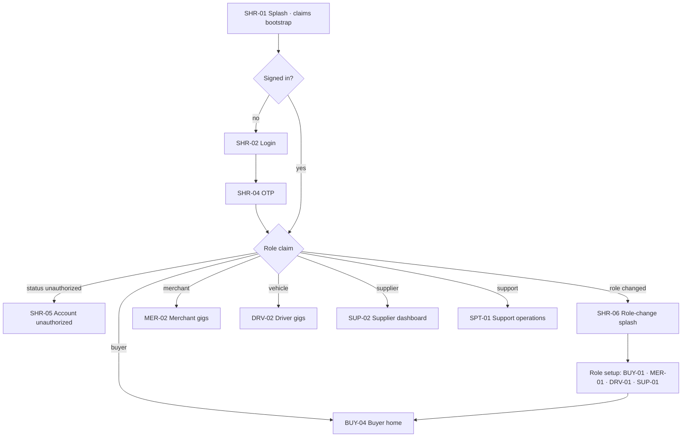
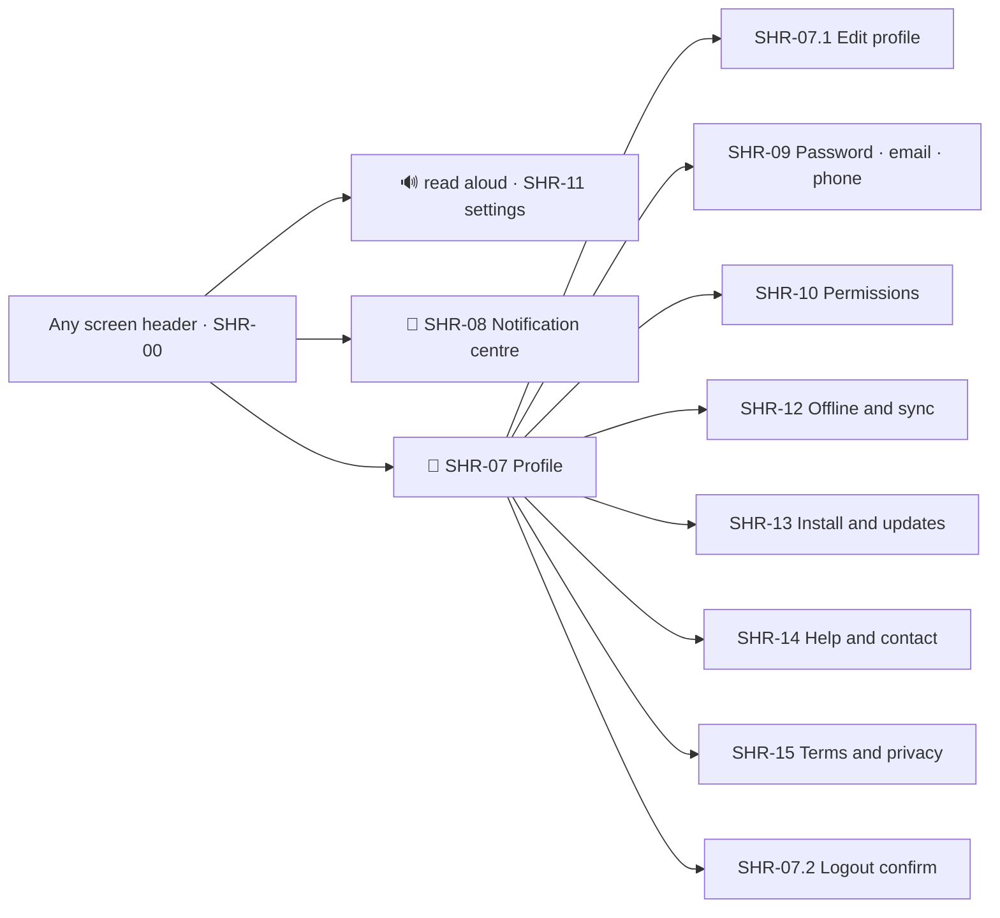
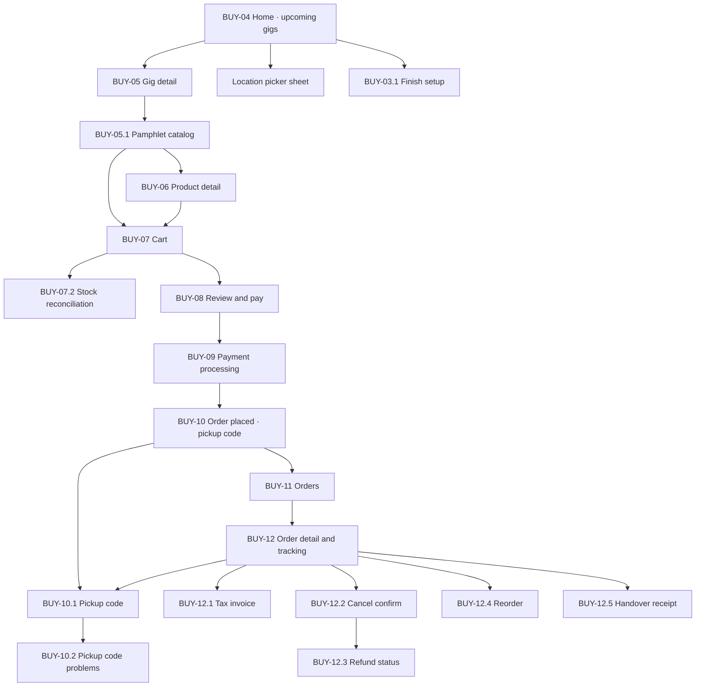
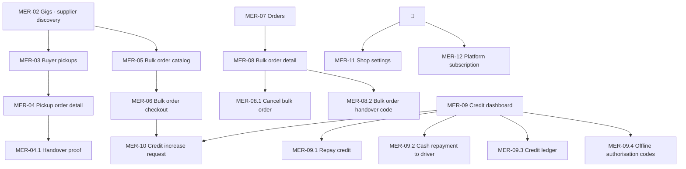
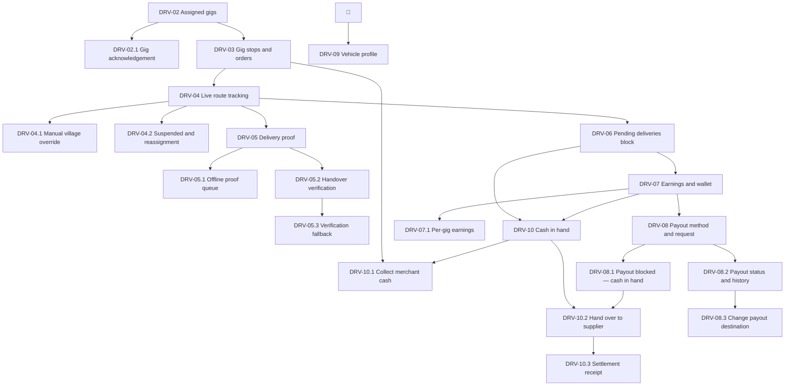
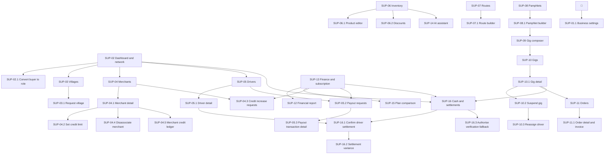

# Navigation and screen registry

Information architecture per role, the route table, back and deep-link behaviour, and the authoritative screen ID registry that maps every screen to its Cloud Functions and its end-to-end test flow. **Which Firestore documents paint a screen, and which control fires which Function, live in that screen's Data block** in the role file ([Patterns.md](Patterns.md) §1A). The Cloud Functions column here is an index, not the implementation contract.

Foundations: [Foundations.md](Foundations.md) · IA and screen IDs: [Navigation.md](Navigation.md) · Shared states, errors, AI and invoice: [Patterns.md](Patterns.md)

Roles: [Shared](Shared.md) · [Buyer](Buyer.md) · [Merchant](Merchant.md) · [Driver](Driver.md) · [Supplier](Supplier.md) · [Support](Support.md)

---

## 1. Screen ID scheme

Screens are identified by a role prefix and a two-digit number. Sub-states of a screen — empty, error, a sheet that belongs to it, a variant — take a decimal suffix. The numbering is stable: a screen keeps its ID for the life of the product even if it moves in the navigation, so specs, tickets, and E2E tests can cite it.

| Prefix | Role file | Bottom nav |
| ------ | --------- | ---------- |
| `SHR` | [Shared.md](Shared.md) | none — chrome, auth, profile, overlays |
| `BUY` | [Buyer.md](Buyer.md) | Home · Cart · Orders |
| `MER` | [Merchant.md](Merchant.md) | Gigs · Orders · Credit |
| `DRV` | [Driver.md](Driver.md) | Gigs · Tracking · Earnings |
| `SUP` | [Supplier.md](Supplier.md) | Dashboard · Gigs · Inventory · Finance |
| `SPT` | [Support.md](Support.md) | Ops · Users · Config · Search |

`BUY-12.1` is the invoice view that belongs to buyer order detail `BUY-12`. A decimal screen is never reachable except through its parent or a deep link that synthesises its parent.

This file is the registry. When a role file draws a screen, it uses the ID assigned here; when a new screen is drawn, it is added here first.

---

## 2. Global structure

Every authenticated screen shares the same chrome: a header carrying the voice, notification, and profile slots, and a role-specific bottom nav. Profile is never a nav tab.

---

## 3. Per-role information architecture

### Buyer

### Merchant

### Driver

### Supplier

### Support

```mermaid
graph TD
  Ops["SPT-01 Operations dashboard"] --> SuspO["SPT-03 Suspended orders"]
  Ops --> VReq["SPT-04 Village requests"]
  Ops --> Subs["SPT-14 Platform subscriptions"]
  Ops --> Audit["SPT-16 Audit log"]
  Ops --> Cash["SPT-19 Cash custody console"]
  Cash --> Disc["SPT-19.1 Discrepancy resolution"]
  Cash --> Trail["SPT-19.2 Custody audit trail"]
  Disc --> Trail
  Audit --> Trail
  Ops --> MonEx["SPT-20 Payment and payout exceptions"]
  MonEx --> Trail
  Ops --> Recon["SPT-21 Reconciliation workspace"]
  Recon --> Trail
  Ops --> Close["SPT-22 Period close"]
  Close --> Recon
  Close --> Tds
  Users["SPT-02 Users"] --> UDet["SPT-02.1 User detail"]
  UDet --> Susp["SPT-02.2 Suspend or restore"]
  Users --> NewSup["SPT-02.3 Create supplier"]
  UDet --> SupDet["SPT-02.4 Supplier detail"]
  Cfg["SPT-05 Config home"] --> Ctry["SPT-06 Countries"]
  Cfg --> St["SPT-07 States"]
  Cfg --> Dist["SPT-08 Districts"]
  Cfg --> Hubs["SPT-09 Hubs"]
  Hubs --> Hub["SPT-09.1 Hub detail and villages"]
  Hub --> VEd["SPT-09.2 Village editor"]
  VReq --> VEd
  Cfg --> Plans["SPT-10 Plans"]
  Cfg --> Tar["SPT-11 Tariffs"]
  Cfg --> Off["SPT-12 Offers"]
  Off --> Codes["SPT-13 Discount codes"]
  Codes --> Redeem["SPT-13.1 Redemption audit"]
  Cfg --> Subs
  Cfg --> Tax["SPT-23 Tax profile and place of supply"]
  Cfg --> Tds["SPT-24 TDS register"]
  Search["SPT-15 Search and explorer"] --> Rec["SPT-15.1 Record detail"]
  Ctry --> Blocked["SPT-17 Deactivation blocked"]
```

Support is the one role with a desktop stance: `SPT-18` defines how every screen above reflows above 1024px.

---

## 4. Route table

Routes are client-side PWA paths. Role prefixes are **separate HTML entries** on one Vite kernel (`constitution/Logikchain_Architecture.md` §2a). Hosting and the Vite dev server rewrite each prefix to that role's `index.html` so a buyer never downloads Support chrome. The service worker must not navigate-fallback `/m`, `/d`, `/s`, or `/x` into the buyer shell.

| Prefix | Role |
| ------ | ---- |
| `/` | Shared and Buyer (the default self-registered role) |
| `/m/` | Merchant |
| `/d/` | Driver (vehicle) |
| `/s/` | Supplier |
| `/x/` | Support |

| Route | Screen |
| ----- | ------ |
| `/` | `SHR-01` splash and claims bootstrap |
| `/login` | `SHR-02` login and register |
| `/language` | `SHR-03` pre-auth language picker |
| `/login/verify` | `SHR-04` OTP verification |
| `/unauthorized` | `SHR-05` account unauthorized |
| `/role-changed` | `SHR-06` role-change splash |
| `/profile` | `SHR-07` profile |
| `/profile/edit` | `SHR-07.1` edit profile |
| `/notifications` | `SHR-08` notification centre |
| `/notifications/settings` | `SHR-08.1` notification settings |
| `/profile/security` | `SHR-09` password, email, phone |
| `/profile/permissions` | `SHR-10` permissions manager |
| `/profile/voice` | `SHR-11` language, voice and audio |
| `/sync` | `SHR-12` offline and sync centre |
| `/install` | `SHR-13` install and updates |
| `/help` | `SHR-14` help and contact |
| `/legal/:doc` | `SHR-15` terms, privacy, consent |
| `/setup` | `BUY-01` … `BUY-03` buyer setup wizard |
| `/home` | `BUY-04` buyer home |
| `/gigs/:gigId` | `BUY-05` gig detail |
| `/gigs/:gigId/pamphlet` | `BUY-05.1` pamphlet catalog |
| `/cart` | `BUY-07` cart |
| `/checkout` | `BUY-08` review and pay |
| `/checkout/processing` | `BUY-09` payment processing |
| `/orders` | `BUY-11` orders |
| `/orders/:orderId` | `BUY-12` order detail and tracking |
| `/orders/:orderId/pickup-code` | `BUY-10.1` pickup code |
| `/orders/:orderId/invoice` | `BUY-12.1` tax invoice |
| `/orders/:orderId/refund` | `BUY-12.3` refund status |
| `/orders/:orderId/receipt` | `BUY-12.5` handover receipt |
| `/m/setup` | `MER-01` merchant setup |
| `/m/gigs` | `MER-02` gigs |
| `/m/gigs/:gigId` | `MER-03` buyer pickups |
| `/m/pickups/:orderId` | `MER-04` pickup order detail |
| `/m/bulk/new` | `MER-05` bulk order catalog |
| `/m/bulk/review` | `MER-06` bulk order checkout |
| `/m/orders` | `MER-07` orders |
| `/m/orders/:merchantOrderId` | `MER-08` bulk order detail |
| `/m/orders/:merchantOrderId/handover-code` | `MER-08.2` bulk order handover code |
| `/m/credit` | `MER-09` credit dashboard |
| `/m/credit/repay` | `MER-09.1` repay credit |
| `/m/credit/collect/:custodyTransferId` | `MER-09.2` cash repayment to driver |
| `/m/credit/ledger` | `MER-09.3` credit ledger |
| `/m/credit/codes` | `MER-09.4` offline authorisation codes |
| `/m/credit/requests` | `MER-10` credit increase requests |
| `/m/shop` | `MER-11` shop settings |
| `/m/subscription` | `MER-12` platform subscription |
| `/d/setup` | `DRV-01` driver setup |
| `/d/gigs` | `DRV-02` assigned gigs |
| `/d/gigs/:gigId` | `DRV-02.1` gig acknowledgement |
| `/d/gigs/:gigId/stop/:index` | `DRV-03` gig stops and orders |
| `/d/tracking` | `DRV-04` live route tracking |
| `/d/tracking/uploads` | `DRV-05.1` offline proof queue |
| `/d/earnings` | `DRV-07` earnings and wallet |
| `/d/earnings/gig/:gigId` | `DRV-07.1` per-gig earnings |
| `/d/earnings/payout` | `DRV-08` payout method and request |
| `/d/earnings/payout/history` | `DRV-08.2` payout status and history |
| `/d/earnings/payout/destination` | `DRV-08.3` change payout destination |
| `/d/cash` | `DRV-10` cash in hand |
| `/d/cash/collect/:merchantId` | `DRV-10.1` collect merchant cash |
| `/d/cash/handover/:settlementId` | `DRV-10.2` hand over to supplier |
| `/d/cash/settlement/:settlementId` | `DRV-10.3` settlement receipt |
| `/d/vehicle` | `DRV-09` vehicle profile |
| `/s/setup` | `SUP-01` supplier first-run setup |
| `/s/settings` | `SUP-01.1` business settings |
| `/s/dashboard` | `SUP-02` dashboard and network |
| `/s/villages` | `SUP-03` villages |
| `/s/merchants` | `SUP-04` merchants |
| `/s/merchants/:merchantId` | `SUP-04.1` merchant detail |
| `/s/merchants/:merchantId/ledger` | `SUP-04.5` merchant credit ledger |
| `/s/credit-requests` | `SUP-04.3` credit increase requests |
| `/s/drivers` | `SUP-05` drivers |
| `/s/drivers/:driverId` | `SUP-05.1` driver detail |
| `/s/payouts` | `SUP-05.2` payout requests |
| `/s/payouts/:payoutTransactionId` | `SUP-05.3` payout transaction detail |
| `/s/inventory` | `SUP-06` inventory |
| `/s/discounts` | `SUP-06.2` discounts |
| `/s/routes` | `SUP-07` routes |
| `/s/routes/:routeId` | `SUP-07.1` route builder |
| `/s/pamphlets` | `SUP-08` pamphlets |
| `/s/pamphlets/:pamphletId` | `SUP-08.1` pamphlet builder |
| `/s/gigs/new` | `SUP-09` gig composer |
| `/s/gigs` | `SUP-10` gigs |
| `/s/gigs/:gigId` | `SUP-10.1` gig detail |
| `/s/orders` | `SUP-11` orders |
| `/s/orders/:orderId` | `SUP-11.1` order detail and invoice |
| `/s/report` | `SUP-12` financial report |
| `/s/finance` | `SUP-13` finance and subscription |
| `/s/ai` | `SUP-14` AI assistant workspace |
| `/s/plans` | `SUP-15` plan comparison |
| `/s/cash` | `SUP-16` cash and settlements |
| `/s/cash/:settlementId` | `SUP-16.1` confirm driver settlement |
| `/s/cash/:settlementId/variance` | `SUP-16.2` settlement variance |
| `/s/fallbacks` | `SUP-16.3` authorise verification fallback |
| `/x/ops` | `SPT-01` operations dashboard |
| `/x/users` | `SPT-02` users |
| `/x/users/:userId` | `SPT-02.1` user detail |
| `/x/suppliers/:supplierId` | `SPT-02.4` supplier detail |
| `/x/orders/suspended` | `SPT-03` suspended orders |
| `/x/villages/requests` | `SPT-04` village requests |
| `/x/config` | `SPT-05` config home |
| `/x/config/countries` | `SPT-06` countries |
| `/x/config/states` | `SPT-07` states |
| `/x/config/districts` | `SPT-08` districts |
| `/x/config/hubs` | `SPT-09` hubs |
| `/x/config/hubs/:hubId` | `SPT-09.1` hub detail and villages |
| `/x/config/plans` | `SPT-10` plans |
| `/x/config/tariffs` | `SPT-11` tariffs |
| `/x/config/offers` | `SPT-12` offers |
| `/x/config/codes` | `SPT-13` discount codes |
| `/x/config/codes/:code/redemptions` | `SPT-13.1` redemption audit |
| `/x/subscriptions` | `SPT-14` platform subscriptions |
| `/x/search` | `SPT-15` search and database explorer |
| `/x/records/:collection/:id` | `SPT-15.1` record detail |
| `/x/audit` | `SPT-16` audit log |
| `/x/cash` | `SPT-19` cash custody console |
| `/x/cash/discrepancies` | `SPT-19.1` discrepancy resolution |
| `/x/cash/trail/:collection/:id` | `SPT-19.2` custody audit trail |
| `/x/money-exceptions` | `SPT-20` payment and payout exceptions |
| `/x/money-exceptions/:queue` | `SPT-20` opened on a named queue: `payments-pending`, `payouts-failed`, `refunds-approval`, `duplicates` |
| `/x/reconciliation` | `SPT-21` reconciliation workspace |
| `/x/reconciliation/:reconciliationRunId` | `SPT-21` opened on a run |
| `/x/reconciliation/exception/:exceptionId` | `SPT-21` opened on one exception |
| `/x/period-close` | `SPT-22` period close |
| `/x/period-close/:accountingPeriodId` | `SPT-22` opened on a period |
| `/x/config/tax` | `SPT-23` tax profile and place of supply |
| `/x/config/tax/:supplierId` | `SPT-23` opened on a supplier's profile |
| `/x/config/tds` | `SPT-24` TDS register |
| `/x/config/tds/:financialYear/:quarter` | `SPT-24` opened on a quarter |

---

## 5. Back and deep-link behaviour

**Roots and the back stack**

- Each bottom-nav tab is a stack root. Switching tabs preserves each tab's own stack, so a merchant deep in a bulk order who checks Credit returns to the same bulk order.
- Back from a tab root does not exit to another tab. On the first tab it shows a "Press back again to exit" toast; the PWA never closes on a single accidental back.
- Back from a detail screen returns to the list it was opened from, restoring scroll position and any active filter or search term.
- Bottom sheets and dialogs consume the back gesture to dismiss themselves before any navigation happens.
- Setup wizards (`BUY-01` … `BUY-03`, `MER-01`, `DRV-01`, `SUP-01`) are a linear stack; back steps to the previous step, and back from step one returns to the role-change splash or, for a fresh buyer, offers Skip.

**Blocked and redirected navigation**

| Situation | Behaviour |
| --------- | --------- |
| Payment in flight (`BUY-09` processing) | Back is blocked while the gateway call is open. The screen states "Do not close this screen". |
| Order placed (`BUY-10`) | Back is replaced, not pushed — back goes to Home, never to checkout, so no order can be double-placed. |
| `UserStatus: "unauthorized"` | Every route redirects to `SHR-05`; only Profile and Logout remain reachable. |
| No active subscription (supplier) | Compose gig, route creation, and merchant conversion redirect to `SUP-13` with a `SUBSCRIPTION_REQUIRED` banner. Read-only screens stay reachable. |
| Role claim does not match the route prefix | Redirect to that role's home. A buyer typing `/s/dashboard` lands on `/home`. |
| Session expired | `SHR-01.1` dialog over the current screen; on re-auth the user returns to the same route with its parameters. |
| Setup incomplete | No hard block. Home shows the `BUY-03.1` completion card; gig lists stay empty until `villageId` is set. |
| Gig suspended | `DRV-04` locks route actions and shows `DRV-04.2`. Buyer and merchant order screens stay readable. Cash already collected is unaffected: `suspendGig` opens a settlement so the driver can still reach `DRV-10.2`. |
| Driver holds unsettled cash | `DRV-08` blocks the payout request with `CASH_IN_CUSTODY_OUTSTANDING` and redirects to `DRV-08.1`, which links to the open settlement. Earnings screens stay readable. |
| Custody transfer pending | `DRV-06` blocks `completeAndFinalizeGig` with `VERIFICATION_REQUIRED` while a handover is unconfirmed, because the cash total is not knowable until it resolves. |
| Handover rejected on sync | `SHR-12` pins the failed row and `DRV-10.2` stays disabled until it is reported through `raiseCashDiscrepancy`. The row cannot be discarded. |

**Deep links**

Every `Notification.deepLink` resolves to a route in the table above. Opening a deep link cold does not leave the user stranded on a screen with no back target: the router synthesises the parent stack from the ID in the route, so back from `/orders/INV-2408210001` lands on `/orders`, then `/home`.

| Notification category | Deep link | Screen |
| --------------------- | --------- | ------ |
| `gig_arrival` | `/orders/:orderId` | `BUY-12` |
| `gig_assignment` | `/d/gigs/:gigId` | `DRV-02.1` |
| `gig_suspension` | `/d/tracking` or `/orders/:orderId` | `DRV-04.2`, `BUY-12` |
| `order_status` | `/orders/:orderId` or `/m/orders/:merchantOrderId` | `BUY-12`, `MER-08` |
| `credit` | `/m/credit` or `/m/credit/requests` | `MER-09`, `MER-10` |
| `payout` | `/d/earnings`, `/d/earnings/payout/history` or `/s/payouts` | `DRV-07`, `DRV-08.2`, `SUP-05.2` |
| `payment` | `/orders/:orderId` or `/m/credit` | `BUY-12`, `MER-09` |
| `refund` | `/orders/:orderId/refund` | `BUY-12.3` |
| `money_exception` | `/x/money-exceptions/:queue` | `SPT-20` |
| `reconciliation` | `/x/reconciliation/:reconciliationRunId` or `/x/period-close` | `SPT-21`, `SPT-22` |
| `subscription` | `/s/finance` or `/m/subscription` | `SUP-13`, `MER-12` |
| `cash_custody` | `/d/cash`, `/s/cash/:settlementId`, `/m/credit` or `/x/cash/discrepancies` | `DRV-10`, `SUP-16.1`, `MER-09`, `SPT-19.1` |
| `verification` | `/orders/:orderId/pickup-code`, `/m/orders/:merchantOrderId/handover-code`, `/m/credit/collect/:custodyTransferId` or `/s/fallbacks` | `BUY-10.1`, `MER-08.2`, `MER-09.2`, `SUP-16.3` |
| `support` | `/notifications` | `SHR-08` |

If the target document is gone, cancelled, or outside the user's permissions, the deep link resolves to the parent list with an explanatory toast rather than to an error page.

**Scroll and state restoration**

List scroll position, active segmented tab, search text, and filter chips are restored on back. The cart survives a full app restart through `localStorage`; draft route, pamphlet, and gig forms survive a refresh through the same mechanism and are cleared on successful submit.

---

## 6. Screen registry and traceability

Each screen maps to the Cloud Functions it calls and to the end-to-end flows it participates in. Flow letters are the five critical paths in `constitution/Logikchain_AI_Studio_System_Instructions.md`:

| Flow | Path |
| ---- | ---- |
| **A** | Buyer upgrade to driver |
| **B** | Supplier gig and pamphlet creation |
| **C** | Buyer purchase to pickup |
| **D** | Driver live execution |
| **E** | Support configuration and subscription enablement |
| **F** | Merchant credit enablement and repayment |
| **G** | Gig suspension, reassignment and order recovery |
| **H** | Cash custody, handover verification and end-of-gig settlement |
| **I** | Digital money movement, exception handling, reconciliation and period close |

A screen with `—` in the function column is read-only or purely client-side. Read paths use Firestore listeners governed by the security rules, not Cloud Functions. Supplier-owned records (`Product`, `Route`, `Pamphlet`, `Discount`) and Support-owned hubs are direct client writes permitted by the rules, not Cloud Functions.

### Shared

| ID | Screen | Cloud Functions | Flow |
| -- | ------ | --------------- | ---- |
| `SHR-00` | Shared chrome | — | — |
| `SHR-01` | Splash and claims bootstrap | — (custom claim refresh) | A |
| `SHR-01.1` | Session expiry and re-authenticate | `registerDeviceToken` on re-auth | — |
| `SHR-02` | Login and register | `listConfigurationCatalog` | A, C |
| `SHR-03` | Pre-auth language picker | — | — |
| `SHR-04` | OTP verification | `registerDeviceToken` | A, C |
| `SHR-04.1` | OTP invalid code | — | — |
| `SHR-04.2` | OTP too many attempts | — | — |
| `SHR-04.3` | OTP resend exhausted | — | — |
| `SHR-05` | Account unauthorized | — | — |
| `SHR-06` | Role-change splash | — | A |
| `SHR-07` | Profile | — | — |
| `SHR-07.1` | Edit profile | `updateUserProfile` | — |
| `SHR-07.2` | Logout confirm | `registerDeviceToken` with revoke | — |
| `SHR-08` | Notification centre | — | C, D |
| `SHR-08.1` | Notification settings | `updateUserProfile` (`notificationPrefs`) | — |
| `SHR-09` | Credential changes | `updateUserProfile` | — |
| `SHR-09.1` | Change password | — (Firebase Auth) | — |
| `SHR-09.2` | Change email | — (Firebase Auth) | — |
| `SHR-09.3` | Change phone | — (Firebase Auth) | — |
| `SHR-10` | Device permissions manager | `updateUserProfile` | — |
| `SHR-11` | Language, voice and audio UI | `updateUserProfile` (`locale`) | — |
| `SHR-12` | Offline and sync centre | replays queued calls | D |
| `SHR-13` | App install and updates | — | — |
| `SHR-13.1` | Install prompt (Chromium) | — | — |
| `SHR-13.2` | Add to Home Screen (iOS) | — | — |
| `SHR-13.3` | Update available | — | — |
| `SHR-14` | Help and contact | — | — |
| `SHR-15` | Terms, privacy, consent | `requestMyDataExport`, `requestAccountDeletion` | — |

### Buyer

| ID | Screen | Cloud Functions | Flow |
| -- | ------ | --------------- | ---- |
| `BUY-01` | Setup step 1 — permissions | `updateUserProfile` | C |
| `BUY-02` | Setup step 2 — geography | `listConfigurationCatalog`, `updateUserProfile` | C |
| `BUY-03` | Setup step 3 — pickup merchant | `updateUserProfile` | C |
| `BUY-03.1` | Incomplete setup re-entry | — | C |
| `BUY-04` | Home — upcoming gigs | — | C |
| `BUY-04.1` | Home — no gigs in village | — | — |
| `BUY-04.2` | Home — offline and GPS denied | — | — |
| `BUY-05` | Gig detail | — | C |
| `BUY-05.1` | Pamphlet catalog — search and filter | — | C |
| `BUY-06` | Product detail sheet | — | C |
| `BUY-07` | Cart | — | C |
| `BUY-07.1` | Cart — empty | — | — |
| `BUY-07.2` | Cart — stock reconciliation | — | C |
| `BUY-07.3` | Cart — gig conflict | — | — |
| `BUY-08` | Order review and payment method | `placeOrder`, `createPaymentIntent` | C |
| `BUY-09` | Payment processing, failure, pending | `processPayment`, `cancelOrder` | C |
| `BUY-10` | Order placed — pickup code | — | C, D |
| `BUY-10.1` | Pickup code | `resendHandoverCode` | C, D, H |
| `BUY-10.2` | Pickup code problems | `resendHandoverCode` | H |
| `BUY-11` | Orders list | — | C |
| `BUY-12` | Order detail and live tracking | — | C, D |
| `BUY-12.1` | Invoice view and download | — | C |
| `BUY-12.2` | Cancel order confirm | `cancelOrder`, `refundOrder` | — |
| `BUY-12.3` | Refund status | — | — |
| `BUY-12.4` | Reorder | — | — |
| `BUY-12.5` | Handover receipt | `raiseCashDiscrepancy` | H |

### Merchant

| ID | Screen | Cloud Functions | Flow |
| -- | ------ | --------------- | ---- |
| `MER-01` | Merchant setup | `updateUserProfile` | A |
| `MER-02` | Gigs — supplier discovery | — | C |
| `MER-03` | Buyer pickup orders list | — | C, D |
| `MER-04` | Buyer pickup order detail | — | C, D |
| `MER-04.1` | Handover proof sheet | `markOrderDelivered`, `resendHandoverCode` | D, H |
| `MER-05` | Bulk order catalog | — | — |
| `MER-06` | Bulk order checkout | `placeMerchantOrder` (requires `gigId`), `requestCreditIncrease`, `createPaymentIntent` | F |
| `MER-07` | Orders tab | — | — |
| `MER-08` | Merchant order detail and tracking | `updateMerchantOrderStatus` | D |
| `MER-08.1` | Cancel bulk order | `cancelMerchantOrder`, `refundOrder` | — |
| `MER-08.2` | Bulk order handover code | `resendHandoverCode`, `updateMerchantOrderStatus` | D, H |
| `MER-09` | Credit dashboard | — | F |
| `MER-09.1` | Credit repayment and receipt | `createPaymentIntent`, `processPayment` | F |
| `MER-09.2` | Cash repayment to driver | `raiseCashDiscrepancy` | F, H |
| `MER-09.3` | Credit ledger | — | F, H |
| `MER-09.4` | Offline authorisation codes | `issueOfflineCodeBatch` | H |
| `MER-10` | Credit increase request and status | `requestCreditIncrease` | F |
| `MER-11` | Shop settings | `updateUserProfile` | — |
| `MER-12` | Platform subscription | `subscribeToPlan`, `cancelSubscription`, `processPayment` | E |

### Driver

| ID | Screen | Cloud Functions | Flow |
| -- | ------ | --------------- | ---- |
| `DRV-01` | Driver setup | `updateUserProfile` | A |
| `DRV-02` | Assigned gigs | — | A, D |
| `DRV-02.1` | Gig acknowledgement | `acknowledgeGig` | D |
| `DRV-03` | Gig stops and orders by village | `updateMerchantOrderStatus` | D, H |
| `DRV-04` | Live route tracking | `startGig`, `updateGigLocation`, `completeAndFinalizeGig` | D |
| `DRV-04.1` | Manual village override | `updateGigLocation` | D |
| `DRV-04.2` | Suspended gig and reassignment | — (`suspendGig` and `reassignGigDriver` are supplier-side) | D, H |
| `DRV-05` | Delivery proof sheet | `markOrderDelivered` | D |
| `DRV-05.1` | Offline proof queue | replays `markOrderDelivered`, `raiseCashDiscrepancy` | D, H |
| `DRV-05.2` | Handover verification | `markOrderDelivered`, `resendHandoverCode`, `raiseCashDiscrepancy` | D, H |
| `DRV-05.3` | Verification fallback | `markOrderDelivered`, `updateMerchantOrderStatus`, `requestVerificationFallback` | H |
| `DRV-06` | End gig blocked — pending deliveries | `completeAndFinalizeGig` | D, H |
| `DRV-07` | Earnings and wallet | `getTdsRegister` (own rows only) | D |
| `DRV-07.1` | Per-gig earnings detail | — | D |
| `DRV-08` | Payout method and request | `registerPayoutBeneficiary`, `requestPayout` | — |
| `DRV-08.1` | Payout blocked — cash in hand | `getCashCustodySummary` | H |
| `DRV-08.2` | Payout status and history | `retryPayout` | — |
| `DRV-08.3` | Change payout destination | `registerPayoutBeneficiary` | — |
| `DRV-09` | Vehicle profile | `updateUserProfile` (includes `vehicleCapacityKg`) | A |
| `DRV-10` | Cash in hand | `getCashCustodySummary` | H |
| `DRV-10.1` | Collect merchant cash | `initiateCreditRepayment`, `confirmCreditRepayment`, `resendHandoverCode` | F, H |
| `DRV-10.2` | Hand over to supplier | `declareCashHandover`, `confirmCashSettlement`, `resendHandoverCode` | H |
| `DRV-10.3` | Settlement receipt | `raiseCashDiscrepancy` | H |

### Supplier

| ID | Screen | Cloud Functions | Flow |
| -- | ------ | --------------- | ---- |
| `SUP-01` | First-run setup | `updateUserProfile`, `listConfigurationCatalog` | E |
| `SUP-01.1` | Business settings | `updateUserProfile`, `updateDriverPayRates` | — |
| `SUP-02` | Dashboard and network | — | A |
| `SUP-02.1` | Convert buyer to role | `convertBuyerToRole` | A |
| `SUP-03` | Villages | — | — |
| `SUP-03.1` | Request new village | `requestVillage` | — |
| `SUP-04` | Merchants | — | — |
| `SUP-04.1` | Merchant detail | — | — |
| `SUP-04.2` | Set credit limit | `setMerchantCreditLimit` | F |
| `SUP-04.3` | Credit increase requests | `reviewCreditIncreaseRequest`, `setMerchantCreditLimit` | F |
| `SUP-04.4` | Disassociate merchant | `disassociateMerchant` | — |
| `SUP-04.5` | Merchant credit ledger | `exportFinanceReport` (`credit_ledger`) | F, H |
| `SUP-05` | Drivers | — | — |
| `SUP-05.1` | Driver detail | `getCashCustodySummary` | H |
| `SUP-05.2` | Payout requests | `reviewPayoutRequest` | H |
| `SUP-05.3` | Payout transaction detail | `retryPayout`, `exportFinanceReport` (`payout_evidence`) | — |
| `SUP-06` | Inventory | — | B |
| `SUP-06.1` | Add / edit product | `adjustProductStock` (stock); other fields direct write | B |
| `SUP-06.2` | Discounts | — (direct write, supplier-owned) | B |
| `SUP-07` | Routes | — | B |
| `SUP-07.1` | Route builder | `computeRouteMetrics`; Save is direct write | B |
| `SUP-08` | Pamphlets | — | B |
| `SUP-08.1` | Pamphlet builder | — (direct write, supplier-owned) | B |
| `SUP-09` | Gig composer | `composeGig` | B |
| `SUP-10` | Gigs list | — | B, D |
| `SUP-10.1` | Gig detail | `getCashCustodySummary` | D, H |
| `SUP-10.2` | Suspend gig | `suspendGig` | D, H |
| `SUP-10.3` | Reassign driver | `reassignGigDriver` | D |
| `SUP-11` | Orders | — | C, D |
| `SUP-11.1` | Order detail and invoice | `cancelOrder`, `refundOrder` | C |
| `SUP-12` | Financial report | `getFinancialReport`, `getFinanceReport`, `exportFinanceReport`, `scheduleFinanceReport`, `getEntitlements`, `getTdsRegister` | — |
| `SUP-13` | Finance and subscription | `getEntitlements`, `cancelSubscription`, `createPaymentIntent`, `processPayment` | E |
| `SUP-14` | AI assistant workspace | — (Gemini, then direct write) | B |
| `SUP-15` | Plan comparison | `listConfigurationCatalog`, `getEntitlements`, `subscribeToPlan`, `previewPlanChange`, `changeSubscriptionPlan` | E |
| `SUP-16` | Cash and settlements | `getCashCustodySummary`, `issueOfflineCodeBatch` | H |
| `SUP-16.1` | Confirm driver settlement | `confirmCashSettlement`, `resendHandoverCode` | H |
| `SUP-16.2` | Settlement variance | `raiseCashDiscrepancy`, `resolveCashDiscrepancy` | H |
| `SUP-16.3` | Authorise verification fallback | `authorizeVerificationFallback` (lists `VerificationFallbackRequests`) | H |

### Support

| ID | Screen | Cloud Functions | Flow |
| -- | ------ | --------------- | ---- |
| `SPT-01` | Operations dashboard | `getCashCustodySummary`, `getSystemHealth` | H |
| `SPT-02` | Users | — | E |
| `SPT-02.1` | User detail | — | — |
| `SPT-02.2` | Suspend or restore user | `suspendUser`, `restoreUser` | — |
| `SPT-02.3` | Create supplier | `createSupplier` | E |
| `SPT-02.4` | Supplier detail | `assignSubscription`, `cancelSubscription`, `upsertRoute` | E |
| `SPT-03` | Suspended orders queue | `cancelOrder`, `cancelMerchantOrder`, `refundOrder`, `reassignOrderMerchant`, `resumeOrderOnGig`, `exportFinanceReport` | — |
| `SPT-04` | Village requests queue | `upsertVillage`, `rejectVillageRequest` | E |
| `SPT-05` | Config home | `listConfigurationCatalog` | E |
| `SPT-06` | Countries | `upsertCountry`, `deactivateConfigurationRecord` | E |
| `SPT-07` | States | `upsertState`, `deactivateConfigurationRecord` | E |
| `SPT-08` | Districts | `upsertDistrict`, `deactivateConfigurationRecord` | E |
| `SPT-09` | Hubs | — (direct write, Support-owned) | E |
| `SPT-09.1` | Hub detail and villages | `upsertVillage` | E |
| `SPT-09.2` | Village editor | `upsertVillage` | E |
| `SPT-10` | Subscription plans | `upsertSubscriptionPlan`, `deactivateConfigurationRecord` | E |
| `SPT-11` | Plan tariffs | `upsertPlanTariff`, `deactivateConfigurationRecord` | E |
| `SPT-12` | Offers | `upsertSubscriptionOffer`, `deactivateConfigurationRecord` | E |
| `SPT-13` | Offer discount codes | `upsertOfferDiscountCode`, `deactivateConfigurationRecord` | E |
| `SPT-13.1` | Redemption audit | — | E |
| `SPT-14` | Platform subscriptions | `assignSubscription`, `cancelSubscription`, `processPayment`, `extendSubscriptionGrace`, `exportFinanceReport` | E |
| `SPT-15` | Search and database explorer | — | E |
| `SPT-15.1` | Record detail | matching `upsert*` | E |
| `SPT-16` | Audit log | — | — |
| `SPT-17` | Deactivation blocked | `deactivateConfigurationRecord` | E |
| `SPT-18` | Responsive desktop layout | — | — |
| `SPT-19` | Cash custody console | `getCashCustodySummary` | H |
| `SPT-19.1` | Discrepancy resolution | `resolveCashDiscrepancy`, `raiseCashDiscrepancy` | H |
| `SPT-19.2` | Custody audit trail | `authorizeVerificationFallback`, `raiseCashDiscrepancy` | H |
| `SPT-20` | Payment and payout exceptions | `handleGatewayWebhook`, `resolveReconciliationException`, `refundOrder`, `retryPayout`, `verifyManualPayout`, `blockPayoutBeneficiary`, `issueCreditNote` | E, I |
| `SPT-21` | Reconciliation workspace | `runReconciliation`, `resolveReconciliationException` | E, I |
| `SPT-22` | Period close | `runReconciliation`, `closeAccountingPeriod`, `reopenAccountingPeriod` | E, I |
| `SPT-23` | Tax profile and place of supply | `upsertTaxProfile` | I |
| `SPT-24` | TDS register | `upsertTdsConfiguration`, `recordTdsChallan`, `issueTdsCertificate`, `getTdsRegister`, `exportFinanceReport` | I |

### Coverage check

Every Cloud Function in [Logikchain_API_Specifications.md](../Logikchain_API_Specifications.md) has at least one screen that calls it:

| Function | Called from |
| -------- | ----------- |
| `createSupplier` | `SPT-02.3` |
| `convertBuyerToRole` | `SUP-02.1` |
| `updateUserProfile` | `SHR-07.1`, `SHR-09`, `SHR-10`, `BUY-01`–`BUY-03`, `MER-01`, `MER-11`, `DRV-01`, `DRV-09`, `SUP-01`, `SUP-01.1` |
| `disassociateMerchant` | `SUP-04.4` |
| `composeGig` | `SUP-09` |
| `startGig` | `DRV-04` |
| `updateGigLocation` | `DRV-04`, `DRV-04.1` |
| `completeAndFinalizeGig` | `DRV-04`, `DRV-06` |
| `suspendGig` | `SUP-10.2` |
| `reassignGigDriver` | `SUP-10.3` |
| `placeOrder` | `BUY-08` |
| `cancelOrder` | `BUY-09`, `BUY-12.2`, `SUP-11.1`, `SPT-03` |
| `markOrderDelivered` | `DRV-05`, `DRV-05.1`, `DRV-05.2`, `DRV-05.3`, `MER-04.1` |
| `placeMerchantOrder` | `MER-06` |
| `updateMerchantOrderStatus` | `DRV-03`, `DRV-05.3`, `MER-08`, `MER-08.2` |
| `cancelMerchantOrder` | `MER-08.1`, `SPT-03` |
| `requestCreditIncrease` | `MER-06`, `MER-10` |
| `setMerchantCreditLimit` | `SUP-04.2` |
| `reviewCreditIncreaseRequest` | `SUP-04.3` |
| `createPaymentIntent` | `BUY-08`, `MER-06`, `MER-09.1`, `MER-12`, `SUP-13` |
| `processPayment` | `BUY-09`, `MER-09.1`, `MER-12`, `SUP-13`, `SPT-14` |
| `refundOrder` | `BUY-12.2`, `MER-08.1`, `SUP-11.1`, `SPT-03`, `SPT-20` |
| `handleGatewayWebhook` | — (provider-invoked; no screen. Its effects surface on `BUY-09`, `DRV-08.2`, `SUP-05.2`, `SPT-20`) |
| `requestPayout` | `DRV-08` |
| `reviewPayoutRequest` | `SUP-05.2` |
| `registerPayoutBeneficiary` | `DRV-08`, `DRV-08.3` |
| `blockPayoutBeneficiary` | `SPT-20` |
| `initiatePayoutTransfer` | — (system-invoked on approval; its effects surface on `DRV-08.2`, `SUP-05.3`) |
| `recordPayoutSettlement` | — (webhook-invoked; its effects surface on `DRV-08.2`, `SUP-05.3`) |
| `verifyManualPayout` | `SPT-20` |
| `retryPayout` | `DRV-08.2`, `SUP-05.3` |
| `resendHandoverCode` | `BUY-10.1`, `BUY-10.2`, `MER-04.1`, `MER-08.2`, `DRV-05.2`, `DRV-10.1`, `DRV-10.2`, `SUP-16.1` |
| `issueOfflineCodeBatch` | `MER-09.4`, `SUP-16` |
| `authorizeVerificationFallback` | `SUP-16.3`, `SPT-19.2` |
| `initiateCreditRepayment` | `DRV-10.1` |
| `confirmCreditRepayment` | `DRV-10.1` |
| `getCashCustodySummary` | `DRV-08.1`, `DRV-10`, `SUP-05.1`, `SUP-10.1`, `SUP-16`, `SPT-01`, `SPT-19` |
| `declareCashHandover` | `DRV-10.2` |
| `confirmCashSettlement` | `DRV-10.2`, `SUP-16.1` |
| `raiseCashDiscrepancy` | `BUY-12.5`, `MER-09.2`, `DRV-05.1`, `DRV-05.2`, `DRV-10.3`, `SUP-16.2`, `SPT-19.1` |
| `resolveCashDiscrepancy` | `SUP-16.2`, `SPT-19.1` |
| `getFinancialReport` | `SUP-12` (the ungated operational revenue summary every subscribed Supplier sees) |
| `getFinanceReport` | `SUP-12`, `MER-09` |
| `exportFinanceReport` | `SUP-12`, `MER-09` |
| `scheduleFinanceReport` | `SUP-12` |
| `runReconciliation` | `SPT-21`, `SPT-22` |
| `resolveReconciliationException` | `SPT-20`, `SPT-21` |
| `closeAccountingPeriod` | `SPT-22` |
| `reopenAccountingPeriod` | `SPT-22` |
| `issueCreditNote` | `SUP-11.1`, `SPT-20` |
| `upsertTaxProfile` | `SPT-23` |
| `upsertTdsConfiguration` | `SPT-24` |
| `recordTdsChallan` | `SPT-24` |
| `issueTdsCertificate` | `SPT-24` |
| `getTdsRegister` | `SPT-24`, `SUP-12`, `DRV-07` |
| `requestVillage` | `SUP-03.1` |
| `upsertVillage` | `SPT-04`, `SPT-09.1`, `SPT-09.2` |
| `upsertCountry` | `SPT-06` |
| `upsertState` | `SPT-07` |
| `upsertDistrict` | `SPT-08` |
| `upsertSubscriptionPlan` | `SPT-10` |
| `upsertPlanTariff` | `SPT-11` |
| `upsertSubscriptionOffer` | `SPT-12` |
| `upsertOfferDiscountCode` | `SPT-13` |
| `deactivateConfigurationRecord` | `SPT-06`–`SPT-13`, `SPT-17` |
| `listConfigurationCatalog` | `SHR-02`, `BUY-02`, `SUP-01`, `SUP-15`, `SPT-05` |
| `assignSubscription` | `SPT-02.4`, `SPT-14` |
| `subscribeToPlan` | `MER-12`, `SUP-15` |
| `previewPlanChange` | `MER-12`, `SUP-15`, `SUP-12`, `MER-09` (upgrade preview inside a locked report) |
| `changeSubscriptionPlan` | `MER-12`, `SUP-15` |
| `getEntitlements` | `SUP-12`, `SUP-13`, `SUP-15`, `MER-09`, `MER-12`, `SPT-10` |
| `cancelSubscription` | `MER-12`, `SUP-13`, `SPT-02.4`, `SPT-14` |
| `registerDeviceToken` | `SHR-04`, `SHR-01.1`, `SHR-07.2` |
| `acknowledgeGig` | `DRV-02.1` |
| `adjustProductStock` | `SUP-06.1`, `SUP-14` |
| `updateDriverPayRates` | `SUP-01.1` |
| `requestVerificationFallback` | `DRV-05.3` |
| `rejectVillageRequest` | `SPT-04` |
| `reassignOrderMerchant` | `SPT-03` |
| `resumeOrderOnGig` | `SPT-03` |
| `extendSubscriptionGrace` | `SPT-14` |
| `computeRouteMetrics` | `SUP-07.1` |
| `upsertRoute` | `SPT-02.4` |
| `getSystemHealth` | `SPT-01` |
| `requestMyDataExport` | `SHR-15` |
| `requestAccountDeletion` | `SHR-15` |

Conversely, no screen in the registry calls a function that does not exist in [Logikchain_API_Specifications.md](../Logikchain_API_Specifications.md). When a new button needs server state, the function is specified first.

The former allow-list gaps are closed: `SHR-08.1` persists `notificationPrefs` through `updateUserProfile` (and FCM honours muted categories before send); `SHR-11` persists `locale`; `SPT-02.2` calls `suspendUser` / `restoreUser` (including Support admitting `"unauthorized"`).
