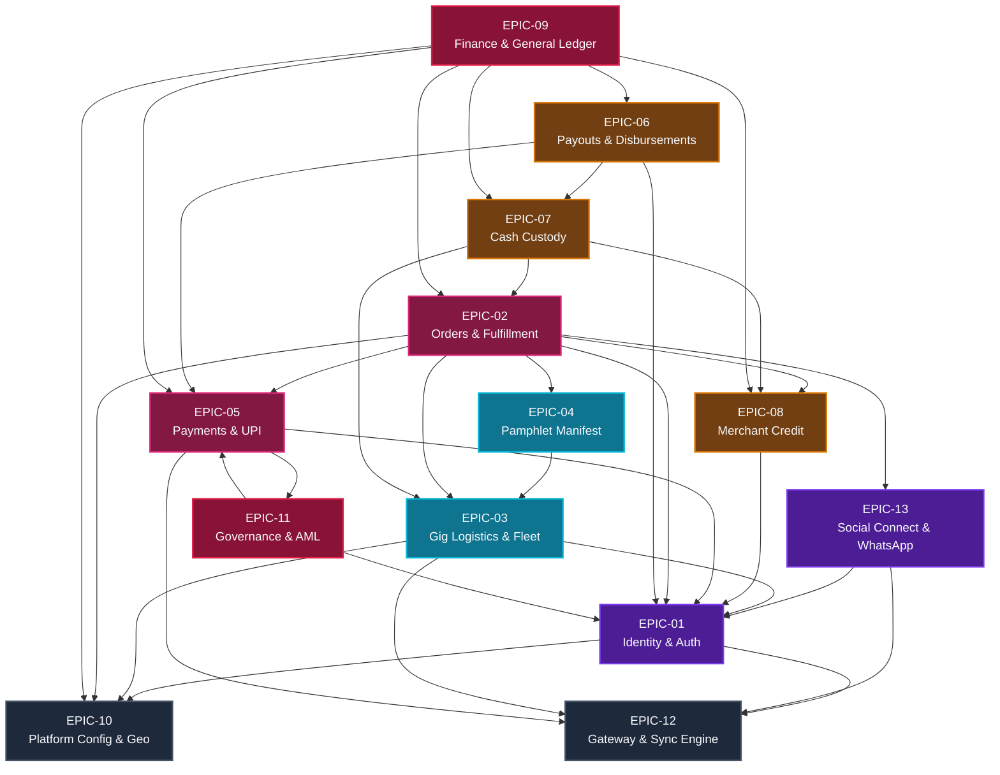
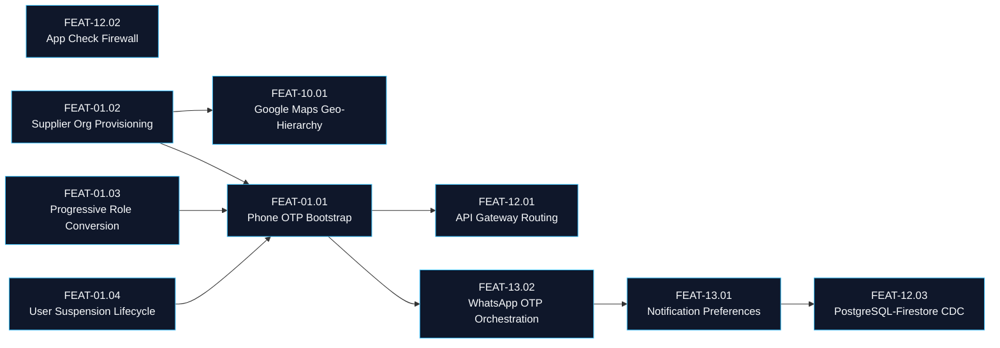
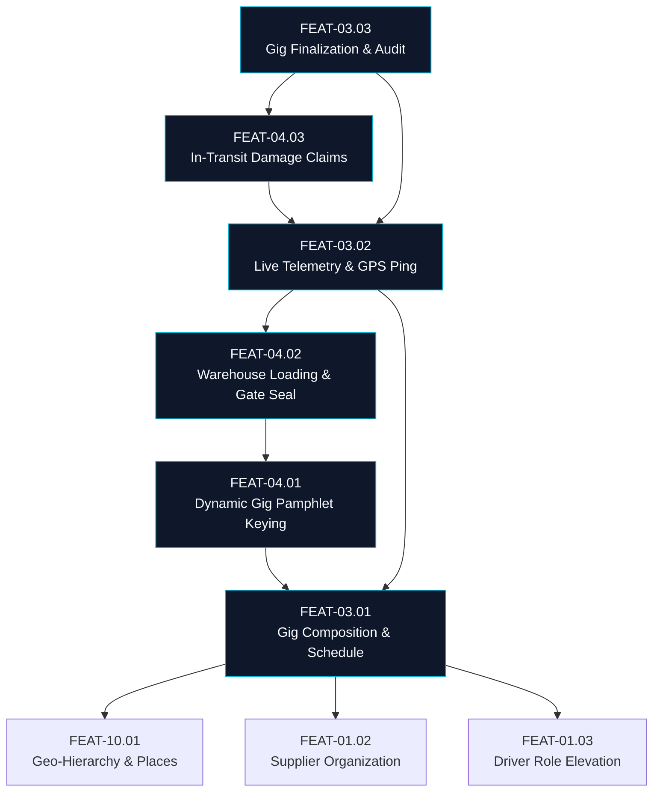
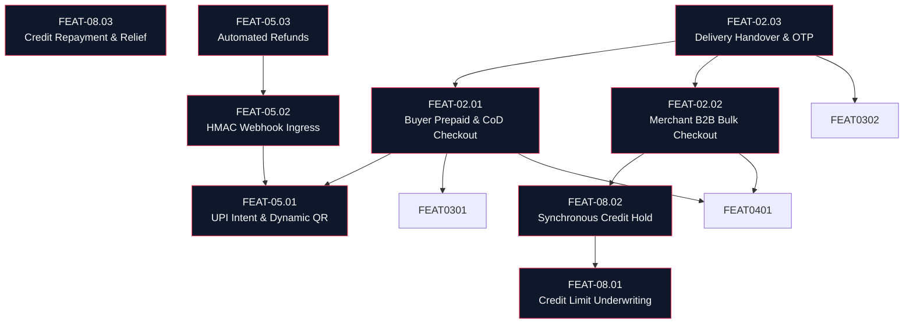
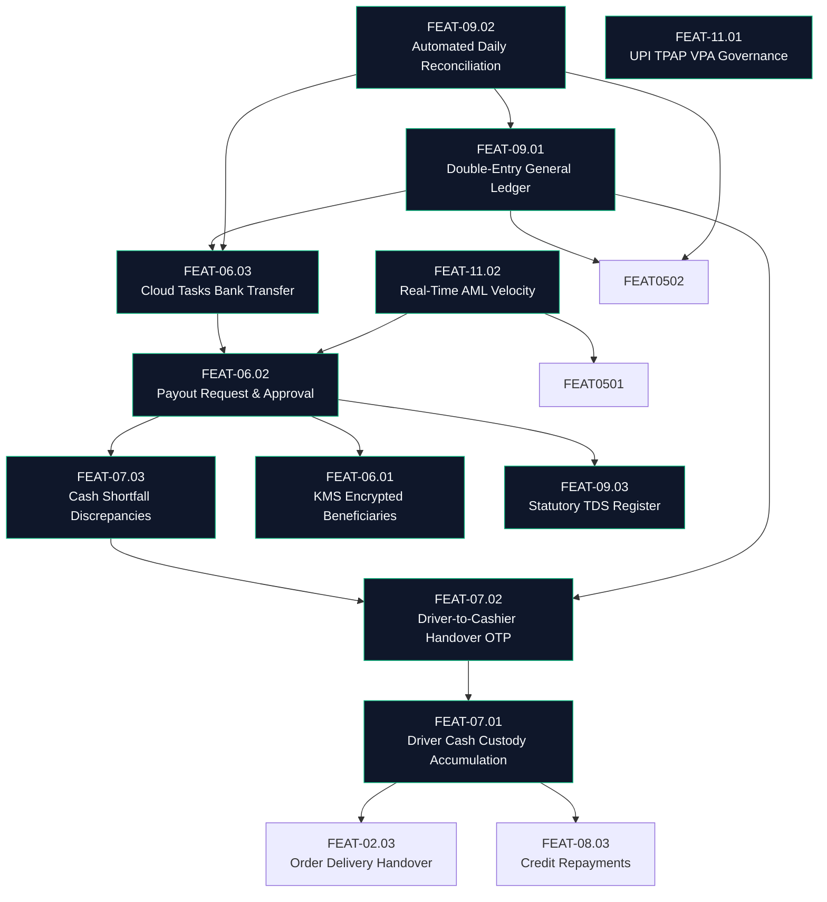

# Logikchain Work Management Dependency Graph (Epic & Feature Level)

This document maps all architectural, functional, and execution dependencies across the **13 Functional Epics** and their constituent **Features** in the Logikchain microservices ecosystem.

---

## 1. High-Level Architectural Tiers

To build, test, and deploy Logikchain reliably, work items are structured into 6 sequential dependency tiers:

```text
┌─────────────────────────────────────────────────────────────────────────────┐
│                    TIER 5: GOVERNANCE, AUDIT & RECONCILIATION               │
│         EPIC-09: Financial Ledger & Tax  ·  EPIC-11: TPAP & AML             │
└──────────────────────────────────────▲──────────────────────────────────────┘
                                       │
┌──────────────────────────────────────┴──────────────────────────────────────┐
│                    TIER 4: FIELD CUSTODY & DISBURSEMENTS                    │
│            EPIC-07: Cash Custody  ·  EPIC-06: Payouts & Banking             │
└──────────────────────────────────────▲──────────────────────────────────────┘
                                       │
┌──────────────────────────────────────┴──────────────────────────────────────┐
│                    TIER 3: COMMERCE & CREDIT TRANSACTIONS                   │
│             EPIC-02: Orders  ·  EPIC-05: Payments  ·  EPIC-08: Credit       │
└──────────────────────────────────────▲──────────────────────────────────────┘
                                       │
┌──────────────────────────────────────┴──────────────────────────────────────┐
│                    TIER 2: FLEET DISPATCH & INVENTORY                       │
│             EPIC-03: Gig Logistics  ·  EPIC-04: Dynamic Pamphlet            │
└──────────────────────────────────────▲──────────────────────────────────────┘
                                       │
┌──────────────────────────────────────┴──────────────────────────────────────┐
│                    TIER 1: IDENTITY & USER INTERACTION                      │
│             EPIC-01: Identity & Roles  ·  EPIC-13: Social Connect           │
└──────────────────────────────────────▲──────────────────────────────────────┘
                                       │
┌──────────────────────────────────────┴──────────────────────────────────────┐
│                    TIER 0: FOUNDATION & INGRESS PERIMETER                   │
│         EPIC-10: Config & Geo-Hierarchy  ·  EPIC-12: Gateway & Sync Engine  │
└─────────────────────────────────────────────────────────────────────────────┘
```

---

## 1.1 Status & Execution Health Matrix (Fact of Truth Summary)

The table below reflects the canonical status of all 13 platform Epics and their multi-client delivery scope, maintained across the Markdown specifications (`work-management/EPIC-*.md`):

| Epic ID | Title | Functional Service | Port | Epic Status | Features | Total Stories | Multi-Client Scope | Cloud Test Project |
| :--- | :--- | :--- | :--- | :--- | :---: | :---: | :--- | :--- |
| **`EPIC-10`** | Master Platform Configuration | `config-service` | `:4010` | **`[IN_PROGRESS]`** | 3 | 30 | Web PWA, Android, iOS | `logikchain-test` |
| **`EPIC-12`** | API Gateway & CDC Sync Engine | `gateway` / `sync-engine` | `:8080 / :4050` | **`[IN_PROGRESS]`** | 4 | 42 | Web PWA, Android, iOS | `logikchain-test` |
| **`EPIC-13`** | Social Connect & Orchestrator | `social-connect-service` | `:4012` | **`[IN_PROGRESS]`** | 4 | 44 | Web PWA, Android, iOS | `logikchain-test` |
| **`EPIC-01`** | Identity, Roles & Auth | `identity-service` | `:4001` | **`[IN_PROGRESS]`** | 4 | 44 | Web PWA, Android, iOS | `logikchain-test` |
| **`EPIC-03`** | Gig Logistics & Fleet Dispatch | `gigs-service` | `:4003` | **`[READY]`** | 3 | 32 | Web PWA, Android, iOS | `logikchain-test` |
| **`EPIC-04`** | Dynamic Pamphlet Manifest | `pamphlet-service` | `:4004` | **`[READY]`** | 3 | 30 | Web PWA, Android, iOS | `logikchain-test` |
| **`EPIC-08`** | Merchant Trade Credit & Limits| `credit-service` | `:4008` | **`[READY]`** | 3 | 31 | Web PWA, Android, iOS | `logikchain-test` |
| **`EPIC-05`** | Payments & UPI Ingress | `payments-service` | `:4005` | **`[READY]`** | 3 | 33 | Web PWA, Android, iOS | `logikchain-test` |
| **`EPIC-02`** | Orders & Delivery Handover | `orders-service` | `:4002` | **`[READY]`** | 3 | 35 | Web PWA, Android, iOS | `logikchain-test` |
| **`EPIC-07`** | Cash Custody & Rural CoD | `cash-service` | `:4007` | **`[READY]`** | 3 | 33 | Web PWA, Android, iOS | `logikchain-test` |
| **`EPIC-06`** | Payouts & Cloud Tasks Bank | `payouts-service` | `:4006` | **`[READY]`** | 3 | 34 | Web PWA, Android, iOS | `logikchain-test` |
| **`EPIC-11`** | Platform Governance & AML | `governance-service` | `:4011` | **`[READY]`** | 3 | 30 | Web PWA, Android, iOS | `logikchain-test` |
| **`EPIC-09`** | General Ledger & Tax Accounting| `finance-service` | `:4009` | **`[READY]`** | 3 | 31 | Web PWA, Android, iOS | `logikchain-test` |
| **TOTALS** | **13 Platform Epics** | **13 Microservices** | — | — | **41** | **419** | **100% 3-Tier Client Scope** | **Cloud Run & Firebase Hosting** |

---

## 2. Epic-Level Dependency Graph

The directed graph below illustrates the inter-epic dependencies. An arrow $A \rightarrow B$ indicates that **$A$ depends on $B$** (i.e., $B$ must be built, mocked, or running before $A$ can function end-to-end):



---

## 3. Feature-Level Dependency Breakdown

### 3.1. Foundation & Identity Cluster (`EPIC-10`, `EPIC-12`, `EPIC-01`, `EPIC-13`)



- **`FEAT-01.01` (Phone Auth Bootstrap)** relies on **`FEAT-13.02` (WhatsApp OTP)** for rural code delivery and **`FEAT-12.01` (API Gateway)** for client routing.
- **`FEAT-01.02` (Supplier Provisioning)** requires **`FEAT-10.01` (Geo-Hierarchy)** to establish country and district operating boundaries.
- **`FEAT-13.01` (Preferences)** synchronizes with Firestore via **`FEAT-12.03` (CDC Sync Engine)**.

---

### 3.2. Fleet Logistics & Inventory Cluster (`EPIC-03`, `EPIC-04`)



- **`FEAT-03.01` (Gig Composition)** invokes **`FEAT-04.01` (Pamphlet Initialization)** on creation to bind the deterministic `{vehicleId}_{startDatetime}` manifest.
- **`FEAT-03.02` (Live Gig Telemetry)** cannot commence until **`FEAT-04.02` (Warehouse Loading & Driver Sign-off)** seals the vehicle manifest.
- **`FEAT-03.03` (Gig Finalization)** audits all un-discharged stock via **`FEAT-04.03` (Damage Adjustments)** before marking the run complete.

---

### 3.3. Commerce, Payments & Credit Cluster (`EPIC-02`, `EPIC-05`, `EPIC-08`)



- **`FEAT-02.01` (Buyer Checkout)** triggers **`FEAT-05.01` (UPI Intent)** for prepaid digital orders and links items to **`FEAT-04.01` (Pamphlet)**.
- **`FEAT-02.02` (Merchant Bulk Checkout)** requires **`FEAT-08.02` (Synchronous Credit Hold)** to verify headroom before confirming the wholesale order.
- **`FEAT-02.03` (Delivery Handover)** executes only when the gig is active (**`FEAT-03.02`**), releasing items from pamphlet custody.

---

### 3.4. Field Custody, Disbursements & Ledger Cluster (`EPIC-06`, `EPIC-07`, `EPIC-09`, `EPIC-11`)



- **`FEAT-07.01` (Cash Custody)** accumulates physical collections from **`FEAT-02.03` (CoD Delivery)** and **`FEAT-08.03` (Credit Cash Repayments)**.
- **`FEAT-06.02` (Payout Request)** has a **hard blocking gate** on **`FEAT-07.03` (Cash Discrepancies)**: if driver cash shortages $> 0$, payouts are locked until cleared.
- **`FEAT-09.01` (General Ledger)** receives immutable double-entry journal postings from **`FEAT-05.02` (Captured Payments)**, **`FEAT-07.02` (Cashier Handover)**, and **`FEAT-06.03` (Bank Payout Transfers)**.
- **`FEAT-09.02` (Daily Reconciliation)** reconciles bank nodal settlements against internal journal entries.

---

## 4. Comprehensive Feature Dependency Matrix

| Feature ID | Feature Name | Status | Multi-Client Deliverables | Hard Pre-requisites | Primary Downstream Consumers |
| :--- | :--- | :---: | :--- | :--- | :--- |
| **`FEAT-10.01`** | Geo-Hierarchy & Geocoding | `[IN_PROGRESS]` | PWA-10.01.01, AND-10.01.01, IOS-10.01.01, TEST-10.01.PWA | Google Maps API restricted keys | `FEAT-01.02`, `FEAT-03.01`, `FEAT-02.01` |
| **`FEAT-10.02`** | Subscription Plans & Tariffs | `[READY]` | PWA-10.02.01, AND-10.02.01, IOS-10.02.01, TEST-10.02.PWA | DB migrations (`config_db`) | `FEAT-01.02` |
| **`FEAT-10.03`** | Tax Profiles & TDS Rules | `[READY]` | PWA-10.03.01, AND-10.03.01, IOS-10.03.01, TEST-10.03.PWA | DB migrations (`config_db`) | `FEAT-02.01`, `FEAT-09.03` |
| **`FEAT-12.01`** | API Gateway Multi-Client Routing | `[IN_PROGRESS]` | PWA-12.01.01, AND-12.01.01, IOS-12.01.01, TEST-12.01.PWA | Kubernetes Cluster Ingress, DNS | All Client Frontends (PWA, Android, iOS) |
| **`FEAT-12.02`** | App Check Zero-Trust Perimeter | `[IN_PROGRESS]` | PWA-12.02.01, AND-12.02.01, IOS-12.02.01, TEST-12.02.PWA | Play Integrity, DeviceCheck keys | `FEAT-03.02`, `FEAT-02.03` |
| **`FEAT-12.03`** | CDC Sync Engine (PG $\rightarrow$ Firestore)| `[READY]` | PWA-12.03.01, AND-12.03.01, IOS-12.03.01, TEST-12.03.PWA | PostgreSQL Outbox tables, Firestore Admin SDK | Mobile & Web Offline Viewers |
| **`FEAT-12.04`** | Cloud Storage Media Sync | `[READY]` | PWA-12.04.01, AND-12.04.01, IOS-12.04.01, TEST-12.04.PWA | Firebase Cloud Storage bucket, GCP IAM | `FEAT-04.03`, `FEAT-09.03`, `FEAT-13.04` |
| **`FEAT-13.01`** | Notification Preferences | `[IN_PROGRESS]` | PWA-13.01.01, AND-13.01.01, IOS-13.01.01, TEST-13.01.PWA | `FEAT-12.03` (Firestore Sync) | `FEAT-13.02`, `FEAT-13.03`, `FEAT-13.04` |
| **`FEAT-13.02`** | WhatsApp OTP Orchestration | `[IN_PROGRESS]` | PWA-13.02.01, AND-13.02.01, IOS-13.02.01, TEST-13.02.PWA | Meta WhatsApp Cloud API credentials | `FEAT-01.01` (Auth Bootstrap) |
| **`FEAT-13.03`** | Order Lifecycle WhatsApp Alerts | `[READY]` | PWA-13.03.01, AND-13.03.01, IOS-13.03.01, TEST-13.03.PWA | `FEAT-13.01` (Preferences) | Buyers, Merchants |
| **`FEAT-13.04`** | Digital Bills & Business Alerts | `[READY]` | PWA-13.04.01, AND-13.04.01, IOS-13.04.01, TEST-13.04.PWA | `FEAT-12.04` (Storage PDF), `FEAT-13.01` | Merchants, Fleet Suppliers |
| **`FEAT-01.01`** | Phone Auth & Claims Bootstrap | `[IN_PROGRESS]` | PWA-01.01.01, AND-01.01.01, IOS-01.01.01, TEST-01.01.PWA | `FEAT-12.01`, `FEAT-13.02` | All User Roles |
| **`FEAT-01.02`** | Supplier Org Provisioning | `[READY]` | PWA-01.02.01, AND-01.02.01, IOS-01.02.01, TEST-01.02.PWA | `FEAT-01.01`, `FEAT-10.01` | `FEAT-03.01`, `FEAT-08.01` |
| **`FEAT-01.03`** | Role Conversion & Handoff | `[READY]` | PWA-01.03.01, AND-01.03.01, IOS-01.03.01, TEST-01.03.PWA | `FEAT-01.01` | Android Driver Loop, Merchant Portal |
| **`FEAT-01.04`** | Suspension & Account Lockdown | `[READY]` | PWA-01.04.01, AND-01.04.01, IOS-01.04.01, TEST-01.04.PWA | `FEAT-01.01` | `FEAT-07.03` |
| **`FEAT-03.01`** | Gig Composition & Schedule | `[READY]` | PWA-03.01.01, AND-03.01.01, IOS-03.01.01, TEST-03.01.PWA | `FEAT-10.01`, `FEAT-01.02`, `FEAT-01.03` | `FEAT-04.01`, `FEAT-02.01`, `FEAT-03.02` |
| **`FEAT-03.02`** | Live Telemetry & GPS Tracking | `[READY]` | PWA-03.02.01, AND-03.02.01, IOS-03.02.01, TEST-03.02.PWA | `FEAT-03.01`, `FEAT-04.02`, `FEAT-12.02` | `FEAT-02.03`, `FEAT-03.03` |
| **`FEAT-03.03`** | Gig Finalization & Settlement | `[READY]` | PWA-03.03.01, AND-03.03.01, IOS-03.03.01, TEST-03.03.PWA | `FEAT-03.02`, `FEAT-04.03` | `FEAT-07.02` |
| **`FEAT-04.01`** | Dynamic Gig Pamphlet Keying | `[READY]` | PWA-04.01.01, AND-04.01.01, IOS-04.01.01, TEST-04.01.PWA | `FEAT-03.01` | `FEAT-04.02`, `FEAT-02.01`, `FEAT-02.02` |
| **`FEAT-04.02`** | Warehouse Loading & Sealing | `[READY]` | PWA-04.02.01, AND-04.02.01, IOS-04.02.01, TEST-04.02.PWA | `FEAT-04.01` | `FEAT-03.02` (Enables departure) |
| **`FEAT-04.03`** | In-Transit Stock Adjustments | `[READY]` | PWA-04.02.01, AND-04.02.01, IOS-04.02.01, TEST-04.02.PWA | `FEAT-04.02`, `FEAT-12.04` | `FEAT-03.03`, `FEAT-02.03` |
| **`FEAT-05.01`** | UPI Intent & Dynamic QR | `[READY]` | PWA-05.01.01, AND-05.01.01, IOS-05.01.01, TEST-05.01.PWA | Razorpay Merchant Account, Secret Manager | `FEAT-02.01` |
| **`FEAT-05.02`** | HMAC Webhook Processing | `[READY]` | PWA-05.02.01, AND-05.02.01, IOS-05.02.01, TEST-05.02.PWA | `FEAT-05.01`, Raw Body Middleware | `FEAT-02.01`, `FEAT-09.01`, `FEAT-09.02` |
| **`FEAT-05.03`** | Automated Refunds & Credit Notes | `[READY]` | PWA-05.03.01, AND-05.03.01, IOS-05.03.01, TEST-05.03.PWA | `FEAT-05.02`, `FEAT-10.03` | `FEAT-09.01` |
| **`FEAT-08.01`** | Credit Underwriting & Limits | `[READY]` | PWA-08.01.01, AND-08.01.01, IOS-08.01.01, TEST-08.01.PWA | `FEAT-01.03` (Approved Merchant) | `FEAT-08.02` |
| **`FEAT-08.02`** | Synchronous Credit Holds | `[READY]` | PWA-08.02.01, AND-08.02.01, IOS-08.02.01, TEST-08.02.PWA | `FEAT-08.01` | `FEAT-02.02` |
| **`FEAT-08.03`** | Credit Repayment & Relief | `[READY]` | PWA-08.03.01, AND-08.03.01, IOS-08.03.01, TEST-08.03.PWA | `FEAT-08.01`, Cloud Scheduler | `FEAT-07.02`, `FEAT-09.01` |
| **`FEAT-02.01`** | Buyer Checkout (Prepaid/CoD) | `[READY]` | PWA-02.01.01, AND-02.01.01, IOS-02.01.01, TEST-02.01.PWA | `FEAT-01.01`, `FEAT-03.01`, `FEAT-04.01` | `FEAT-02.03` |
| **`FEAT-02.02`** | Merchant B2B Bulk Checkout | `[READY]` | PWA-02.02.01, AND-02.02.01, IOS-02.02.01, TEST-02.02.PWA | `FEAT-08.02`, `FEAT-04.01` | `FEAT-02.03` |
| **`FEAT-02.03`** | Order Handover & Custody POD | `[READY]` | PWA-02.03.01, AND-02.03.01, IOS-02.03.01, TEST-02.03.PWA | `FEAT-02.01` / `FEAT-02.02`, `FEAT-03.02` | `FEAT-07.01`, `FEAT-04.02` |
| **`FEAT-07.01`** | CoD Cash Custody Accumulation| `[READY]` | PWA-07.01.01, AND-07.01.01, IOS-07.01.01, TEST-07.01.PWA | `FEAT-02.03` | `FEAT-07.02` |
| **`FEAT-07.02`** | Cash Handover 6-Digit OTP | `[READY]` | PWA-07.02.01, AND-07.02.01, IOS-07.02.01, TEST-07.02.PWA | `FEAT-07.01` | `FEAT-07.03`, `FEAT-09.01`, `FEAT-06.02` |
| **`FEAT-07.03`** | Discrepancy Reporting | `[READY]` | PWA-07.03.01, AND-07.03.01, IOS-07.03.01, TEST-07.03.PWA | `FEAT-07.02` | `FEAT-06.02` (Blocks payouts if > 0) |
| **`FEAT-06.01`** | Beneficiary KMS Encryption | `[READY]` | PWA-06.01.01, AND-06.01.01, IOS-06.01.01, TEST-06.01.PWA | Google Cloud KMS, Penny-Drop API | `FEAT-06.02` |
| **`FEAT-06.02`** | Payout Request & Review | `[READY]` | PWA-06.02.01, AND-06.02.01, IOS-06.02.01, TEST-06.02.PWA | `FEAT-06.01`, `FEAT-07.03` (Must be 0) | `FEAT-06.03` |
| **`FEAT-06.03`** | Cloud Tasks Bank Transfer | `[READY]` | PWA-06.03.01, AND-06.03.01, IOS-06.03.01, TEST-06.03.PWA | Google Cloud Tasks, RazorpayX API | `FEAT-09.01`, `FEAT-09.02`, `FEAT-13.04` |
| **`FEAT-09.01`** | Double-Entry General Ledger | `[READY]` | PWA-09.01.01, AND-09.01.01, IOS-09.01.01, TEST-09.01.PWA | DB migrations (`finance_db`) | `FEAT-09.02`, `FEAT-13.04` |
| **`FEAT-09.02`** | Nightly Bank Reconciliation | `[READY]` | PWA-09.02.01, AND-09.02.01, IOS-09.02.01, TEST-09.02.PWA | `FEAT-09.01`, `FEAT-05.02`, `FEAT-06.03` | Financial Audit Reports |
| **`FEAT-09.03`** | Statutory TDS Register | `[READY]` | PWA-09.03.01, AND-09.03.01, IOS-09.03.01, TEST-09.03.PWA | `FEAT-10.03`, `FEAT-12.04` | `FEAT-06.02` (Withholding deduction) |
| **`FEAT-11.01`** | UPI TPAP VPA Governance | `[READY]` | PWA-11.01.01, AND-11.01.01, IOS-11.01.01, TEST-11.01.PWA | NPCI Directory, PSP APIs | `FEAT-05.01` |
| **`FEAT-11.02`** | Real-Time AML Fraud Scoring | `[READY]` | PWA-11.02.01, AND-11.02.01, IOS-11.02.01, TEST-11.02.PWA | Redis Sliding-Window | `FEAT-05.01`, `FEAT-01.04` |
| **`FEAT-11.03`** | 24h Dispute SLA & NPCI Filing| `[READY]` | PWA-11.03.01, AND-11.03.01, IOS-11.03.01, TEST-11.03.PWA | DB migrations (`governance_db`) | Regulatory Reporting |

---

---

## 5. Implementation Execution Roadmap (Critical Path Phases)

```text
PHASE 0: FOUNDATION ENABLERS
├── EPIC-10: Master Configuration & Google Maps Geo-Hierarchy
└── EPIC-12: API Gateway & CDC Sync Engine (PostgreSQL to Firestore)
     │
     ▼
PHASE 1: IDENTITY & INTERACTION
├── EPIC-13: Social Media Connect, User Preferences & WhatsApp OTP
└── EPIC-01: Identity, Role Lifecycle & Custom Claims Bootstrap
     │
     ▼
PHASE 2: FLEET DISPATCH & INVENTORY
├── EPIC-03: Gig Logistics & Real-Time Driver Routing
└── EPIC-04: Dynamic Pamphlet Manifest & Warehouse Loading
     │
     ▼
PHASE 3: COMMERCE & FINANCIAL TRANSACTION ENGINE
├── EPIC-08: Merchant Trade Credit Limits & Holds
├── EPIC-05: UPI Intent, Dynamic QR & Webhooks
└── EPIC-02: Orders Fulfillment (Buyer Checkout, B2B Orders & Handover)
     │
     ▼
PHASE 4: FIELD CUSTODY & CASH MANAGEMENT
├── EPIC-07: Cash Custody, Handover OTP & Discrepancies
└── EPIC-06: KMS-Encrypted Payouts & Cloud Tasks Bank Transfers
     │
     ▼
PHASE 5: COMPLIANCE, RECONCILIATION & GOVERNANCE
├── EPIC-11: UPI TPAP Compliance, AML Velocity & Dispute SLA
└── EPIC-09: Double-Entry General Ledger, Nightly Reconciliation & TDS
```

---

## 6. Critical Operational Gates & Circuit Breakers

1. **The Payout Custody Gate**:
   - **Rule**: A driver *cannot* request or receive payout disbursements (`FEAT-06.02`) if there are unresolved cash custody discrepancies (`FEAT-07.03`).
   - **Circuit Breaker**: `payouts-service` queries `cash-service` synchronously; if `unresolved_discrepancies > 0`, the payout button is locked on mobile with error code `CASH_CUSTODY_DISCREPANCY_UNRESOLVED`.

2. **The Vehicle Departure Gate**:
   - **Rule**: A delivery driver *cannot* start route navigation or stream GPS coordinates (`FEAT-03.02`) until the warehouse dispatcher and driver digitally sign off on loaded inventory (`FEAT-04.02`).
   - **Circuit Breaker**: `gigs-service` queries `pamphlet-service`; if status $\neq$ `sealed`, `startGig` rejects with `MANIFEST_UNSEALED`.

3. **The Credit Headroom Gate**:
   - **Rule**: A merchant *cannot* place a wholesale bulk order on credit (`FEAT-02.02`) unless available headroom exceeds order amount.
   - **Circuit Breaker**: `orders-service` issues a two-phase synchronous hold (`FEAT-08.02`) to `credit-service`. If headroom is insufficient or merchant is delinquent, order placement aborts.

4. **The Zero-Trust Perimeter Gate**:
   - **Rule**: Microservices *never* accept un-attested public traffic.
   - **Circuit Breaker**: API Gateway (`FEAT-12.01`, `FEAT-12.02`) verifies App Check (Play Integrity, DeviceCheck, reCAPTCHA Enterprise) and decodes Firebase Auth Bearer tokens before forwarding requests over the internal VPC.

---

## 7. Master End-to-End "Happy Path" Delivery Lifecycle (100% Coverage)

Based on topological dependency analysis, **one single, continuous, operational "Happy Path"** has been derived that covers **100% of all 13 Epics** and exercises their primary constituent features in strict prerequisite order.

### 7.1 Happy Path Architectural Sequence Diagram

```mermaid
sequenceDiagram
    autonumber
    actor Support as Platform Support
    actor Buyer as Rural Buyer
    actor Driver as Delivery Driver
    actor Merch as Kirana Merchant
    actor Supplier as Regional Supplier
    participant GW as API Gateway (:8080)
    participant CFG as Config Service (:4010)
    participant SOC as Social Connect (:4012)
    participant IDN as Identity Service (:4001)
    participant GIG as Gigs Service (:4003)
    participant PAM as Pamphlet Service (:4004)
    participant CRD as Credit Service (:4008)
    participant ORD as Orders Service (:4002)
    participant PAY as Payments Service (:4005)
    participant CSH as Cash Service (:4007)
    participant DIS as Payouts Service (:4006)
    participant GOV as Governance Service (:4011)
    participant FIN as Finance Service (:4009)

    %% Stage 1: Day Zero Bootstrap
    Note over Support,GW: STAGE 1: Day Zero Bootstrap & Master Geo-Hierarchy (EPIC-10, EPIC-12)
    Support->>GW: POST /api/v1/config/geo/sync (Seed States, Districts, Villages)
    GW->>CFG: Validate App Check & Save Geo-Hierarchy
    CFG-->>GW: Master Spatial Data Active (Firestore Mirror /Villages)

    %% Stage 2: Onboarding & WhatsApp OTP
    Note over Buyer,IDN: STAGE 2: Citizen Onboarding, WhatsApp OTP & Role Elevation (EPIC-13, EPIC-01)
    Buyer->>GW: POST /api/v1/social/otp/send (Mobile: +91 98765 43210)
    GW->>SOC: Check Local Preferences & Call Meta WhatsApp Cloud API
    SOC-->>Buyer: WhatsApp Template OTP with "Tap to Copy" Button
    Buyer->>GW: POST /api/v1/auth/verify-otp (Enter OTP)
    GW->>IDN: Provision Firebase Custom Claims { role: "buyer" }
    Support->>IDN: POST /api/v1/auth/roles/elevate (Elevate Driver & Merchant)

    %% Stage 3: Fleet Route Scheduling & Manifest
    Note over Supplier,PAM: STAGE 3: Fleet Route Scheduling & Dynamic Vehicle Manifest (EPIC-03, EPIC-04)
    Supplier->>GIG: POST /api/v1/gigs/compose (4 Villages via Google Maps Matrix)
    GIG->>PAM: POST /api/v1/pamphlet/init (Run: V042_20261003_0600)
    Supplier->>PAM: POST /api/v1/pamphlet/seal (Loading complete, co-signed by Driver)
    PAM-->>GIG: Status = 'sealed' (Vehicle Departure Gate Cleared)

    %% Stage 4: Merchant Trade Credit
    Note over Supplier,CRD: STAGE 4: Merchant Trade Credit Line Underwriting (EPIC-08)
    Supplier->>CRD: POST /api/v1/credit/underwrite (Merchant Limit: ₹50,000, 14-day terms)
    CRD-->>Supplier: Credit Headroom Active: ₹50,000 (Mirror /CreditProfiles)

    %% Stage 5: Dual Commerce Ordering
    Note over Buyer,SOC: STAGE 5: Dual Commerce Ordering & Payment Ingress (EPIC-02, EPIC-05, EPIC-08, EPIC-13)
    Buyer->>PAY: POST /api/v1/payments/intent (UPI Intent ₹850)
    PAY-->>ORD: Webhook Validated (HMAC SHA256) -> Create Order #B-101
    Merch->>ORD: POST /api/v1/orders/merchant/bulk (5 Flour Sacks ₹15,000 on Credit)
    ORD->>CRD: POST /api/v1/credit/hold (Reserve ₹15,000)
    CRD-->>ORD: Hold Confirmed (Headroom: ₹35,000) -> Create Order #M-202
    ORD->>SOC: Trigger Order Confirmations
    SOC-->>Buyer: WhatsApp Order Receipt & Delivery Window
    SOC-->>Merch: WhatsApp Bulk Order Confirmation

    %% Stage 6: Live Route Navigation & Handover
    Note over Driver,PAM: STAGE 6: Live Route Navigation & Delivery Custody (EPIC-03, EPIC-02, EPIC-07, EPIC-04)
    Driver->>GIG: POST /api/v1/gigs/telemetry (GPS ping with Play Integrity)
    Driver->>ORD: POST /api/v1/orders/handover/otp (Enter Buyer 4-digit OTP)
    ORD->>PAM: Decrement Stock Manifest
    Driver->>CSH: POST /api/v1/cash/custody/collect (Collect ₹850 CoD Cash)
    CSH-->>Driver: Driver In-Hand Custody = ₹850

    %% Stage 7: In-Person Credit Collection
    Note over Driver,CRD: STAGE 7: In-Person Credit Repayment Collection (EPIC-08, EPIC-07)
    Merch->>Driver: Repays ₹10,000 Physical Cash for previous credit invoice
    Driver->>CRD: POST /api/v1/credit/repay/field-cash (₹10,000)
    CRD-->>Merch: Headroom Restored: ₹45,000
    Driver->>CSH: In-Hand Custody +₹10,000 -> Total = ₹10,850

    %% Stage 8: Shift Close & Cashier OTP
    Note over Driver,CSH: STAGE 8: End-of-Shift Finalization & Cash Handover (EPIC-03, EPIC-07)
    Driver->>GIG: POST /api/v1/gigs/finalize (62 km driven -> Status: 'completed')
    Driver->>Supplier: Hands over ₹10,850 cash bundle at supplier depot
    Supplier->>CSH: POST /api/v1/cash/handover/cashier-otp (Driver provides 6-digit OTP)
    CSH-->>Driver: Driver Custody Balance = ₹0, Discrepancies = 0 (Gate Cleared)

    %% Stage 9: Payouts & Disbursements
    Note over Driver,SOC: STAGE 9: Driver Earnings Withdrawal & Cloud Tasks (EPIC-06, EPIC-07, EPIC-13)
    Driver->>DIS: POST /api/v1/payouts/request (Withdraw ₹1,800 Day Wage)
    DIS->>CSH: Query Discrepancies (Returns 0 -> Payout Custody Gate Cleared)
    DIS->>GW: Decrypt KMS Bank Details & Dispatch via Cloud Tasks -> RazorpayX
    DIS->>SOC: WhatsApp Credit Alert
    SOC-->>Driver: WhatsApp "₹1,800 credited to Account ending 4012 (UTR98124)"

    %% Stage 10: Governance, Tax & Reconciliation
    Note over GOV,FIN: STAGE 10: Regulatory Compliance, Nightly Reconciliation & Ledger Close (EPIC-11, EPIC-09)
    GOV->>PAY: Audit UPI TPAP VPAs & Redis Sliding-Window AML Velocity (Clean)
    FIN->>FIN: Record Balanced Double-Entry Journal (Debits = Credits)
    FIN->>FIN: 01:00 AM Cloud Scheduler: 3-Way Bank Reconciliation (Variance = ₹0)
    FIN->>FIN: Record Statutory TDS (Section 194C / 194O) & Seal Day
```



---

### 7.2 Stage-by-Stage Operational Traceability Matrix

| Stage | Name | Epics Covered | Features Exercised | Actors Involved | Microservices & Ports | Critical Gate Checked | Success State |
| :---: | :--- | :--- | :--- | :--- | :--- | :--- | :--- |
| **01** | **Day Zero Bootstrap & Geo-Hierarchy** | `EPIC-10`, `EPIC-12` | `FEAT-10.01`, `FEAT-10.02`, `FEAT-10.03`, `FEAT-12.01`, `FEAT-12.02`, `FEAT-12.03` | **Support** | `config-service` (:4010), `gateway` (:8080), `sync-engine` (:4050) | **Zero-Trust Perimeter Gate**: All public traffic carries valid App Check | 48,000 Indian villages seeded, tax rules locked, CDC engine streaming to `/Villages` |
| **02** | **Citizen Onboarding & Role Elevation** | `EPIC-13`, `EPIC-01` | `FEAT-13.01`, `FEAT-13.02`, `FEAT-01.01`, `FEAT-01.02`, `FEAT-01.03` | **Buyer** (self-registers), **Supplier** (provisions org), **Support** (elevates roles) | `social-connect-service` (:4012), `identity-service` (:4001) | Custom claims enforcement on Gateway | WhatsApp OTP verified, `role: buyer` assigned, progressive promotion to merchant and driver |
| **03** | **Fleet Route Scheduling & Manifest** | `EPIC-03`, `EPIC-04` | `FEAT-03.01`, `FEAT-04.01`, `FEAT-04.02` | **Supplier** (schedules gig & seals manifest), **Driver** (co-signs loading) | `gigs-service` (:4003), `pamphlet-service` (:4004) | **Vehicle Departure Gate**: Cannot navigate without `status: sealed` | Gig scheduled across 4 villages, truck loaded with 200 items, gate seal digitally confirmed |
| **04** | **Merchant Trade Credit Underwriting** | `EPIC-08` | `FEAT-08.01` | **Supplier** (underwrites limit), **Merchant** (applies for credit) | `credit-service` (:4008), `sync-engine` (:4050) | Merchant identity verification & status active | ₹50,000 credit limit assigned, 14-day terms, mirrored to `/CreditProfiles/{uid}` |
| **05** | **Dual Commerce Ordering & Payments** | `EPIC-02`, `EPIC-05`, `EPIC-08`, `EPIC-13` | `FEAT-02.01`, `FEAT-05.01`, `FEAT-05.02`, `FEAT-02.02`, `FEAT-08.02`, `FEAT-13.03` | **Buyer** (prepaid order), **Merchant** (bulk credit order) | `orders-service` (:4002), `payments-service` (:4005), `credit-service` (:4008), `social-connect-service` (:4012) | **Credit Headroom Gate**: Order blocked if amount > available headroom | Buyer ₹850 UPI order confirmed; Merchant ₹15,000 credit hold reserved; WhatsApp notifications sent |
| **06** | **Live Route Navigation & Handover** | `EPIC-03`, `EPIC-02`, `EPIC-07`, `EPIC-04` | `FEAT-03.02`, `FEAT-02.03`, `FEAT-07.01`, `FEAT-04.02` | **Driver** (navigates & delivers), **Buyer** (receives order, provides OTP) | `gigs-service` (:4003), `orders-service` (:4002), `cash-service` (:4007), `pamphlet-service` (:4004) | Play Integrity GPS verification & 4-digit buyer OTP | Order delivered, pamphlet stock decremented, ₹850 CoD cash collected into driver custody |
| **07** | **In-Person Credit Repayment** | `EPIC-08`, `EPIC-07` | `FEAT-08.03`, `FEAT-07.01` | **Driver** (collects repayment), **Merchant** (pays credit cash) | `credit-service` (:4008), `cash-service` (:4007) | Driver maximum field cash limit check | Merchant repays ₹10,000 cash; credit headroom restored to ₹45,000; driver custody balance reaches ₹10,850 |
| **08** | **Shift Close & Cash Handover** | `EPIC-03`, `EPIC-07` | `FEAT-03.03`, `FEAT-07.02`, `FEAT-07.03` | **Driver** (finalizes gig & hands over cash), **Supplier** (receives & verifies cash at depot) | `gigs-service` (:4003), `cash-service` (:4007) | 6-digit driver handover OTP & cash count audit | Gig completed (62 km); ₹10,850 physical cash deposited; driver custody clears to ₹0 (0 discrepancies) |
| **09** | **Driver Payout & Banking Disbursement** | `EPIC-06`, `EPIC-07`, `EPIC-13` | `FEAT-06.01`, `FEAT-06.02`, `FEAT-06.03`, `FEAT-13.04` | **Driver** (requests payout), Automated Cloud Tasks | `payouts-service` (:4006), `cash-service` (:4007), `social-connect-service` (:4012) | **Payout Custody Gate**: Hard block if unresolved discrepancies > 0 | Discrepancies == 0 verified; KMS decrypted bank transfer dispatched via RazorpayX; WhatsApp UTR receipt sent |
| **10** | **Governance, Ledger Close & 3-Way Recon** | `EPIC-11`, `EPIC-09` | `FEAT-11.01`, `FEAT-11.02`, `FEAT-11.03`, `FEAT-09.01`, `FEAT-09.02`, `FEAT-09.03` | **Support** (monitors compliance), Nightly Cloud Scheduler | `governance-service` (:4011), `finance-service` (:4009) | Double-entry integrity: $\sum \text{Debit} \equiv \sum \text{Credit}$ | TPAP/AML verified; balanced ledger entries posted; 01:00 AM 3-way recon matched with ₹0 variance; TDS recorded |

---

### 7.3 Verification and Interactive Demonstration

To explore this Golden Path interactively with automated camera pan/zoom, node pulsing glow, and stage narrative controls:
1. Open [`work-management/dependency_graph.html`](file:///c:/Users/Admin/Downloads/logikchain/logikchain.com/work-management/dependency_graph.html) in any modern browser.
2. Click the **"🌟 Happy Path (100% Coverage)"** tab to view the comprehensive 10-stage storyboard.
3. Click **"✨ Play Golden Path"** in the top navigation header to launch the interactive DAG player walkthrough.

